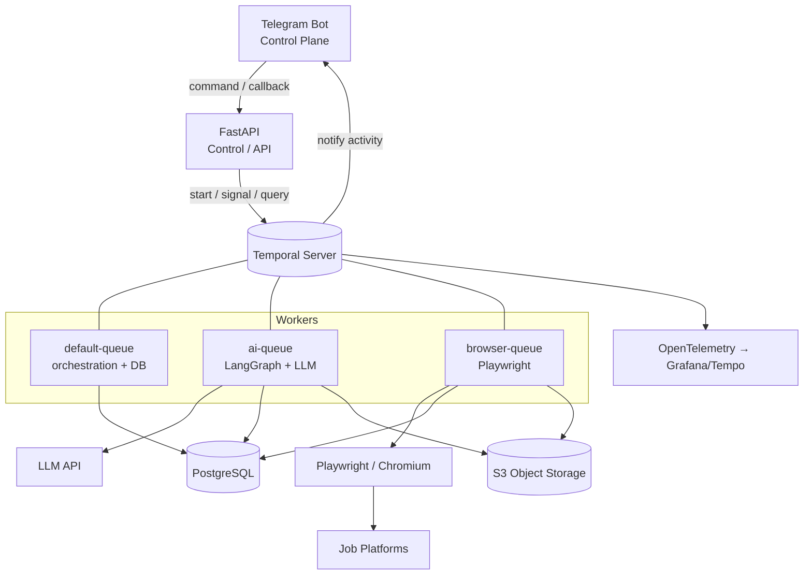
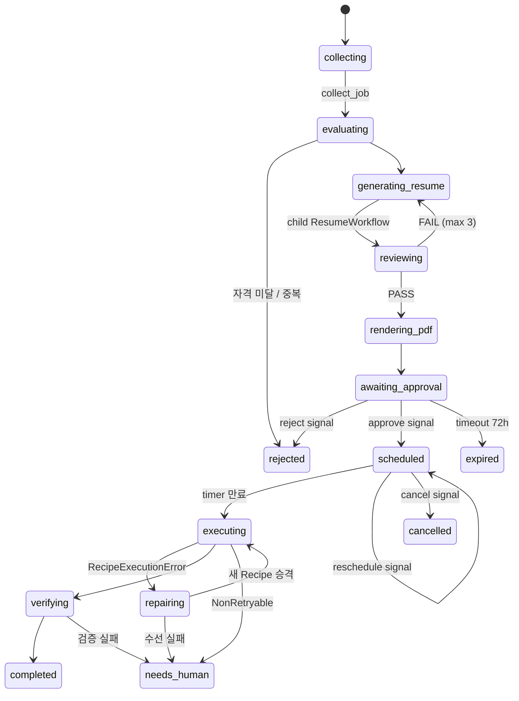
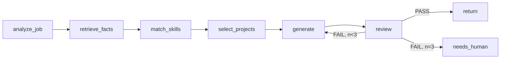
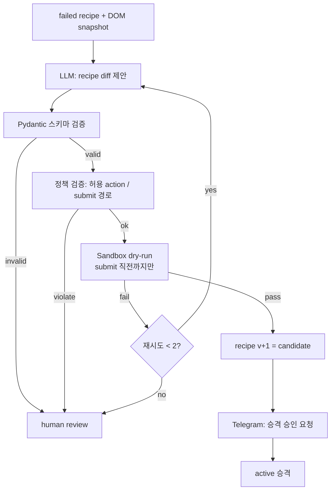
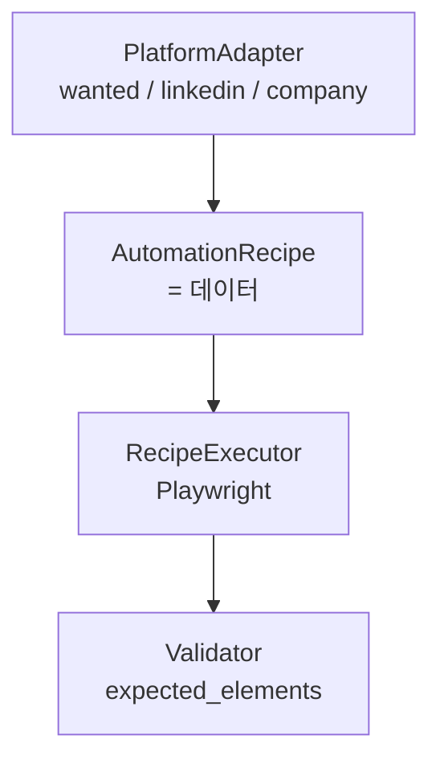
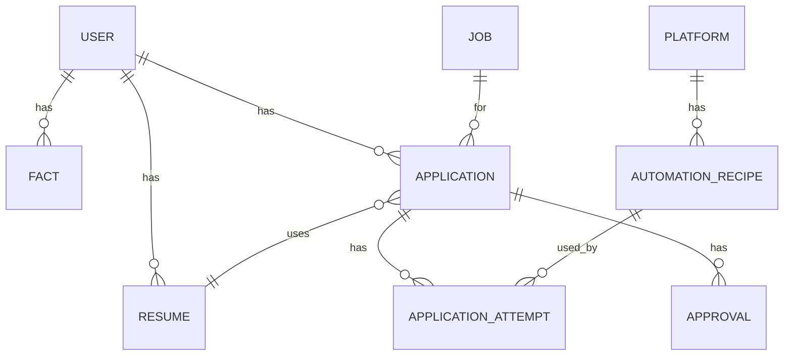

# auto-apply v2 — Architecture

> V1의 가장 큰 문제가 "이 지원 건이 지금 어느 단계인지" 추적/디버깅이었다면,
> V2의 설계 목표는 **워크플로우를 1급 객체로 만들고, 그 상태를 우리가 직접 관리하지 않는 것**이다.

---

## 0. 한 줄 요약

| 계층 | 기술 | 책임 | 책임이 아닌 것 |
|---|---|---|---|
| Control Plane | FastAPI | 외부 진입점, 워크플로우 시작/시그널 전달 | 오래 걸리는 작업 실행 |
| Orchestration | Temporal | 단계·상태·타이머·재시도·승인 대기 | 비즈니스 데이터 저장 |
| AI Reasoning | LangGraph (+ LLM SDK) | Resume 생성/검토 루프, Recipe 수선 추론 | 시스템 전체 흐름 제어 |
| Execution | Playwright | **검증된 Recipe만** 실행 | 무엇을 할지 판단 |
| Human Loop | Telegram Bot | 승인/스케줄/중단 (운영 콘솔) | 상태의 원본 보관 |
| Data | PostgreSQL + S3 | 비즈니스 사실(fact)과 파일 | 실행 진행 상태 |
| Contract | Pydantic | AI 출력 / Recipe 스키마 검증 | — |

핵심 불변식 4개 — 이 4개가 깨지면 V1의 디버깅 지옥이 재현된다.

1. **Temporal = 실행 상태, DB = 비즈니스 데이터.** 진행 단계를 DB에 이중으로 관리하지 않는다.
2. **AI는 제출하지 않는다.** AI는 Recipe(데이터)를 만들고, Playwright는 Recipe를 실행한다.
3. **모든 I/O는 Activity 안에서만.** Workflow 코드는 결정적(deterministic)이어야 한다.
4. **되돌릴 수 없는 행위(최종 submit)는 사람의 승인 뒤에서만.**

---

## 1. 시스템 구성도



### Task Queue를 3개로 나누는 이유
| Queue | Worker 특성 | 동시성 |
|---|---|---|
| `default` | 가벼움, DB 트랜잭션 위주 | 높게 (수십) |
| `ai` | 느림, 토큰 비용, rate limit | 중간 (LLM RPM에 맞춤) |
| `browser` | 메모리 수백 MB/세션, 플랫폼별 rate limit | **낮게 (플랫폼당 1~2)** |

한 큐에 몰면 Playwright 세션이 워커를 잡아먹어 승인 처리 같은 가벼운 작업까지 지연된다.
`browser` 큐는 플랫폼당 동시성 1을 강제해서 "같은 사이트에 동시 3건 지원" 같은 사고를 구조적으로 막는다.

---

## 2. 워크플로우 설계

도메인 단위로 3개만 정의한다. 더 쪼개면 추적이 어려워지고, 덜 쪼개면 재사용이 안 된다.

| Workflow | workflow_id | 역할 |
|---|---|---|
| `ApplicationWorkflow` | `application-{application_id}` | 지원 1건의 전 생애 (parent) |
| `ResumeWorkflow` | `resume-{application_id}-{attempt}` | 이력서 생성·검토 루프 (child) |
| `AutomationRepairWorkflow` | `repair-{platform}-{form_hash}` | Recipe 수선 (child, **dedupe key**) |
| `JobCollectionWorkflow` | Temporal Schedule (cron) | 공고 수집 |

### 2.1 workflow_id = 멱등성 키
`application-{id}`로 고정하면 API가 실수로 두 번 호출되어도 `WorkflowIdReusePolicy.REJECT_DUPLICATE`가
중복 지원을 막는다. **애플리케이션 레벨 중복 방지 로직을 따로 만들 필요가 없다.**

`repair-{platform}-{form_hash}`가 특히 중요하다. DOM이 바뀌면 그 플랫폼의 대기 중인 지원 건 N개가
"동시에" 실패한다. workflow_id를 폼 구조 해시로 잡으면 N개의 실패가 **하나의 수선 작업으로 합쳐진다.**
(LLM 호출 N배 + 사람에게 알림 N개를 방지)

### 2.2 ApplicationWorkflow



의사코드 (실제 구조를 그대로 반영):

```python
@workflow.defn
class ApplicationWorkflow:
    def __init__(self) -> None:
        self._state = "collecting"
        self._decision: Decision | None = None      # approve / reject
        self._scheduled_at: datetime | None = None
        self._cancelled = False

    @workflow.run
    async def run(self, cmd: StartApplication) -> ApplicationResult:
        job = await workflow.execute_activity(
            collect_job, cmd.job_url,
            start_to_close_timeout=timedelta(minutes=2),
            retry_policy=RetryPolicy(maximum_attempts=5),
        )

        verdict = await workflow.execute_activity(evaluate_eligibility, job, ...)
        if not verdict.eligible:
            await self._persist("rejected", reason=verdict.reason)
            return ApplicationResult.rejected(verdict.reason)

        # AI 루프는 child workflow로 분리 → Temporal UI에서 따로 추적/재실행 가능
        resume = await workflow.execute_child_workflow(
            ResumeWorkflow.run, ResumeInput(job=job, user_id=cmd.user_id),
            id=f"resume-{cmd.application_id}-1",
            task_queue="ai",
        )
        pdf = await workflow.execute_activity(render_pdf, resume, ...)

        # ---- Human-in-the-loop ----
        await self._persist("awaiting_approval", resume_id=resume.id, pdf_key=pdf.key)
        await workflow.execute_activity(notify_approval_request, ...)   # Telegram
        try:
            await workflow.wait_condition(
                lambda: self._decision is not None, timeout=timedelta(hours=72)
            )
        except asyncio.TimeoutError:
            await self._persist("expired")
            return ApplicationResult.expired()
        if self._decision.kind == "reject":
            await self._persist("rejected", reason=self._decision.reason)
            return ApplicationResult.rejected(self._decision.reason)

        # ---- Durable timer: 프로세스가 죽어도 살아남는 스케줄 ----
        self._scheduled_at = self._decision.scheduled_at
        while True:
            delay = self._scheduled_at - workflow.now()
            if delay <= timedelta(0):
                break
            changed_at = self._scheduled_at
            await workflow.wait_condition(          # reschedule/cancel 시그널로 깨어남
                lambda: self._cancelled or self._scheduled_at != changed_at,
                timeout=delay,
            )
            if self._cancelled:
                await self._persist("cancelled")
                return ApplicationResult.cancelled()

        # ---- 실행 (Recipe 실패 시 수선 후 1회 재시도) ----
        for attempt in (1, 2):
            recipe = await workflow.execute_activity(load_active_recipe, job.platform, ...)
            try:
                submission = await workflow.execute_activity(
                    execute_application,
                    ExecuteInput(recipe=recipe, application_id=cmd.application_id),
                    task_queue="browser",
                    start_to_close_timeout=timedelta(minutes=15),
                    heartbeat_timeout=timedelta(seconds=30),
                    retry_policy=RetryPolicy(
                        maximum_attempts=2,
                        non_retryable_error_types=["RecipeExecutionError",
                                                   "CaptchaEncountered",
                                                   "AuthRequired"],
                    ),
                )
                break
            except ActivityError as e:
                if not isinstance(e.cause, RecipeExecutionError) or attempt == 2:
                    raise
                await self._persist("repairing")
                repaired = await workflow.execute_child_workflow(
                    AutomationRepairWorkflow.run,
                    RepairInput(platform=job.platform, snapshot_key=e.cause.snapshot_key),
                    id=f"repair-{job.platform}-{e.cause.form_hash}",   # 동시 실패 dedupe
                    task_queue="ai",
                )
                if not repaired.promoted:
                    await self._persist("needs_human")
                    return ApplicationResult.needs_human("recipe repair failed")

        await workflow.execute_activity(verify_submission, submission, ...)
        await self._persist("completed", submitted_at=submission.submitted_at)
        return ApplicationResult.completed(submission)

    # ---------- Signals (Telegram / API에서 전달) ----------
    @workflow.signal
    def approve(self, d: ApproveSignal) -> None:
        if self._decision is None:                 # 중복 승인 무시 = 멱등
            self._decision = Decision.approve(d.scheduled_at)

    @workflow.signal
    def reject(self, reason: str) -> None:
        if self._decision is None:
            self._decision = Decision.reject(reason)

    @workflow.signal
    def reschedule(self, at: datetime) -> None:
        self._scheduled_at = at

    @workflow.signal
    def cancel(self) -> None:
        self._cancelled = True

    # ---------- Query (Telegram /status 가 이걸 읽는다) ----------
    @workflow.query
    def state(self) -> StateView:
        return StateView(state=self._state, scheduled_at=self._scheduled_at)
```

**설계 포인트**
- `/status`는 DB를 조회하지 않고 **워크플로우를 query**한다. 상태의 원본이 하나로 유지된다.
- 스케줄은 `sleep`이 아니라 `wait_condition(timeout=...)`. 그래야 대기 중에 재조정/취소가 먹는다.
- 승인 대기는 무한이 아니라 72시간. 무한 대기 워크플로우가 쌓이면 그게 또 운영 부채다.

### 2.3 ResumeWorkflow (AI child)



- 이 그래프 **내부**가 오케스트레이션 프레임워크(LangGraph 또는 PydanticAI, §9.2)의 영역이 될 수 있다.
  재시도 루프·상태는 Temporal이 아니라 그래프가 들고 있어도 되지만, **경계는 activity 단위**로 잡는다:
  `run_resume_graph(input) -> ResumeDraft`.
- 왜 그래프를 activity 하나에 넣는가: 그래프 실행 중간 상태는 Temporal 이벤트 히스토리에 넣을 만한 가치가 없다
  (LLM 호출은 비결정적, 재생 불가). 대신 **각 노드의 프롬프트/출력을 S3에 덤프**해서 디버깅한다.
- 반대로 "생성 → 검토 → 재생성" **큰 루프는 Temporal에 노출**한다. 3회 시도가 UI에 보여야 디버깅이 된다.
- 사실(fact) 기반 생성 (M3, 구현 완료): `retrieve_facts`(`FactSource` port, `config/facts.yaml`가 원본) →
  `select_relevant_facts`(`domain/resume_matching.py`, keyword 겹침으로 match_skills/select_projects를
  한 랭킹 단계로 합침) → LLM 구조화 생성(`ai/schemas.py`의 `ResumeContentSchema`, 스키마 위반 시 §5대로
  내부 2회 재프롬프트) → review 노드의 첫 체크는 `ground_check`(같은 파일) — highlight마다 근거 `fact_id`가
  있는지, 그 id가 실제 `Fact` 목록에 존재하는지를 본다. 근거 없는 서술과 지어낸 fact_id 인용 둘 다
  hallucination으로 잡는다. Recipe의 `value_ref`(참조만, 리터럴 금지, §3)와 같은 철학 — 이력서의 모든
  서술도 리터럴이 아니라 fact_id 참조여야 한다.
- 이 파이프라인은 여전히 분기·병렬 없는 선형 체인이다 — §9.2 도입 기준을 못 채워 plain 함수로 남아있다.
- **경력/프로젝트 블록 구조 + PDF 출력 (M3 연장)**: 실제 이력서 문서(원티드 PDF 내보내기 형식 참고 —
  이름/연락처 헤더 → 한줄 요약 → 상단 하이라이트 → 경력(회사 헤더 + 하위 블록별 불릿·기술스택) →
  개인 프로젝트 → AI 활용 경험 → 학력 → 스킬 태그 → 언어)를 만들려면 `summary`+`highlights` 뿐인
  스키마로는 부족했다. `Fact`에 `entity`/`entity_label`/`entity_period`/`block`/`block_label`/
  `block_period`를 추가해(`config/facts.yaml`) 회사명·기간·블록 제목을 **결정론 코드로** 조립하고
  (`domain/resume_blocks.group_facts_for_resume` → `FactBlock`), LLM은 그 블록 안에서 불릿
  문장만 쓴다(`ai/schemas.py`의 `BlockBullets`, 프롬프트가 block_id를 그대로 인용하도록 강제) —
  Recipe/AutomationRecipe와 같은 "AI는 생성만, 판정·조합은 코드" 철학의 연장이다. 개인 프로젝트가
  여러 개일 수 있어 `select_relevant_blocks`로 job 관련도 상위 N개만 추리고(경력은 전부 유지),
  `ground_check`는 `career[].blocks[].bullets`/`projects[].bullets`/`ai_usage`까지 재귀적으로
  검사하도록 확장했다. 이름·연락처·학력 상세·스킬 태그·언어처럼 **서술이 필요 없는 정형 정보**는
  Fact(LLM 근거)가 아니라 별도 `ProfileSource` port(`config/profile.yaml`, `FactSource`와 동일
  패턴)에서 와서 LLM을 거치지 않고 템플릿에 그대로 꽂힌다. `adapters/resume/_assemble.py`가 이
  셋(결정론 블록 메타데이터 + LLM 불릿 + Profile)을 `contracts/resume_content.AssembledResume`
  모양으로 합쳐 `ResumeDraft.content`에 담고, `PdfRenderer`는 그 모양만 알면 된다 — LLM 스키마나
  Fact 그룹핑을 몰라도 되게 경계를 나눴다. `PdfRenderer`는 §9.1에서 candidate로만 적어뒀던
  WeasyPrint를 실제로 구현했다(`adapters/pdf/weasyprint.py`, HTML/CSS 템플릿은
  `adapters/pdf/_template.py`에 분리해 weasyprint 없이도 순수 함수로 테스트한다). macOS(Homebrew)
  환경에서 weasyprint가 요구하는 libgobject/pango/cairo dlopen에 `DYLD_FALLBACK_LIBRARY_PATH`가
  필요해서 어댑터 모듈 로드 시점에 보정한다 — 사용자 셸 설정에 기대면 `make api`/`make worker`가
  새 셸에서 조용히 깨진다. weasyprint 렌더 테스트는 시스템 라이브러리(cairo/pango/glib)가 있어야
  돌아서 `@pytest.mark.integration`(`make test-all`, `make up` 불필요 — Docker가 아니라 시스템
  라이브러리 문제라서 별도다)이고, `PDF_RENDERER` 기본값은 `weasyprint`다(`stub`는 JSON 덤프로
  남겨뒀다 — 인프라 없는 개발 환경을 위한 대역).

### 2.4 AutomationRepairWorkflow



- **AI가 만든 Recipe는 절대 바로 `active`가 되지 않는다.** `draft → candidate → active → deprecated`.
- `candidate`의 첫 실전 실행은 **supervised mode**: 최종 submit 직전 스크린샷을 Telegram으로 보내 확인받는다.
  성공 1회 후 자동으로 `active` 승격.
- Sandbox dry-run은 `stop_before_submit=True`로 실제 제출 없이 전 단계를 검증한다.

---

## 3. Browser Automation 계층



Recipe는 **코드가 아니라 데이터**다. 그래서 LLM이 수정할 수 있고, 버전 관리·롤백·리뷰가 가능하다.
(모델은 workflow payload로 오가므로 `contracts/recipe.py`에 둔다. 정책 검증 로직은 `automation/policy.py`.)

```python
class ActionType(str, Enum):
    GOTO = "goto"; CLICK = "click"; FILL = "fill"; SELECT = "select"
    UPLOAD = "upload"; WAIT_FOR = "wait_for"; ASSERT_VISIBLE = "assert_visible"
    SCREENSHOT = "screenshot"; SUBMIT = "submit"          # 특별 취급

class Action(BaseModel):
    model_config = ConfigDict(extra="forbid")             # LLM의 창작 필드 차단
    type: ActionType
    selector: str | None = None
    value_ref: str | None = None                          # "profile.email" 같은 참조만
    value_literal: str | None = None
    timeout_ms: int = Field(default=5_000, le=60_000)
    optional: bool = False

class AutomationRecipe(BaseModel):
    model_config = ConfigDict(extra="forbid")
    platform: str
    version: int
    status: Literal["draft", "candidate", "active", "deprecated"]
    form_hash: str                                        # DOM 구조 지문
    actions: list[Action] = Field(max_length=120)
    expected_elements: list[str]                          # 실행 전 사전 조건
    success_signals: list[str]                            # 제출 성공 판정 근거
    validation_rules: list[Rule] = []

    @model_validator(mode="after")
    def submit_must_be_terminal(self):
        idx = [i for i, a in enumerate(self.actions) if a.type == ActionType.SUBMIT]
        if len(idx) > 1:
            raise ValueError("submit action은 최대 1개")
        if idx and idx[0] != len(self.actions) - 1:
            raise ValueError("submit은 마지막 action이어야 한다")
        return self
```

**정책 검증(스키마 검증과 별도)** — LLM 출력이 통과해야 하는 게이트:
- `value_literal`에 자격증명/토큰 패턴 금지. 개인정보는 반드시 `value_ref`로 프로필에서 주입.
- `SUBMIT` 액션은 마지막에 1회만. 새 Recipe가 submit 대상 셀렉터를 바꾸면 무조건 human review.
- `goto` 도메인은 플랫폼 allowlist 내부만.
- 액션 수·타임아웃 상한 (무한 루프/폭주 방지).

**세션/로그인**: 비밀번호를 시스템이 타이핑하지 않는다. 사용자가 최초 1회 수동 로그인한
Playwright `storage_state`를 암호화 저장하고 만료 시 재요청한다. CAPTCHA를 만나면
`CaptchaEncountered`(non-retryable)로 즉시 중단하고 사람에게 넘긴다 — 우회 시도는 하지 않는다.

---

## 4. 데이터 모델



SQLAlchemy 2.x + Alembic. 핵심 테이블만:

| Table | 핵심 컬럼 | 비고 |
|---|---|---|
| `users` | id, profile(JSONB) | 지원서에 채울 기본 정보 |
| `facts` | id, user_id, kind, content, source, verified_at | **이력서 생성의 유일한 사실 원천** |
| `jobs` | id, platform, external_id, url, title, company, raw(JSONB), collected_at | `UNIQUE(platform, external_id)` |
| `resumes` | id, user_id, job_id, content(JSONB), pdf_key, review_score, created_at | |
| `applications` | id, user_id, job_id, resume_id, status, workflow_id, scheduled_at, submitted_at, result(JSONB) | `UNIQUE(user_id, job_id)` = 중복 지원 방지 |
| `application_attempts` | id, application_id, recipe_id, recipe_version, mode, started_at, ended_at, outcome, error_code, snapshot_key, artifact_keys(JSONB) | 실행 1회 = 1행. 감사 로그 |
| `approvals` | id, application_id, channel, decided_by, decision, nonce, decided_at | nonce로 Telegram 버튼 재사용 차단 |
| `automation_recipes` | id, platform, version, status, form_hash, spec(JSONB), promoted_by, created_at | `UNIQUE(platform, version)` |
| `platform_policies` | platform, max_per_day, min_interval_sec, allowed_domains(JSONB) | rate limit 근거 |

### 4.1 Temporal과 DB의 경계 (가장 중요)
`applications.status`는 **원본이 아니라 projection**이다. 규칙:

- 상태를 바꾸는 주체는 오직 `persist_state` **activity 하나**. 다른 곳에서 status를 UPDATE 하지 않는다.
- 그 activity는 `(application_id, workflow_run_id, state)` 기준으로 **멱등**하게 upsert한다
  (activity는 최소 1회 실행이므로 중복 호출을 전제해야 한다).
- 사람이 "지금 어디?"를 물으면 → Temporal query.
  "지난달 몇 건 지원했지?"를 물으면 → DB.
- `applications.workflow_id`가 두 세계를 잇는 유일한 조인 키다. 로그·트레이스·S3 키에 모두 이 값을 넣는다.

### 4.2 S3 레이아웃
```
s3://auto-apply/
├── resumes/{user_id}/{resume_id}.pdf
├── portfolios/{user_id}/{file_id}
├── dom-snapshots/{platform}/{form_hash}/{ts}.html.gz
├── ai-traces/{workflow_id}/{node}/{seq}.json      # LangGraph 노드 입출력
└── application-artifacts/{application_id}/{attempt}/{step}.png
```

---

## 5. 실패 분류와 재시도 정책

재시도 정책을 에러 타입으로 결정한다. "일단 3번 재시도"는 V1에서 문제를 숨긴 방식이다.

| 에러 | 성격 | Temporal 처리 |
|---|---|---|
| 네트워크/타임아웃/5xx | 일시적 | 재시도 (exp backoff, 최대 5회) |
| LLM rate limit | 일시적 | 재시도 + backoff 크게 |
| LLM 출력 스키마 위반 | 준일시적 | activity 내부에서 2회 재프롬프트 → 실패 시 non-retryable |
| `RecipeExecutionError` | 구조 변경 | **재시도 금지** → RepairWorkflow |
| `CaptchaEncountered` | 정책 | 재시도 금지 → 사람 |
| `AuthRequired` | 세션 만료 | 재시도 금지 → 사람에게 재로그인 요청 |
| `AlreadySubmitted` | 멱등 충돌 | 성공으로 간주 (verify로 확인) |
| 자격 미달 | 정상 종료 | 재시도 아님, `rejected` |

**부분 제출 위험**: submit 도중 크래시하면 "제출됐는지" 알 수 없다. 그래서
`execute_application`은 submit 직전에 `application_attempts`에 `submitting` 행을 기록하고,
재개 시 항상 `verify_submission`(지원 내역 페이지 확인)을 **먼저** 돌린다. 되돌릴 수 없는
단계 앞뒤에 기록을 남기는 것이 유일한 방어다.

---

## 6. Telegram Control Plane

```
알림                            명령
─────────────────────────────   ────────────────────────────────
RESUME_READY  [승인][거절]      /status 123
SUBMIT_CONFIRM (supervised)     /schedule 123 2026-08-20 09:00
RECIPE_CANDIDATE [승격][보류]   /cancel 123 · /retry 123
NEEDS_HUMAN                     /pause · /resume
DAILY_DIGEST                    /recipes wanted
```

- 콜백 데이터에 `nonce`를 넣고 `approvals.nonce`로 1회성 검증 → 버튼 재탭/오래된 메시지 재사용 방지.
- 명령 → FastAPI → `client.get_workflow_handle(f"application-{id}").signal(...)`.
  Telegram 핸들러가 DB를 직접 쓰지 않는다.
- 발신자 `chat_id` allowlist. 이 봇은 실제 제출 권한을 가진 콘솔이다.

---

## 7. FastAPI 표면

```
POST   /jobs                          공고 등록/수집 트리거
POST   /applications                  → ApplicationWorkflow 시작 (즉시 202 + workflow_id)
GET    /applications/{id}             DB 사실 + Temporal query 병합
POST   /applications/{id}/approve     → signal
POST   /applications/{id}/reject      → signal
POST   /applications/{id}/schedule    → signal
POST   /applications/{id}/cancel      → signal
GET    /recipes/{platform}            버전 목록
POST   /recipes/{platform}/promote    candidate → active (사람만)
POST   /telegram/webhook              Bot 진입점
GET    /healthz  /metrics
```

규칙: **API 핸들러 안에서 LLM/Playwright를 실행하지 않는다.** 워크플로우를 시작하고 즉시 응답한다.

---

## 8. 리포지토리 구조

```
auto-apply-v2/
├── docker-compose.yml            postgres · temporal · temporal-ui · minio · api · workers
├── alembic/
├── config/
│   ├── matching.yaml             하드컷/트랙/스코어링 규칙 — 사용자의 직무 취향 데이터 (§11.2b)
│   ├── facts.yaml                이력서 생성의 유일한 사실 원천 — 사람이 직접 채운다 (§2.3, §4).
│                                  개인정보라 gitignore 대상. facts.example.yaml(형식만, git 추적)을
│                                  복사해서 만든다 — .env.example과 같은 패턴
│   └── profile.yaml              이력서 헤더/학력/스킬태그/언어 — LLM 을 거치지 않는 정형 정보(§2.3).
│                                  facts.yaml 과 같은 이유로 gitignore, profile.example.yaml 이 형식만 공유
├── src/auto_apply/
│   ├── api/                      FastAPI (routers, deps, schemas)
│   ├── telegram/                 bot handlers, keyboards, nonce
│   ├── workflows/
│   │   ├── application.py
│   │   ├── resume.py
│   │   ├── repair.py
│   │   └── job_collection.py
│   ├── activities/
│   │   ├── job.py  resume.py  pdf.py  notify.py  persist.py
│   │   ├── job_collection.py     collect_platform_jobs (§11.2b)
│   │   └── browser.py            Playwright activity (heartbeat 포함)
│   ├── contracts/                ★ workflow-safe: pydantic/stdlib 만, 벤더 SDK 없음
│   │   ├── dto.py                워크플로우 입출력 타입
│   │   ├── recipe.py             AutomationRecipe (workflow payload 로 오간다)
│   │   ├── job.py                JobPosting · ScreeningVerdict · ApplicabilityVerdict (§11.2b)
│   │   ├── matching_config.py    TrackRule · HardcutRule · MatchingConfig (§11.2b)
│   │   ├── fact.py               Fact (§2.3, §4)
│   │   ├── profile.py            Profile · EducationEntry · LanguageEntry (§2.3)
│   │   ├── resume_content.py     AssembledResume — ResumeDraft.content 의 실제 모양 (§2.3)
│   │   └── activity_defs.py      activity 인터페이스 stub (@activity.defn)
│   ├── ports/                    ★ Protocol 정의. 구현을 import 하지 않는다
│   │   ├── llm.py                LLMClient
│   │   ├── storage.py            BlobStore
│   │   ├── notifier.py           Notifier
│   │   ├── repository.py         *Repository + UnitOfWork
│   │   ├── executor.py           RecipeExecutor
│   │   ├── platform.py           PlatformAdapter (URL 단건 조회 — §11.2b 와 구분)
│   │   ├── job_source.py         JobSource (플랫폼 대량 수집 — §11.2b)
│   │   ├── matching_config.py    MatchingConfigSource (§11.2b)
│   │   ├── facts.py              FactSource (§2.3)
│   │   ├── profile.py            ProfileSource (§2.3)
│   │   ├── resume.py             ResumeGenerator / ResumeReviewer
│   │   ├── pdf.py                PdfRenderer
│   │   └── clock.py              Clock, IdGen (테스트 결정성)
│   ├── adapters/                 ★ port별 구현체. 서로를 모른다
│   │   ├── llm/anthropic.py · llm/stub.py
│   │   ├── storage/s3.py · storage/local.py
│   │   ├── notifier/telegram.py · notifier/console.py
│   │   ├── db/                   SQLAlchemy models · repositories · uow
│   │   ├── executor/playwright.py · executor/replay.py
│   │   ├── platform/wanted.py · linkedin.py · company.py · registry.py
│   │   ├── job_source/wanted.py · saramin.py · jasoseol.py · fixture.py (§11.2b)
│   │   ├── matching_config/yaml_file.py · static.py (§11.2b)
│   │   ├── facts/yaml_file.py · static.py (§2.3)
│   │   ├── profile/yaml_source.py · static.py (§2.3)
│   │   ├── resume/simple.py · resume/_assemble.py (오케스트레이션 프레임워크 구현은 §9.2 결정 뒤로 보류)
│   │   └── pdf/weasyprint.py · pdf/_template.py · pdf/stub.py (§2.3)
│   ├── ai/                       ★ 프레임워크 무의존: 순수 Pydantic + 문자열 함수 (§9.2)
│   │   ├── schemas.py            ResumeContentSchema · BlockBullets 등 — LLM 구조화 출력 스키마
│   │   └── prompts.py            프롬프트 조립 (LLM 호출 자체는 adapters/ 쪽에서)
│   ├── automation/
│   │   ├── policy.py             Recipe 정책 검증 (스키마 검증과 별도, §3)
│   │   └── snapshot.py           DOM snapshot + form_hash
│   ├── domain/                   순수 도메인: enums · errors · state machine · policy
│   │   ├── job_identity.py       정규화 · canonical_key (§11.2b)
│   │   ├── job_screening.py      축1 적합도: 하드컷 · 트랙 · 스코어링 (§11.2b)
│   │   ├── job_applicability.py  축2 지원가능성: blocker · requires (§11.2b)
│   │   ├── resume_matching.py    select_relevant_facts · ground_check (§2.3)
│   │   └── resume_blocks.py      group_facts_for_resume · select_relevant_blocks (§2.3)
│   ├── bootstrap.py              ★ composition root: 설정 → 구현체 조립
│   ├── config.py                 pydantic-settings
│   ├── schedule.py               JobCollectionWorkflow Temporal Schedule 등록/삭제 (§11.2b)
│   └── worker.py                 --queue {default|ai|browser}
└── tests/
    ├── ports/                    ★ contract test: 모든 구현체에 동일 스위트
    ├── workflows/                Temporal test env (시간 스킵 → 72h 대기 즉시 검증)
    ├── recipes/                  로컬 고정 HTML fixture 대상 executor 테스트
    └── schemas/                  LLM 출력 스키마 회귀 테스트
```

---

## 9. 대화에서 열려 있던 결정들 — 내 권고

### 9.1 DB: SQLite로 시작 vs Postgres로 시작 → **Postgres 권고**
대화의 "SQLite로 시작해도 된다"는 옳지만, 그 근거인 *단순함*이 이 스택에서는 성립하지 않는다.
Temporal을 쓰는 순간 이미 `docker-compose`를 띄운다. 컨테이너가 이미 있으면 Postgres 추가 비용은
거의 0이고, 반대로 SQLite로 가면 (a) 워커 3개의 쓰기 경합, (b) `JSONB` 없이 `raw`/`spec`/`profile`
질의, (c) 나중 마이그레이션 — 세 가지를 나중에 갚아야 한다.
단, **Repository 계층은 그대로 둔다** (테스트에서 SQLite in-memory를 쓸 수 있고 결합도가 낮아진다).

### 9.2 오케스트레이션 프레임워크(LangGraph 등): 지금 필요한가 → **M3에도 여전히 보류**
"생성 → 검토 → 재생성" 루프만이라면 Temporal이 이미 루프·상태·재시도를 준다. 먼저 넣으면
**두 개의 오케스트레이터를 동시에 디버깅**하게 되는데, 그게 정확히 V1의 실패 모드다.
경계(`run_resume_graph(input) -> ResumeDraft`, 실제로는 `ports/resume.py`의 `ResumeGenerator`/
`ResumeReviewer`)만 확정해 두면, 그래프가 실제로 분기·병렬·조건부 재작성으로 복잡해지는 시점에
내부 구현만 갈아끼울 수 있다.

M3에서 Fact 기반 생성(retrieve_facts → select_relevant_facts → generate → ground_check)을
실제로 구현하면서 이 판단을 재확인했다: 파이프라인이 여전히 분기·병렬 없는 선형 체인이라 도입
기준을 못 채운다. 그래서 plain 함수(`adapters/resume/simple.py`)로 남겨뒀다. 후보도 LangGraph로
못박지 않는다 — 소규모 프로젝트에는 PydanticAI 쪽이 더 맞을 수 있어 그것도 함께 검토 중이다.
`ai/schemas.py`(순수 Pydantic)와 `ai/prompts.py`(순수 문자열 함수)를 어느 프레임워크의 타입에도
묶지 않은 이유가 이것 — 나중에 `LangGraphResumeGenerator`든 `PydanticAIResumeGenerator`든 같은
스키마를 그대로 재사용하며 포트 뒤에서 교체할 수 있다.

### 9.3 Recipe 자동 승격 → **금지 (supervised 1회 필수)**
대화의 흐름은 "Sandbox PASS → 저장"이었다. 그런데 dry-run은 submit을 하지 않으므로
**submit 경로의 정확성을 증명하지 못한다.** 그래서 `candidate` 첫 실행은 사람 확인이 붙는 supervised 모드.

### 9.4 관측성 → 처음부터 최소한만
Grafana 스택 전체를 초기에 세우지 않는다. 대신 **Temporal UI를 1차 운영 콘솔로 쓰고**,
모든 로그에 `workflow_id`를 구조화 필드로 넣는다. OTel exporter는 워커 부트스트랩에 자리만 만들고
실제 백엔드 연결은 M4에서.

### 9.5 법적/정책 리스크 (설계 제약으로 반영)
자동 지원은 플랫폼 ToS와 충돌할 수 있다. 그래서 설계에 다음을 **기능이 아니라 제약으로** 넣었다:
`platform_policies`의 일일 상한/최소 간격, 플랫폼당 동시성 1, CAPTCHA 우회 금지, 최종 제출은
사람 승인 뒤에만. 규모를 키우는 방향(대량 자동 지원)이 아니라 **본인 지원 건을 정확하게 처리하는**
방향으로 설계했다.

---

## 10. 마일스톤

| M | 목표 | 완료 기준 (Definition of Done) |
|---|---|---|
| **M0** | 뼈대 | docker-compose로 postgres·temporal·minio·api·worker 부팅. `ApplicationWorkflow`가 activity 3개를 지나 completed. Temporal UI에서 단계 확인. |
| **M1** | Human-in-the-loop | Telegram 승인 → signal → durable timer → 예약 시각에 깨어남. 워커를 강제 종료해도 예약이 살아있음. |
| **M2** | 실제 제출 1개 플랫폼 | 손으로 작성한 Recipe(JSON)로 Playwright가 dry-run → supervised → live. `application_attempts`에 감사 로그. |
| **M3** | AI Resume | Fact 기반 생성 + review 게이트. 여기서 LangGraph 도입 판단. hallucination 회귀 테스트. |
| **M4** | 자기 수선 | DOM 변경을 인위적으로 만들고 RepairWorkflow가 candidate 생성 → 사람 승격 → 실행 재개. OTel 연결. |
| **M5** | 다중 플랫폼 | PlatformAdapter 2번째 구현. rate limit·동시성 정책 검증. |

각 마일스톤의 검증은 "코드가 돌아간다"가 아니라 **"워커를 죽였다 살려도 워크플로우가 이어진다"**로 잡는다.
그게 Temporal을 도입한 유일한 이유이기 때문이다.

---

## 11. Ports & Adapters — 교체 가능성 설계

### 11.1 원칙 3개
1. **의존성 역전은 "밖으로 나가는 것"에만.** LLM·S3·DB·Telegram·브라우저 = 전부 port.
   도메인 로직(자격 판정, 상태 전이, Recipe 정책)은 어떤 어댑터도 import 하지 않는다.
2. **Protocol을 쓰고 ABC 상속을 강요하지 않는다.** 구현체가 우리 인터페이스를 상속해야 한다면,
   그 구현체는 이미 우리 코드에 묶인 것이다. `typing.Protocol`은 구조적 타이핑이라 어댑터가 port를 모른다.
3. **교체 가능성은 contract test로만 증명된다.** 인터페이스만 있고 구현이 하나면 그건 교체 가능한 게 아니라
   "교체 가능해 보이는" 것이다. 모든 port는 **구현 2개 이상**(실제 + 테스트 대역)을 갖는다.

### 11.2 Port 목록

| Port | M0 구현 | 대역/2번째 구현 | 교체 가치 | 비고 |
|---|---|---|---|---|
| `LLMClient` | `AnthropicLLM`(M3) · `ClaudeCodeCliLLM`(M3 연장) | `StubLLM`(고정 응답 재생) | **높음** | 모델 교체·비용 실험·테스트 결정성. `ClaudeCodeCliLLM`은 `ANTHROPIC_API_KEY` 종량제 대신 로컬에 로그인된 Claude Code 구독으로 `claude` CLI 를 headless 로 호출한다(§11.2c) |
| `BlobStore` | MinIO(S3) | `LocalBlobStore` | **높음** | 로컬 개발에서 컨테이너 하나 덜 띄움 |
| `Notifier` | Telegram | `ConsoleNotifier` | **높음** | 승인 흐름 테스트가 봇 없이 가능 |
| `*Repository` + `UnitOfWork` | SQLAlchemy/Postgres | `InMemoryRepo` | 중간 | 실제 목적은 DB 교체보다 **테스트 속도** |
| `RecipeExecutor` | Playwright | `ReplayExecutor` (고정 HTML) | **높음** | dry_run/supervised/live는 이 port의 모드 |
| `PlatformAdapter` | wanted | linkedin, company | **높음** | 확장 지점. registry로 등록 |
| `JobSource` | wanted/saramin/jasoseol | `FixtureJobSource` | **높음** | 공고 대량 수집. §11.2b |
| `MatchingConfigSource` | `YamlMatchingConfigSource` | `StaticMatchingConfigSource` | 중간 | 하드컷/트랙 규칙. §11.2b |
| `FactSource` | `YamlFactSource` | `StaticFactSource` | 중간 | 이력서 생성의 유일한 사실 원천(§2.3). `MatchingConfigSource`와 동일 패턴 |
| `ProfileSource` | `YamlProfileSource` | `StaticProfileSource` | 중간 | 이력서 헤더/학력/스킬태그/언어(§2.3). `FactSource`와 동일 패턴 |
| `ResumeGenerator` / `ResumeReviewer` | plain 함수(`SimpleResume*`) | — (§9.2 보류, 아직 2번째 구현 없음) | **높음** | LangGraph/PydanticAI 등, 프레임워크는 미정 — §9.2 보류 결정을 가능하게 하는 seam |
| `Clock` / `IdGen` | 시스템 | 고정값 | 중간 | 테스트 결정성 |
| `PdfRenderer` | `WeasyPrintPdfRenderer`(구현 완료, §2.3) | `StubPdfRenderer`(JSON 덤프) | 낮음 | 교체 가능성보다 격리 목적. weasyprint 렌더 테스트는 시스템 라이브러리 필요해 integration |

```python
# ports/llm.py — 구현을 전혀 모른다
class LLMClient(Protocol):
    async def complete(self, prompt: Prompt, *, max_tokens: int) -> str: ...
    async def structured[T: BaseModel](self, prompt: Prompt, schema: type[T]) -> T: ...

# ports/storage.py
class BlobStore(Protocol):
    async def put(self, key: str, data: bytes, content_type: str) -> str: ...
    async def get(self, key: str) -> bytes: ...
    async def presign(self, key: str, ttl: timedelta) -> str: ...

# ports/notifier.py — "Telegram"이라는 단어가 없다
class Notifier(Protocol):
    async def request_decision(self, req: DecisionRequest) -> DecisionTicket: ...
    async def notify(self, event: NotifyEvent) -> None: ...

# ports/executor.py — 브라우저가 아니라 "Recipe를 실행하는 것"을 추상화
class RecipeExecutor(Protocol):
    async def run(self, recipe: AutomationRecipe, ctx: ExecutionContext,
                  mode: ExecutionMode) -> ExecutionResult: ...

# ports/repository.py
class UnitOfWork(Protocol):
    applications: "ApplicationRepository"
    recipes: "RecipeRepository"
    async def __aenter__(self) -> "UnitOfWork": ...
    async def commit(self) -> None: ...
```

**`RecipeExecutor`를 port로 잡고 `BrowserDriver`는 잡지 않는 이유:** Playwright가 이미 Chromium/Firefox/WebKit을
추상화한다. 그 위에 또 한 겹을 두면 Playwright의 표현력만 잃는다. 우리에게 의미 있는 교체 축은
브라우저 엔진이 아니라 **"실제로 제출하는가"** (live / supervised / dry_run / replay)이므로, 그쪽을 port로 잡는다.

### 11.2b 공고 수집·매칭 — `JobSource` vs `PlatformAdapter`, 그리고 순수 domain

ports/domain/adapters 를 먼저 넣고, 그 위에 `JobCollectionWorkflow` + activity + `jobs`
저장소를 얹었다 (Temporal Schedule 배선은 아직 — §2.1 참고). 이전 auto-apply(v1)를 참고했지만
그대로 옮기지 않았다 — v1은 "플랫폼별 수집"이 어댑터 하나 안에서 수집·판정·저장까지 다 하는
구조라 유지보수가 힘들었다. 갈라낸 경계는 세 개다.

1. **`JobSource`(대량 수집) ≠ `PlatformAdapter`(URL 단건 조회).** 이름이 비슷해 헷갈리기 쉽지만
   축이 다르다. `PlatformAdapter.fetch_job(url)`은 사람이 이미 링크를 아는 상태(`ApplicationWorkflow`
   시작)에 쓰고, `JobSource.list_jobs()`는 아직 뭐가 있는지 모를 때 목록을 훑는다. 둘을 하나로
   합치고 싶은 유혹이 있지만, 지금 합치면 "URL 하나 조회"와 "수백 건 순회"가 같은 인터페이스에
   얽혀 어느 쪽 계약도 깔끔하지 않다. 실제 어댑터(예: wanted)가 내부적으로 같은 상세 API를 쓰는 건
   괜찮다 — 인터페이스가 같아야 한다는 뜻은 아니다.
2. **매칭(하드컷/트랙/스코어링/지원가능성)은 domain의 순수 함수다.** `domain/job_screening.py`,
   `domain/job_applicability.py`는 플랫폼을 모른다 — `JobPosting`(contracts/job.py)만 받는다.
   v1은 이 판정을 어댑터 근처에 흩어두지 않고 이미 분리해뒀던 부분이라 구조는 그대로 가져왔다.
   다만 v1의 `evaluate_applicability`는 함수 안에서 레시피 파일을 직접 읽었는데(§11.1 원칙 위반),
   여기서는 `recipe_exists`/`form_has_essays`/`session_ok`/`required_gaps`를 호출부(미래의 activity)가
   미리 확인해 인자로 넘긴다 — domain은 파일도 DB도 모른다.
3. **매칭 규칙(키워드/트랙/하드컷)은 `MatchingConfigSource` port 뒤의 데이터다.** `config/matching.yaml`은
   Recipe와 같은 이유로 코드가 아니라 데이터다 — 이 프로젝트 사용자의 직무 취향이 바뀌면 코드를
   고치지 않고 이 파일만 고친다. v1의 값(하드컷/트랙/스코어링 키워드)을 그대로 옮겼다 — 같은
   사용자의 실제 구직 취향이라 새로 지어낼 이유가 없었지만, **로직 구조**(파일 하나에서 플랫폼별로
   분기하던 v1의 실수)는 반복하지 않았다.

```python
# ports/job_source.py
class JobSource(Protocol):
    @property
    def platform(self) -> str: ...
    def list_jobs(self) -> AsyncIterator[JobPosting]: ...
    async def enrich(self, job: JobPosting) -> JobPosting: ...

# ports/matching_config.py
class MatchingConfigSource(Protocol):
    async def load(self) -> MatchingConfig: ...
```

새 플랫폼을 추가하는 절차는 §11.2 원칙 그대로다: `adapters/job_source/`에 클래스 하나 추가하고
`bootstrap.py`의 `_build_job_sources`에 등록하면, `domain/job_screening.py` 이하는 손대지 않는다.

`JobCollectionWorkflow`(§2)는 플랫폼별로 `collect_platform_jobs` activity 하나를 동시에 돌린다
(`asyncio.gather` — 한 플랫폼이 느리거나 실패해도 나머지 결과를 지우지 않는다). 그 activity
하나가 목록 수집 → 스크리닝 → 상세 조회 → 재스크리닝 → 지원가능성 판정 → `jobs` 저장까지
전부 담당한다(`activities/job_collection.py`) — 공고 하나씩 별도 activity로 쪼개지 않는 이유는
플랫폼당 수백 건을 개별 activity 스케줄링하면 Temporal 히스토리만 커지고 얻는 게 없어서다
(재시도 단위는 "이 플랫폼 전체"로 충분하다 — 부분 실패는 activity 안에서 흡수한다:
상세 조회 한 건이 실패해도 나머지는 계속 처리하고 `enrich_errors`로만 센다).

`jobs` 저장은 `applications`와 같은 `UnitOfWork`(§4.1) 뒤에 있다 — `JobRepository.upsert()`는
`(platform, platform_job_id)` 기준 멱등이라 재수집이 행을 늘리지 않는다. M1 은 파일 기반
(`FileJobRepository`)이고, §4의 `jobs` 테이블(Postgres)은 M2 에서 같은 port 로 교체한다.

Schedule(cron) 등록은 `schedule.py`의 `ensure_job_collection_schedule`/`delete_job_collection_schedule`
+ `cli.py collect-schedule`/`collect-unschedule`로 배선했다. `ensure_job_collection_schedule`는
create-or-update다 — `client.create_schedule()`이 `ScheduleAlreadyRunningError`를 던지면(이미
등록돼 있으면) `ScheduleHandle.update()`로 덮어쓴다. 몇 번을 실행해도 최종 상태가 같아서(idempotent),
배포 스크립트가 매번 무조건 호출해도 안전하다. cron 표현식과 플랫폼 목록은
`JOB_COLLECTION_CRON`/`JOB_COLLECTION_PLATFORMS` 환경변수(`config.py`)로 정하고, 겹쳐 도는 걸
막기 위해 `SchedulePolicy(overlap=SKIP)`을 쓴다(재시도 단위가 "플랫폼 전체"라 겹쳐 돌면 같은
공고를 두 activity가 동시에 upsert할 수 있어서다 — `JobRepository.upsert()`가 멱등이라 깨지진
않지만 막을 이유가 있다).

수동 1회 실행(`uv run python -m auto_apply.cli collect --platforms wanted,saramin`)은 여전히
유효하다 — Schedule은 "누가/언제 시작하는지"만 바꾸고 워크플로우 자체는 그대로다.

**테스트 함정:** Temporal의 time-skipping test server(`WorkflowEnvironment.start_time_skipping()`,
§ test_ping.py)는 `CreateSchedule` RPC를 구현하지 않는다(`RPCError: ... is unimplemented`) — 이
프로젝트의 다른 workflow 통합 테스트가 쓰는 서버가 이거다. 그래서 Schedule RPC를 실제로 검증하려면
`WorkflowEnvironment.start_local()`(풀 dev server, 최초 실행 시 별도 바이너리 다운로드)을 써야
한다(`tests/test_schedule.py`). `build_job_collection_schedule()` 자체는 순수 함수라 서버 없이도
바로 테스트한다 — Temporal 연동이 필요한 부분(`ensure_*`/`delete_*`)만 얇게 분리해둔 이유다.

### 11.2c `ClaudeCodeCliLLM` — API 키 종량제 대신 로컬 구독

`AnthropicLLM`은 `ANTHROPIC_API_KEY`로 Messages API 를 직접 부른다(종량제). 이 프로젝트는
개발자 본인이 이미 Claude Code 구독(Pro/Max)을 갖고 있어서, 같은 워크로드를 API 키 없이
그 구독으로 실행할 수 있으면 이력서 생성 비용이 0에 가까워진다 — `ClaudeCodeCliLLM`
(`adapters/llm/claude_code_cli.py`)이 그 경로다: 이 머신에 `claude login`(또는
`claude setup-token`)으로 로그인된 `claude` CLI 를 `asyncio.create_subprocess_exec` 로
headless 호출한다(`-p`/`--output-format json`).

**`--bare`를 안 쓰는 이유 (실측):** `claude --bare --help`에 "Anthropic auth is strictly
ANTHROPIC_API_KEY or apiKeyHelper... (OAuth and keychain are never read)"라고 명시돼 있다.
`--bare`는 하네스를 걷어내는 지름길처럼 보이지만 인증 경로 자체를 API 키 종량제로 강제해서,
이 어댑터가 피하려는 과금 방식으로 되돌아간다. 그래서 낱개 플래그로 직접 걷어낸다:

| 걷어내는 것 | 플래그 |
|---|---|
| 빌트인 툴(Bash/Read/Write/...) | `--tools ""` |
| MCP 서버 | `--strict-mcp-config` (`--mcp-config` 생략) |
| 스킬/슬래시 명령 | `--disable-slash-commands` |
| 프로젝트/사용자 `settings.json`, `CLAUDE.md` | `--setting-sources ""` |
| 기본 시스템 프롬프트(툴 설명 등 포함) | `--system-prompt <우리 문장>`(교체, append 아님) |
| 모델 자동 라우팅 분류기 호출 | `--model` 명시 (실측: 생략하면 `modelUsage`에 `claude-haiku-4-5` 가 추가로 잡힌다 — CLI 가 라우팅용으로 Haiku 를 한 번 더 부른다) |

구조화 출력은 Anthropic Messages API 의 `tool_choice` 강제 대신 `--json-schema <JSON Schema>`
+ `--output-format json`을 쓴다 — 응답 JSON 봉투의 `structured_output` 필드에 스키마를 만족하는
값이 이미 파싱되어 온다(실측: `ResumeContentSchema`의 `$defs`/`$ref` 포함 중첩 스키마로 검증
완료). `structured_output`이 없거나 우리 Pydantic 모델 검증에 실패하면 `AnthropicLLM`과 같은
계약으로 `LLMSchemaViolation`을 던져서, `SimpleResumeGenerator`의 재프롬프트 루프(§2.3)가
그대로 재사용된다. 프로세스 자체가 실패(비정상 종료·타임아웃·JSON 파싱 실패·`is_error`)하면
`LLMExecutionError`— 스키마 문제가 아니라 대부분 일시적이라 재시도 대상이다(NON_RETRYABLE
에 없음).

**실패 분류 → 텔레그램 알림 (재시도로 안 풀리는 두 가지):** `is_error` 응답 중 일부는 재시도해도
똑같이 실패한다 — 로그인이 풀렸거나(`claude login` 필요) 구독 사용량 한도(5시간/주간)를
넘었을 때다. `_run()`은 exit code 를 먼저 보지 않고 stdout 을 먼저 JSON 파싱한다(실측: CLI 는
이 두 실패도 exit code 1 과 함께 stdout 에 유효한 JSON 을 낸다 — 로그인 풀림은
`result:"Not logged in · Please run /login"`, 한도초과는
`terminal_reason:"budget_exhausted"`/`subtype:"error_max_budget_usd"`). 그 문자열/필드를
`_classify_error()`가 CLI 바이너리 안에 실제로 박혀 있는 auth-실패 감지 정규식과 같은 패턴으로
분류해서 `LLMAuthRequired`/`LLMQuotaExceeded`(둘 다 `LLMExecutionError`의 서브클래스,
`domain/errors.py`)를 던진다 — 이 둘은 NON_RETRYABLE 이라 Temporal 이 재시도 없이 1회만
시도한다. `ResumeWorkflow`가 `generate_resume`/`review_resume` 호출을 감싸고 `ActivityError.cause.type`
으로 이 둘을 알아보면(§ CLAUDE.md "Temporal 관련 주의" — `.type` 문자열 비교), 재던지기 전에
`notify` activity(`ports/notifier.py`, 이미 승인 흐름이 쓰는 것과 같은 채널)를 큐를 건너
(`task_queue=QUEUE_DEFAULT`, `render_pdf`가 반대 방향으로 `QUEUE_AI`를 넘기는 것과 대칭) 호출해
사람에게 알린다. NON_RETRYABLE 이라 시도가 정확히 1번이라 알림도 자연히 1번만 나가고, 별도
debounce 는 안 뒀다.

**캐시 (사용자 요청 "cache 적극 활용"):** 완전히 새 프로세스로 매번 부르면 프롬프트가
100% 동일해도 캐시가 전혀 안 붙는다(실측: 동일 system-prompt 로 두 번 연속 새 프로세스 호출
— `cache_creation_input_tokens`/`cache_read_input_tokens` 둘 다 0). Claude Code 는 세션을
이어야만(`--resume <session-id>`) 이전 턴이 캐시로 읽힌다(실측: 세션을 이었더니 두 번째 턴의
`cache_read_input_tokens`가 첫 턴의 `cache_creation_input_tokens`와 정확히 일치했다). 그래서
`LLMClient.structured()`/`complete()`에 선택 파라미터 `cache_key`를 추가했다(Protocol 확장 —
`StubLLM`은 무시, `AnthropicLLM`은 힌트가 있을 때만 프롬프트 블록에 `cache_control:
{"type":"ephemeral"}`을 붙인다). `SimpleResumeGenerator`는 `cache_key=req.user_id`를 넘긴다 —
같은 사용자의 Fact/Profile 목록처럼 여러 공고에 걸쳐 반복되는 큰 프리픽스가 캐시로 읽힌다.
같은 키의 첫 호출엔 `--session-id`로 세션을 새로 열고, 이후 호출엔 `--resume`으로 잇는다.
무한정 이어붙이면 세션이 계속 자라 캐시 이득보다 비용이 커지므로 `_MAX_TURNS_PER_SESSION`
(12턴)·`_SESSION_TTL_SECONDS`(Anthropic ephemeral 캐시 기본 TTL인 5분에 맞춤)를 넘기면 새
세션을 판다. 같은 키로 동시 호출이 들어오면 같은 세션 파일에 동시 쓰기가 나므로 키별
`asyncio.Lock`으로 직렬화한다. `cache_key` 없이 부르면(`complete()`의 유일한 현재 호출자는
없다 — 아직 미사용) 세션을 아예 안 남긴다(`--no-session-persistence`).

`LLM_PROVIDER=claude_cli` + `CLAUDE_CLI_BINARY`/`CLAUDE_CLI_MODEL`/`CLAUDE_CLI_MAX_BUDGET_USD`로
켠다(`.env.example`). 기본값은 여전히 `stub`이고, `anthropic`도 그대로 남아있다 — 어느 걸 켤지는
사용자 몫이다(§11.6과 같은 이유로 자동 전환하지 않는다). worker 를 띄우는 머신에 `claude` CLI 가
설치되고 로그인돼 있어야 한다는 전제가 있어 CI/컨테이너 배포 환경에는 안 맞을 수 있다 — 로컬
개발/개인 실행 용도다.

### 11.3 Temporal에서의 주입 — activity가 곧 seam

이 부분이 Temporal 프로젝트에서 가장 자주 틀리는 지점이다.

- **Workflow는 의존성을 가질 수 없다.** 결정적이어야 하고, Temporal의 workflow sandbox가 모듈을 재import한다.
  → workflow 파일은 `contracts/`(stdlib + dataclass)만 import 한다. 어댑터를 import 하면 sandbox 경고/오류가 난다.
- **Activity는 클래스로 만들고 생성자에서 port를 주입한다.** 그리고 worker에 *바인딩된 메서드*를 등록한다.

```python
# contracts/activity_defs.py  — 인터페이스 stub. 절대 worker에 등록하지 않는다
@activity.defn(name="generate_resume")
async def generate_resume(req: GenerateResumeRequest) -> ResumeDraft:
    raise NotImplementedError("interface only")

# activities/resume.py — 구현. 이름이 stub과 같다
class ResumeActivities:
    def __init__(self, generator: ResumeGenerator, reviewer: ResumeReviewer,
                 store: BlobStore, uow: Callable[[], UnitOfWork]) -> None:
        self._gen, self._rev, self._store, self._uow = generator, reviewer, store, uow

    @activity.defn(name="generate_resume")
    async def generate_resume(self, req: GenerateResumeRequest) -> ResumeDraft:
        draft = await self._gen.generate(req)
        await self._store.put(f"ai-traces/{activity.info().workflow_id}/draft.json", ...)
        return draft

# workflows/resume.py — stub을 호출한다. 타입 체크는 되고, 구현은 모른다
from auto_apply.contracts.activity_defs import generate_resume
draft = await workflow.execute_activity(generate_resume, req,
                                        start_to_close_timeout=timedelta(minutes=5))
```

동작 원리: `execute_activity(stub, ...)`는 `@activity.defn`의 **이름**("generate_resume")을 서버에 보내고,
worker는 같은 이름으로 등록된 구현을 실행한다. 그래서 **workflow → activity 구현 방향의 import가 0**이 된다.
(주의: stub 함수를 worker의 `activities=[...]`에 넣으면 안 된다. 넣으면 `NotImplementedError`가 난다.)

### 11.4 Composition root — 조립은 한 곳에서만

```python
# bootstrap.py — 구현체 선택이 존재하는 유일한 파일
def build_container(cfg: Settings) -> Container:
    llm: LLMClient = (
        AnthropicLLM(cfg.anthropic_api_key) if cfg.llm_provider == "anthropic"
        else RecordedLLM(cfg.llm_fixture_dir)
    )
    store: BlobStore = S3BlobStore(cfg.s3) if cfg.storage == "s3" else LocalBlobStore(cfg.data_dir)
    notifier: Notifier = TelegramNotifier(cfg.telegram) if cfg.notifier == "telegram" else ConsoleNotifier()
    generator: ResumeGenerator = (
        LangGraphResumeGenerator(llm) if cfg.resume_engine == "langgraph" else SimpleResumeGenerator(llm)
    )
    return Container(llm=llm, store=store, notifier=notifier, generator=generator, uow=...)

# worker.py
c = build_container(settings)
acts = [*ResumeActivities(c.generator, c.reviewer, c.store, c.uow).all(),
        *BrowserActivities(c.executor, c.store, c.uow).all()]
Worker(client, task_queue=queue, workflows=[ApplicationWorkflow, ...], activities=acts)
```

- 환경변수로 구현을 고른다: `LLM_PROVIDER` · `STORAGE` · `NOTIFIER` · `RESUME_ENGINE` · `EXECUTOR`.
  덕분에 **`EXECUTOR=replay NOTIFIER=console LLM_PROVIDER=recorded`로 전체 파이프라인을 오프라인 실행**할 수 있다.
  M2 이후 이게 개발 속도를 가장 크게 좌우한다.
- DI 프레임워크는 쓰지 않는다. 명시적 생성자 주입 + 파일 하나로 충분하고, 그게 더 읽기 쉽다.
- FastAPI는 `Depends`로 컨테이너에서 꺼내 쓰기만 한다. 라우터가 어댑터를 직접 생성하지 않는다.

### 11.5 Contract test — 교체 가능성의 유일한 증거

```python
# tests/ports/test_blobstore.py
@pytest.fixture(params=["s3", "local"])
def store(request, tmp_path, minio) -> BlobStore:
    return S3BlobStore(minio) if request.param == "s3" else LocalBlobStore(tmp_path)

async def test_put_then_get_roundtrip(store: BlobStore): ...
async def test_get_missing_raises_blob_not_found(store: BlobStore): ...
async def test_presign_url_is_fetchable(store: BlobStore): ...
```

같은 스위트를 모든 구현에 돌린다. 새 어댑터를 추가할 때 할 일은 **params에 이름 하나 추가**뿐이고,
그 순간 이미 정의된 계약 전체가 강제된다. 특히 `LLMClient.structured()`(스키마 위반 시 어떤 예외?)와
`RecipeExecutor`(`AlreadySubmitted`를 어떻게 보고?)의 **예외 계약**을 여기서 못박는다 —
port에서 새는 것은 보통 반환값이 아니라 예외다.

### 11.6 추상화하지 말아야 할 것 (의도적 결정)

| 대상 | 왜 추상화하지 않는가 |
|---|---|
| **Temporal** | 워크플로우 엔진을 감싸면 durable timer·signal·history라는 도입 이유 자체를 잃는다. Temporal은 프레임워크로 받아들이고, 대신 **도메인 로직을 activity 안에서 얇게** 유지해서 엔진과 무관한 부분을 순수 함수로 뽑는다. |
| **Pydantic / SQLAlchemy 타입** | 데이터 계약 도구를 한 겹 더 감싸면 검증 표현력이 사라진다. 다만 **SQLAlchemy 모델을 도메인 객체로 API 밖까지 흘리지 않는다** (Repository가 경계에서 DTO로 변환). |
| **브라우저 엔진** | §11.2 참고. Playwright가 이미 그 역할이다. |
| **Telegram 메시지 포맷** | `Notifier` port는 "결정을 요청한다"는 의도만 추상화한다. 버튼/마크다운 같은 채널 고유 표현은 어댑터 안에 둔다. port가 채널 UI를 알기 시작하면 그건 이미 Telegram 전용 인터페이스다. |

### 11.7 체크리스트 (PR 리뷰 기준)
- [ ] `domain/`과 `ports/`가 `adapters/`를 import 하지 않는다 — CI에서 import-linter로 강제
- [ ] `workflows/`가 `contracts/` 외의 내부 모듈을 import 하지 않는다
- [ ] 새 외부 의존성을 넣을 때 port를 먼저 정의했다
- [ ] 모든 port에 구현이 2개 이상 (실제 + 테스트 대역)
- [ ] 어댑터 생성 코드가 `bootstrap.py` 밖에 없다
- [ ] port 시그니처에 벤더 타입이 노출되지 않는다 (`boto3` 객체, Anthropic `Message` 등)
