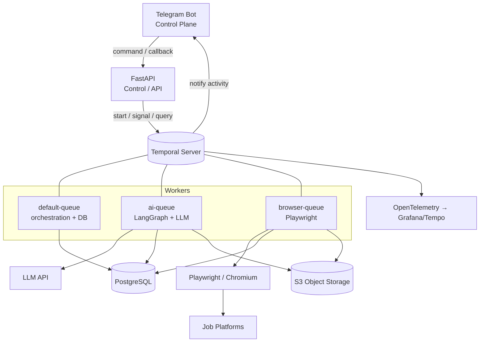
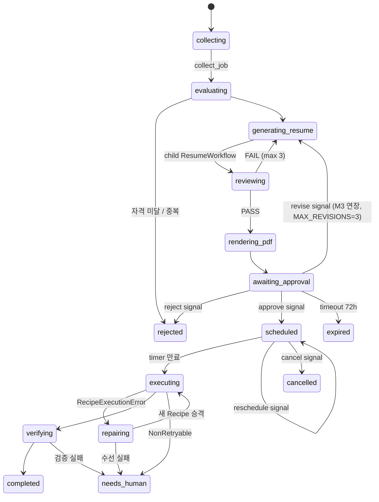
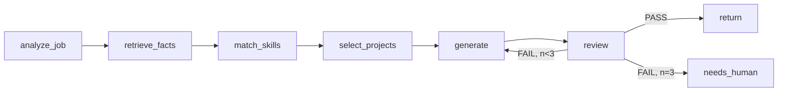
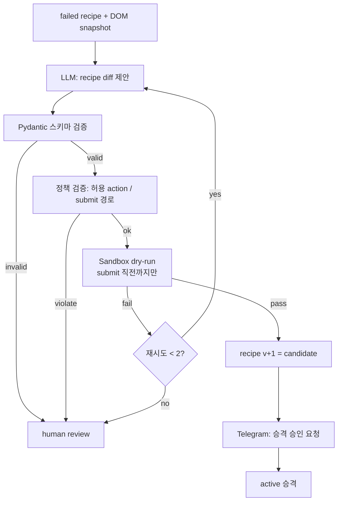
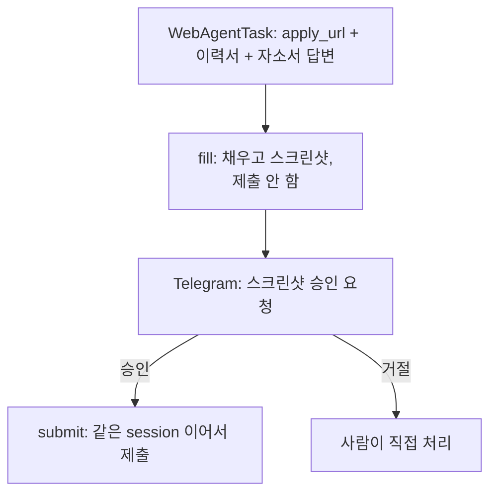
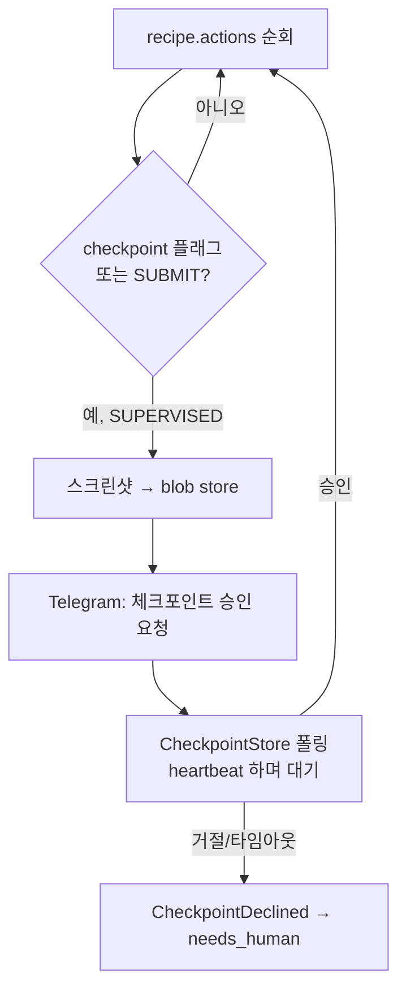
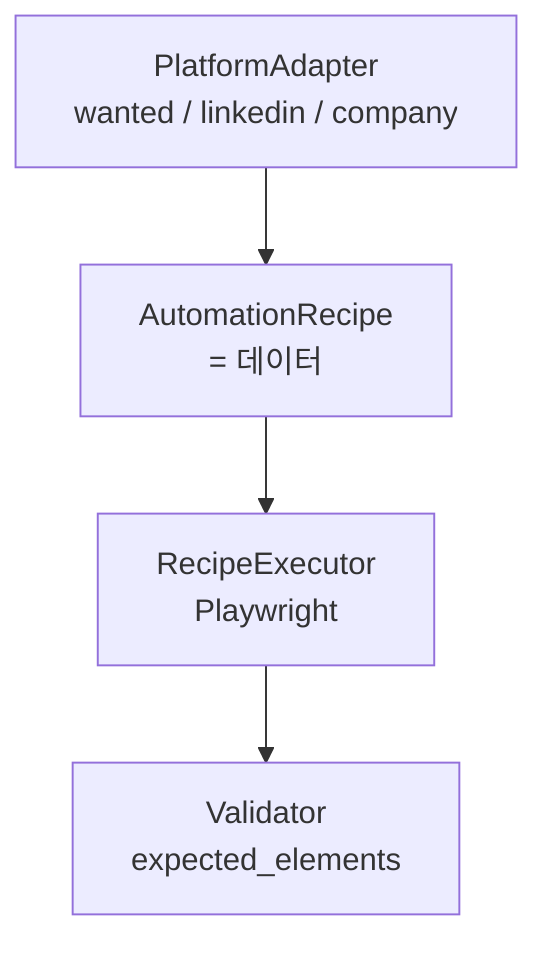
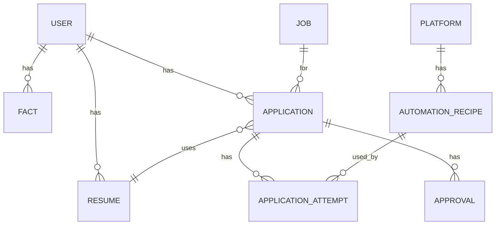

# auto-apply v2 — Architecture

> V1의 가장 큰 문제가 "이 지원 건이 지금 어느 단계인지" 추적/디버깅이었다면,
> V2의 설계 목표는 **워크플로우를 1급 객체로 만들고, 그 상태를 우리가 직접 관리하지 않는 것**이다.

---

## 0. 한 줄 요약

| 계층 | 기술 | 책임 | 책임이 아닌 것 |
|---|---|---|---|
| Control Plane | FastAPI | 외부 진입점, 워크플로우 시작/시그널 전달 | 오래 걸리는 작업 실행 |
| Orchestration | Temporal | 단계·상태·타이머·재시도·승인 대기 | 비즈니스 데이터 저장 |
| AI Reasoning | LangGraph (+ LLM SDK) | Resume 생성/검토 루프, Recipe 수선 추론 | 시스템 전체 흐름 제어 |
| Execution | Playwright | **검증된 Recipe만** 실행 | 무엇을 할지 판단 |
| Human Loop | Telegram Bot | 승인/스케줄/중단 (운영 콘솔) | 상태의 원본 보관 |
| Data | PostgreSQL + S3 | 비즈니스 사실(fact)과 파일 | 실행 진행 상태 |
| Contract | Pydantic | AI 출력 / Recipe 스키마 검증 | — |

핵심 불변식 4개 — 이 4개가 깨지면 V1의 디버깅 지옥이 재현된다.

1. **Temporal = 실행 상태, DB = 비즈니스 데이터.** 진행 단계를 DB에 이중으로 관리하지 않는다.
2. **AI는 제출하지 않는다.** AI는 Recipe(데이터)를 만들고, Playwright는 Recipe를 실행한다.
3. **모든 I/O는 Activity 안에서만.** Workflow 코드는 결정적(deterministic)이어야 한다.
4. **되돌릴 수 없는 행위(최종 submit)는 사람의 승인 뒤에서만.**

---

## 1. 시스템 구성도



### Task Queue를 3개로 나누는 이유
| Queue | Worker 특성 | 동시성 |
|---|---|---|
| `default` | 가벼움, DB 트랜잭션 위주 | 높게 (수십) |
| `ai` | 느림, 토큰 비용, rate limit | 중간 (LLM RPM에 맞춤) |
| `browser` | 메모리 수백 MB/세션, 플랫폼별 rate limit | **낮게 (플랫폼당 1~2)** |

한 큐에 몰면 Playwright 세션이 워커를 잡아먹어 승인 처리 같은 가벼운 작업까지 지연된다.
`browser` 큐는 플랫폼당 동시성 1을 강제해서 "같은 사이트에 동시 3건 지원" 같은 사고를 구조적으로 막는다.

---

## 2. 워크플로우 설계

도메인 단위로 3개만 정의한다. 더 쪼개면 추적이 어려워지고, 덜 쪼개면 재사용이 안 된다.

| Workflow | workflow_id | 역할 |
|---|---|---|
| `ApplicationWorkflow` | `application-{application_id}` | 지원 1건의 전 생애 (parent) |
| `ResumeWorkflow` | `resume-{application_id}-{attempt}` | 이력서 생성·검토 루프 (child) |
| `AutomationRepairWorkflow` | `repair-{platform}-{form_hash}` | Recipe 수선 (child, **dedupe key**) |
| `JobCollectionWorkflow` | Temporal Schedule (cron) | 공고 수집 |

### 2.1 workflow_id = 멱등성 키
`application-{id}`로 고정하면 API가 실수로 두 번 호출되어도 `WorkflowIdReusePolicy.REJECT_DUPLICATE`가
중복 지원을 막는다. **애플리케이션 레벨 중복 방지 로직을 따로 만들 필요가 없다.**

`repair-{platform}-{form_hash}`가 특히 중요하다. DOM이 바뀌면 그 플랫폼의 대기 중인 지원 건 N개가
"동시에" 실패한다. workflow_id를 폼 구조 해시로 잡으면 N개의 실패가 **하나의 수선 작업으로 합쳐진다.**
(LLM 호출 N배 + 사람에게 알림 N개를 방지)

### 2.2 ApplicationWorkflow



의사코드 (실제 구조를 그대로 반영):

```python
@workflow.defn
class ApplicationWorkflow:
    def __init__(self) -> None:
        self._state = "collecting"
        self._decision: Decision | None = None      # approve / reject
        self._scheduled_at: datetime | None = None
        self._cancelled = False

    @workflow.run
    async def run(self, cmd: StartApplication) -> ApplicationResult:
        job = await workflow.execute_activity(
            collect_job, cmd.job_url,
            start_to_close_timeout=timedelta(minutes=2),
            retry_policy=RetryPolicy(maximum_attempts=5),
        )

        verdict = await workflow.execute_activity(evaluate_eligibility, job, ...)
        if not verdict.eligible:
            await self._persist("rejected", reason=verdict.reason)
            return ApplicationResult.rejected(verdict.reason)

        # AI 루프는 child workflow로 분리 → Temporal UI에서 따로 추적/재실행 가능
        resume = await workflow.execute_child_workflow(
            ResumeWorkflow.run, ResumeInput(job=job, user_id=cmd.user_id),
            id=f"resume-{cmd.application_id}-1",
            task_queue="ai",
        )
        pdf = await workflow.execute_activity(render_pdf, resume, ...)

        # ---- Human-in-the-loop ----
        await self._persist("awaiting_approval", resume_id=resume.id, pdf_key=pdf.key)
        await workflow.execute_activity(notify_approval_request, ...)   # Telegram
        try:
            await workflow.wait_condition(
                lambda: self._decision is not None, timeout=timedelta(hours=72)
            )
        except asyncio.TimeoutError:
            await self._persist("expired")
            return ApplicationResult.expired()
        if self._decision.kind == "reject":
            await self._persist("rejected", reason=self._decision.reason)
            return ApplicationResult.rejected(self._decision.reason)

        # ---- Durable timer: 프로세스가 죽어도 살아남는 스케줄 ----
        self._scheduled_at = self._decision.scheduled_at
        while True:
            delay = self._scheduled_at - workflow.now()
            if delay <= timedelta(0):
                break
            changed_at = self._scheduled_at
            await workflow.wait_condition(          # reschedule/cancel 시그널로 깨어남
                lambda: self._cancelled or self._scheduled_at != changed_at,
                timeout=delay,
            )
            if self._cancelled:
                await self._persist("cancelled")
                return ApplicationResult.cancelled()

        # ---- 실행 (Recipe 실패 시 수선 후 1회 재시도) ----
        for attempt in (1, 2):
            recipe = await workflow.execute_activity(load_active_recipe, job.platform, ...)
            try:
                submission = await workflow.execute_activity(
                    execute_application,
                    ExecuteInput(recipe=recipe, application_id=cmd.application_id),
                    task_queue="browser",
                    start_to_close_timeout=timedelta(minutes=15),
                    heartbeat_timeout=timedelta(seconds=30),
                    retry_policy=RetryPolicy(
                        maximum_attempts=2,
                        non_retryable_error_types=["RecipeExecutionError",
                                                   "CaptchaEncountered",
                                                   "AuthRequired"],
                    ),
                )
                break
            except ActivityError as e:
                if not isinstance(e.cause, RecipeExecutionError) or attempt == 2:
                    raise
                await self._persist("repairing")
                repaired = await workflow.execute_child_workflow(
                    AutomationRepairWorkflow.run,
                    RepairInput(platform=job.platform, snapshot_key=e.cause.snapshot_key),
                    id=f"repair-{job.platform}-{e.cause.form_hash}",   # 동시 실패 dedupe
                    task_queue="ai",
                )
                if not repaired.promoted:
                    await self._persist("needs_human")
                    return ApplicationResult.needs_human("recipe repair failed")

        await workflow.execute_activity(verify_submission, submission, ...)
        await self._persist("completed", submitted_at=submission.submitted_at)
        return ApplicationResult.completed(submission)

    # ---------- Signals (Telegram / API에서 전달) ----------
    @workflow.signal
    def approve(self, d: ApproveSignal) -> None:
        if self._decision is None:                 # 중복 승인 무시 = 멱등
            self._decision = Decision.approve(d.scheduled_at)

    @workflow.signal
    def reject(self, reason: str) -> None:
        if self._decision is None:
            self._decision = Decision.reject(reason)

    @workflow.signal
    def reschedule(self, at: datetime) -> None:
        self._scheduled_at = at

    @workflow.signal
    def cancel(self) -> None:
        self._cancelled = True

    # ---------- Query (Telegram /status 가 이걸 읽는다) ----------
    @workflow.query
    def state(self) -> StateView:
        return StateView(state=self._state, scheduled_at=self._scheduled_at)
```

**설계 포인트**
- `/status`는 DB를 조회하지 않고 **워크플로우를 query**한다. 상태의 원본이 하나로 유지된다.
- 스케줄은 `sleep`이 아니라 `wait_condition(timeout=...)`. 그래야 대기 중에 재조정/취소가 먹는다.
- 승인 대기는 무한이 아니라 72시간. 무한 대기 워크플로우가 쌓이면 그게 또 운영 부채다.
- **REVISE(M3 연장)**: 위 의사코드의 2갈래(approve/reject)는 실제로는 3갈래다.
  `DecisionKind.REVISE`가 오면 `RevisionScope.SPECIFIC`(이번 재생성 1회에만, 영속 저장 안 함)
  /`GENERAL`(`config/resume_guide.{platform}.md`에 영속 — 단 사람이 diff를 한 번 더 승인해야
  반영)로 갈라서 이력서를 재생성하고 `awaiting_approval`로 되돌아간다. 가이드는 `JobRef.platform`
  별로 파일이 갈린다(§2.3, `GuideSource`) — 지금은 원티드만 실제로 쓴다. `MAX_REVISIONS`(3)를
  넘으면 `needs_human`. 자세한 구현은 CLAUDE.md "M3 연장 — REVISE" 항목과 `workflows/_revision.py`.

### 2.3 ResumeWorkflow (AI child)



- 이 그래프 **내부**가 오케스트레이션 프레임워크(LangGraph 또는 PydanticAI, §9.2)의 영역이 될 수 있다.
  재시도 루프·상태는 Temporal이 아니라 그래프가 들고 있어도 되지만, **경계는 activity 단위**로 잡는다:
  `run_resume_graph(input) -> ResumeDraft`.
- 왜 그래프를 activity 하나에 넣는가: 그래프 실행 중간 상태는 Temporal 이벤트 히스토리에 넣을 만한 가치가 없다
  (LLM 호출은 비결정적, 재생 불가). 대신 **각 노드의 프롬프트/출력을 S3에 덤프**해서 디버깅한다.
- 반대로 "생성 → 검토 → 재생성" **큰 루프는 Temporal에 노출**한다. 3회 시도가 UI에 보여야 디버깅이 된다.
- 사실(fact) 기반 생성 (M3, 구현 완료): `retrieve_facts`(`FactSource` port, `config/facts.yaml`가 원본) →
  `select_relevant_facts`(`domain/resume_matching.py`, keyword 겹침으로 match_skills/select_projects를
  한 랭킹 단계로 합침) → LLM 구조화 생성(`ai/schemas.py`의 `ResumeContentSchema`, 스키마 위반 시 §5대로
  내부 2회 재프롬프트) → review 노드의 첫 체크는 `ground_check`(같은 파일) — highlight마다 근거 `fact_id`가
  있는지, 그 id가 실제 `Fact` 목록에 존재하는지를 본다. 근거 없는 서술과 지어낸 fact_id 인용 둘 다
  hallucination으로 잡는다. Recipe의 `value_ref`(참조만, 리터럴 금지, §3)와 같은 철학 — 이력서의 모든
  서술도 리터럴이 아니라 fact_id 참조여야 한다.
- **LLM 기반 2차 리뷰는 보류(2026-08-20 결정)** — `SimpleResumeReviewer`가 하는 일은 위 `ground_check`
  (룰 기반)와 summary 길이 체크뿐, "LLM이 LLM 출력을 다시 평가"하는 단계는 없다. `ResumeReviewer` port도
  여전히 구현체 1개(§11.1 "구현 2개" 원칙 미충족, 아래 어댑터 표 참고). 의도적으로 추가하지 않기로
  했다 — hallucination(가장 위험한 실패 모드, 근거 없는 사실이 제출 문서에 들어가는 것)은 이미
  `ground_check`가 막고, 톤/자연스러움 같은 품질 문제는 텔레그램 승인 단계에서 사람이 PDF 실물을 보고
  거르며 REVISE(§7)로 되돌릴 수 있다. LLM 리뷰를 넣어도 이미 있는 사람 체크포인트를 한 번 더 도는
  셈이라 비용 대비 이득이 낮다고 판단했다. 재검토 트리거: REVISE 왕복이 특정 패턴(문장 어색함 등)으로
  반복되면, 리뷰 단계를 늘리기보다 그 패턴을 `resume_guide.{platform}.md`에 규칙으로 박아 넣는 쪽을
  먼저 고려한다(가이드 patch가 이미 그 용도).
- 이 파이프라인은 여전히 분기·병렬 없는 선형 체인이다 — §9.2 도입 기준을 못 채워 plain 함수로 남아있다.
- **경력/프로젝트 블록 구조 + PDF 출력 (M3 연장)**: 실제 이력서 문서(원티드 PDF 내보내기 형식 참고 —
  이름/연락처 헤더 → 한줄 요약 → 상단 하이라이트 → 경력(회사 헤더 + 하위 블록별 불릿·기술스택) →
  개인 프로젝트 → AI 활용 경험 → 학력 → 스킬 태그 → 언어)를 만들려면 `summary`+`highlights` 뿐인
  스키마로는 부족했다. `Fact`에 `entity`/`entity_label`/`entity_period`/`block`/`block_label`/
  `block_period`를 추가해(`config/facts.yaml`) 회사명·기간·블록 제목을 **결정론 코드로** 조립하고
  (`domain/resume_blocks.group_facts_for_resume` → `FactBlock`), LLM은 그 블록 안에서 불릿
  문장만 쓴다(`ai/schemas.py`의 `BlockBullets`, 프롬프트가 block_id를 그대로 인용하도록 강제) —
  Recipe/AutomationRecipe와 같은 "AI는 생성만, 판정·조합은 코드" 철학의 연장이다. 개인 프로젝트가
  여러 개일 수 있어 `select_relevant_blocks`로 job 관련도 상위 N개만 추리고, 경력도 회사(entity)
  마다 따로 상위 N개로 줄인다(회사 자체를 솎아내진 않는다 — 그 회사 안 세부 블록 개수만 줄인다).
  처음엔 "경력은 전부 겪은 이력이라 다 보여주는 게 정상"이라 경력을 무제한으로 뒀었는데, 한 회사
  안에서 fact를 세분화한 `block`이 많아지면(실측 — 한 회사에 세부 이니셔티브 5개) 그 회사만
  압도적으로 길어지는 문제가 나왔다. REVISE(수정요청)로 "최대 4개로 줄여줘" 피드백이 왔을 때
  이게 가이드 patch(자연어, `resume_guide.{platform}.md`)로는 원천적으로 안 고쳐진다는 것도 같이 확인했다 —
  몇 개 블록이 나오는지는 LLM이 아니라 `select_relevant_blocks`가 결정하기 때문이다. 그래서 상한
  값 자체를 `Settings`(`RESUME_MAX_PROJECT_BLOCKS`/`RESUME_MAX_CAREER_BLOCKS_PER_ENTITY`, 기본
  3/4)로 빼서 사람이 `.env`로 조정하게 했다 — 자연어로는 못 바꾸는 숫자 레버라 안전장치 계열
  (`MAX_REVISIONS` 등)과 같은 자리에 둔다. `ground_check`는 `career[].blocks[].bullets`/
  `projects[].bullets`/`ai_usage`까지 재귀적으로
  검사하도록 확장했다. 이름·연락처·학력 상세·스킬 태그·언어처럼 **서술이 필요 없는 정형 정보**는
  Fact(LLM 근거)가 아니라 별도 `ProfileSource` port(`config/profile.yaml`, `FactSource`와 동일
  패턴)에서 와서 LLM을 거치지 않고 템플릿에 그대로 꽂힌다. `adapters/resume/_assemble.py`가 이
  셋(결정론 블록 메타데이터 + LLM 불릿 + Profile)을 `contracts/resume_content.AssembledResume`
  모양으로 합쳐 `ResumeDraft.content`에 담고, `PdfRenderer`는 그 모양만 알면 된다 — LLM 스키마나
  Fact 그룹핑을 몰라도 되게 경계를 나눴다. `PdfRenderer`는 §9.1에서 candidate로만 적어뒀던
  WeasyPrint를 실제로 구현했다(`adapters/pdf/weasyprint.py`, HTML/CSS 템플릿은
  `adapters/pdf/_template.py`에 분리해 weasyprint 없이도 순수 함수로 테스트한다). macOS(Homebrew)
  환경에서 weasyprint가 요구하는 libgobject/pango/cairo dlopen에 `DYLD_FALLBACK_LIBRARY_PATH`가
  필요해서 어댑터 모듈 로드 시점에 보정한다 — 사용자 셸 설정에 기대면 `make api`/`make worker`가
  새 셸에서 조용히 깨진다. weasyprint 렌더 테스트는 시스템 라이브러리(cairo/pango/glib)가 있어야
  돌아서 `@pytest.mark.integration`(`make test-all`, `make up` 불필요 — Docker가 아니라 시스템
  라이브러리 문제라서 별도다)이고, `PDF_RENDERER` 기본값은 `weasyprint`다(`stub`는 JSON 덤프로
  남겨뒀다 — 인프라 없는 개발 환경을 위한 대역).

### 2.4 AutomationRepairWorkflow



- **AI가 만든 Recipe는 절대 바로 `active`가 되지 않는다.** `draft → candidate → active → deprecated`.
- Sandbox dry-run은 새 실행 모드가 필요 없다 — 기존 `ExecutionMode.DRY_RUN`(submit 직전까지만)을
  그대로 쓴다(§9.5, `_execution.resolve_mode`가 이미 이 의미로 쓰고 있었다).
- 승격(node I→J)은 `AutomationRepairWorkflow` 자기 자신이 Telegram 승인을 받아 그 자리에서
  끝낸다 — "candidate의 첫 실전 실행이 supervised mode로 돌다가 성공하면 자동 승격"이라는
  이전 초안의 대안 경로는 채택하지 않았다: `ExecutionMode.SUPERVISED`가 실제 실행 중 사람이
  submit 직전 스크린샷을 보고 멈춰 세우는 메커니즘(§2.4c)이 이제는 있지만, 승격 여부가
  임의의 미래 지원 건 실행 결과에 걸리는 건 `RepairResult`를 동기적으로 기다리는
  `ApplicationWorkflow` 쪽 흐름과 여전히 안 맞는다 — 이 결정은 체크포인트 메커니즘의 유무와
  무관하다. 대신 샌드박스 dry-run 결과(actions 개수/success_signals)를 요약해 그 자리에서
  승인받는다.

**진행 상황 — M4 phase 1(버전관리 write path + 정책 검증) + phase 2(이 다이어그램 B~J 전
구간, `ApplicationWorkflow` 연동) 구현 완료.** phase 1(`RecipeSource` write path,
`{platform}/{version}.json` 파일 레이아웃, `domain/recipe_policy.py`)은 이전 절 그대로다.
phase 2에서 추가한 것:

- **`ai/schemas.RecipeDiffSchema`**(node B/C) — `actions: list[Action]`가 `contracts.recipe.Action`을
  그대로 재사용한다. `Action`의 model_validator(selector 필요 여부 등)가
  `LLMClient.structured()`의 `model_validate()` 경유로 이미 실행되므로, node C "Pydantic 스키마
  검증"이 `activities/repair.py`의 재프롬프트 루프(`SimpleResumeGenerator._structured_with_reprompt`와
  같은 패턴, `max_reprompts=2`) 안에서 공짜로 딸려온다 — 조립된 `AutomationRecipe` 전체가
  무효(예: submit이 마지막이 아님)여도 같은 루프에서 재프롬프트한다. `expected_elements`/
  `validation_rules`는 LLM이 안 건드리고 `domain/recipe_repair.build_candidate_recipe`(순수
  함수, "AI는 생성만, 조합은 코드")가 이전 recipe에서 그대로 물려받는다. `propose_recipe_diff`
  activity가 `previous`도 같이 돌려줘서(`RecipeDiffResult`) node D(정책 검증)를 workflow가
  activity 없이 순수 함수로 직접 부를 수 있게 했다(§11.3 "모든 I/O는 activity 안에서만" —
  정책 검증엔 I/O가 없다).
- **`workflows/repair.AutomationRepairWorkflow`** — 위 다이어그램을 그대로 코드화했다.
  `MAX_SANDBOX_ATTEMPTS=2`로 "재시도 < 2?" 루프를 구현하고(실패한 샌드박스 시도의 새
  snapshot_key로 다음 LLM 호출을 다시 프롬프팅한다), 통과하면 `status="candidate"`로
  `save_recipe_candidate` 한 뒤 Telegram 승인을 기다려(자체 `approve`/`reject` signal + nonce,
  `ApplicationWorkflow`의 승인 패턴과 동일) `promote_recipe`를 부른다. 실패 지점 어디서든
  `RepairResult(promoted=False, reason=...)`로 정상 종료하며 그때마다 `notify` activity로
  사람에게 알린다.
- **샌드박스 dry-run의 실행 컨텍스트** — `RepairInput.ctx: ExecutionContext`에 그 실패를 만든
  실제 지원 건의 profile/upload_keys를 그대로 담아 온다(`workflows/_execution.build_context`를
  `run_execution`과 공유). "이 selector 수정이 실제로 값을 채울 수 있는가"는 데이터와 무관한
  질문이라, dedupe로 다른 지원 건의 실패가 이 워크플로우를 트리거했어도 상관없다 — 먼저
  도착한 실행의 컨텍스트로 검증하면 충분하다.
- **child workflow dedupe(`repair-{platform}-{form_hash}`)** — phase 1에서 "전례 없는 새
  패턴"으로 미해결로 남겼던 지점. `workflow.execute_child_workflow`가 이미 도는 실행과 같은
  id로 시작하면 `WorkflowAlreadyStartedError`가 나는데, **"이미 도는 수선에 붙어서 결과를
  같이 기다리기"는 채택하지 않았다** — Temporal 워크플로우 코드 안에서 child가 아닌 임의
  워크플로우의 완료를 기다릴 표준 API가 없다(activity로 Client를 새로 만들어 폴링하는 방법은
  있지만, 이 정도 이득에 비해 컨테이너에 Temporal Client를 추가로 흘려보내는 배선 비용이
  크다고 판단했다). 대신 `workflows/_repair.run_repair`가 이 예외를 잡아 그 지원 건만
  포기시키고 사람에게 넘긴다 — 진행 중인 수선이 끝나 recipe가 승격되면 다음 지원 시도가
  `load_active_recipe`로 그 결과를 자연히 집어간다.
- **`ApplicationWorkflow` 연동** — `_execution.ExecutionOutcome`에 `repair: RepairTrigger | None`을
  추가해 `_handle_execution_failure`가 RecipeExecutionError일 때만 채운다(§2.2 pseudocode의
  `for attempt in (1, 2)`를 그대로 구현 — `application.py._execute`가 첫 실행 실패 시 딱 한
  번 `_repair.run_repair`를 부르고 recipe를 재조회해 두 번째 실행을 시도한다, 그 이상은
  없다). `ApplicationState.REPAIRING`(이미 §2.2 상태 기계에 있던 값)을 이 구간에 persist한다.
- **Telegram 승격 승인 라우팅** — `DecisionRequest.repair_promotion`(신규 bool)이 True면
  `TelegramNotifier`가 승인/보류 2버튼(`_repair_keyboard`, REVISE/코멘트 없음)을 보낸다.
  이때 `application_id` 필드는 실제 지원 건이 아니라 `f"{platform}-{form_hash}"`를 담는다 —
  `telegram/bridge.py`가 `pa`/`pr` 콜백을 받으면 이 값으로 `wf_id = f"repair-{...}"`를
  복원해 `AutomationRepairWorkflow.approve`/`.reject`를 부른다(`application-*`로 조립하는
  기존 액션들과 분기).

### 2.4b ATS/자체구축 실행 — `WebAgentExecutor`(Aside)

외부 ATS(`domain/job_applicability.py`의 `channel == "external_ats"`)와 회사 자체구축 채용폼은
Recipe로 처리하지 않는다 — 회사마다 폼이 달라 recipe 재사용(§2.1의 `form_hash` dedup 전제)이
안 되기 때문이다. 그렇다고 지원 자체를 영구히 차단하지도 않는다 — 대신 범용 브라우저
에이전트(Aside, CLI/MCP로 제어 가능한 로컬 구독 도구)를 실행 도구로 쓰고, 이 프로젝트는
이력서(`AssembledResume`, §2.3의 산출물을 그대로 재사용)와 자소서 답변(별도 파이프라인, 아직
없음)만 만들어 넘긴다. `RecipeExecutor`처럼 `PlatformAdapter`를 하나 더 추가하는 문제가
아니다 — Recipe 자체가 "재사용 가능한 구조"를 전제하는데, 이 채널은 회사마다 1회성이라
recipe라는 개념 자체가 안 맞는다.



**`fill()`과 `submit()`을 프로토콜에서 별도 메서드로 분리한 게 핵심 안전장치다** — 한 메서드로
합치면 구현이 실수로/편의상 한 호출에 채움+제출을 다 해버릴 길이 타입 레벨에서 열려버린다.
`submit()`은 `fill()`이 돌려준 session으로만 이어받는다. Recipe의 supervised mode(§2.4)와
같은 자리에 있는 안전장치이지만, 이쪽은 매 실행이 전부 이 게이트를 거친다 — 회사마다
1회성이라 recipe처럼 "N회 성공하면 자동 승격"이 의미가 없기 때문이다(같은 회사 폼이
반복되면 자연히 재사용되고 승인 피로도가 줄어들 뿐, 별도 승격 절차는 두지 않는다).

이 설계는 다음을 실측(2026-08-20, aside 1.26.810.1915)해서 확정했다:
- `aside exec "<프롬프트>"`는 실제 clickable submit 버튼 앞에서도 "누르지 마라" 지시를
  지킨다(httpbin.org/forms/post로 검증: screenshot·accessibility snapshot·URL 불변 3중 확인).
- `aside exec --session <id> "이제 제출해라"`로 같은 세션을 이어서 실제 제출까지 완주한다.
- `--session` 없이 부르면 지금 사람이 포커스한 탭에 붙어버린다(실측: 관련 없는 탭을 잡음) —
  그래서 로그인~채움~제출을 하나의 세션 안에서 이어가야 한다.
- `aside repl`(별도 명령, `--session` 없음)은 LLM을 거치지 않고 JS를 브라우저에 직접
  실행한다(응답 61ms — LLM 호출이면 수초). `exec` 프롬프트 안에서 모델에게 repl 도구를 쓰라고
  지시하면, 모델이 내부적으로 그 repl 호출을 한다 — 그래서 로그인 자격증명을 **파일 경로로만**
  프롬프트에 넣고 실제 값은 `fs.readFile`로 그 안에서 읽게 하면, 프롬프트 텍스트·모델 출력
  어디에도 평문 비밀번호가 안 남는다(the-internet.herokuapp.com 공개 테스트 계정으로 로그인
  성공 + 값 미노출까지 확인).
- Aside는 `~/.aside/u/<account>/sessions/<id>/attachments/` 밖의 파일 접근을 샌드박스로
  막는다("Path escapes Project and session roots") — 자격증명 파일은 그 경로 안에만 쓴다.
- Aside 자체 비밀번호 매니저가 도메인 기준으로 "이 계정 저장할까요?" 팝업을 띄우는 것도
  확인했다 — 같은 ATS 도메인을 여러 회사가 공유하면 계정이 섞일 수 있다는 뜻이라, 이
  프로젝트는 Aside 자체 매니저를 신뢰하지 않고 자체 `CredentialSource`(회사명 키)를 쓴다.

**레이어링 규칙**: `CredentialSource.get()`이 돌려주는 `Credential`은 Temporal 활동 경계를
절대 넘지 않는다 — 활동 반환값은 event history에 영구 기록되므로, `Credential`을
`contracts/`(workflow-safe DTO 자리)가 아니라 `ports/`에 두고, `WebAgentExecutor` 구현체
생성자에 주입해 그 구현체 **내부에서만** 호출한다. Recipe의 `value_ref`(LLM 프롬프트에 값
대신 참조만 흘리는 것)와 같은 철학을 활동 경계까지 확장한 것.

**세션 id 추출은 공식 API가 아니라 실측 기반 휴리스틱**이다 — `aside exec`가 세션 id를
구조화로 돌려주는 옵션을 찾지 못해서, 호출 전후 `~/.aside/u/<account>/sessions/` 디렉터리
목록을 diff해서 새로 생긴 디렉터리를 세션으로 간주한다(`adapters/web_agent/aside_cli.py`).
동시에 다른 프로세스가 세션을 열면 깨질 수 있어, 이 executor도 platform/company당 동시성
1(§ "Task Queue를 3개로 나누는 이유"와 같은 이유) 정책을 따라야 한다. 로그인 실패/CAPTCHA
조우 시 Aside가 실제로 남기는 stdout 문구도 아직 라이브로 재현하지 못했다 — 현재 패턴
(`_LOGIN_FAIL_PATTERN`/`_CAPTCHA_PATTERN`)은 `ClaudeCodeCliLLM`의 실측 패턴만큼 신뢰할 수
없는 최선 추정이라, 실패 사례를 관찰하는 대로 갱신해야 한다.

**아직 안 된 것(다음 phase)**: `ApplicationWorkflow`/`_execution.py` 배선(channel 분기,
스크린샷 승인 슬롯 추가/재사용)과 자소서 답변 생성 파이프라인. 지금은 port·adapter·contract
test까지만 있고, 실제 지원 흐름에 연결되지 않았다.

---

### 2.4c SUPERVISED 페이지 경계 체크포인트 — `CheckpointWaiter`

`ExecutionMode.SUPERVISED`가 이름만 있고 실제로는 `LIVE`와 동일하게 그냥 제출까지 진행되던
갭(§2.4의 이전 버전, §9.3에서 "supervised 1회 필수"라고 정책만 정해두고 실행기 구현은
비워뒀던 부분)을 메웠다. 사용자가 원한 UX는 "스텝별 알림인데 구조는 폼 채우기 완료 후
스샷 인증 — 인적사항 완료 → 스샷 승인받고 → 자기소개서 페이지 → 반복"이다. 즉 각 페이지
경계마다 스크린샷 승인을 받되, 그 사이엔 브라우저 세션이 계속 살아있어야 한다.



검토했다가 기각한 대안 두 가지:
- **브라우저 세션을 승인 대기 내내 유지하는 디태치드 프로세스 + CDP 재연결** — §2.4b의
  `WebAgentExecutor`(Aside)와 같은 급의 인프라 투자인데, 그 설계는 이미 최후순위로 동결됐다
  (메모리 ats-web-agent-executor-design) — 여기서 먼저 지을 이유가 없다.
- **DRY_RUN 패스로 끝까지 채워 스크린샷 승인 → 승인되면 완전히 새 세션으로 LIVE 재실행** —
  새 인프라는 필요 없지만 매 체크포인트마다 전체를 처음부터 다시 채우는 건 낭비/취약(뒤로
  못 가는 폼도 있다) — "페이지마다 승인받고 이어서 진행"이라는 요구와 안 맞는다.

**채택한 설계**: 단일 `execute_application` activity 호출 안에서 브라우저를 계속 띄운 채,
페이지 경계(체크포인트)마다 `activity.heartbeat()`로 워커에 생존신호를 보내며 짧게(기본
30분, `CHECKPOINT_TIMEOUT_MINUTES`) 승인을 폴링 대기한다 — "사람이 실시간으로 지켜보고
있다"는 전제 위에 서 있다. 위 두 대안의 무거운 인프라/재실행 낭비 없이 절충한다.

- `Action.checkpoint: bool`(`contracts/recipe.py`) — recipe가 페이지 경계를 명시적으로
  표시한다. `SUBMIT`은 이 플래그를 안 세워도 SUPERVISED에서 **항상** 체크포인트가 걸린다
  (CLAUDE.md 절대규칙 4 "최종 submit은 승인 뒤에만"을 recipe 작성 실수와 무관하게 강제).
- `CheckpointStore` port(`ports/checkpoint_store.py`, `record_decision`/`get_decision`) —
  nonce 발급 프로세스(worker, activity 안에서 대기)와 승인 프로세스(webhook/리스너)가
  갈라진다는 점은 §6의 nonce와 같지만, 여기서 기다리는 건 워크플로우가 아니라 **activity
  자신**이라 Temporal signal로 못 받는다 — 그래서 프로세스 경계를 넘는 별도 공유 저장소가
  필요하다. `FileCheckpointStore`(파일 하나 = 결정 하나, 다른 파일 어댑터와 같은 원자적
  쓰기 패턴) + `InMemoryCheckpointStore`(테스트 대역) 2 구현, contract test 포함.
- `CheckpointWaiter`(`adapters/executor/_checkpoint.py`, port 아님 — `Notifier`/
  `CheckpointStore`/`BlobStore`/`IdGen`을 조합하는 클래스) — 스크린샷을 blob store에 올리고
  `notifier.request_decision(DecisionRequest(checkpoint=True, ...))`으로 승인을 요청한 뒤
  `store.get_decision(nonce)`를 폴링한다. 타임아웃을 넘기거나 거절되면
  `CheckpointDeclined`(`domain/errors.py`, `NON_RETRYABLE`) 하나로 두 경우를 표현한다(사유는
  메시지 문자열로만 구분).
- `RecipeExecutor.run()`에 `heartbeat: Callable[[str], None] | None = None` 키워드 인자를
  추가했다 — activity(`activities/browser.py`)가 `temporalio.activity.heartbeat`를 plain
  callable로 넘겨줘서, adapters 레이어가 temporalio를 직접 import하지 않아도 되게 한다
  (§11 레이어 규칙, temporalio는 contracts에서만 허용). `heartbeat_timeout=30초`가 이미
  `execute_application` activity 호출에 걸려 있어(`workflows/_execution.py`) 체크포인트
  대기 중 heartbeat를 안 하면 30초 뒤 타임아웃/재시도가 난다 — 그래서 필수다. 체크포인트를
  안 쓰는 구현(`ReplayExecutor`/`AgentBrowserExecutor`)은 시그니처만 맞추고 무시한다.
  `ExecutionMode.DRY_RUN`(샌드박스, repair의 `MAX_SANDBOX_ATTEMPTS` 루프 포함)은 조건에
  `mode is SUPERVISED`가 이미 있어 체크포인트 로직과 자동으로 무관하다.
- Telegram 쪽은 `DecisionRequest.checkpoint`(중첩 승인, 승인/거절 2버튼만 — guide_patch/
  repair_promotion과 같은 자리) → 콜백 prefix `ca`/`cr`. 이 콜백은 워크플로우가 아니라
  activity가 기다리는 대상이라 signal 경로를 안 탄다 — `telegram/bridge.py`가
  `c.checkpoint_store.record_decision(nonce, approved=...)`를 직접 호출한다(§6 nonce와
  같은 이유로 이 프로세스가 워크플로우 상태를 대신 검증할 수 없다).

구현·유닛/통합 테스트(`tests/ports/test_checkpoint_store_contract.py`,
`tests/adapters/test_checkpoint_waiter.py`, `tests/adapters/test_playwright_checkpoint.py`,
`tests/telegram/test_bridge_checkpoint.py`)·`make check` 통과 완료. `EXECUTOR=agent_browser`는
아직 체크포인트를 안 지원한다(Playwright만 우선 구현) — SUPERVISED로 그 실행기를 쓰면
오늘은 체크포인트 없이 그냥 진행된다.

---

## 3. Browser Automation 계층



Recipe는 **코드가 아니라 데이터**다. 그래서 LLM이 수정할 수 있고, 버전 관리·롤백·리뷰가 가능하다.
(모델은 workflow payload로 오가므로 `contracts/recipe.py`에 둔다. 정책 검증 로직은 `automation/policy.py`.)

```python
class ActionType(str, Enum):
    GOTO = "goto"; CLICK = "click"; FILL = "fill"; SELECT = "select"
    UPLOAD = "upload"; WAIT_FOR = "wait_for"; ASSERT_VISIBLE = "assert_visible"
    SCREENSHOT = "screenshot"; SUBMIT = "submit"          # 특별 취급

class Action(BaseModel):
    model_config = ConfigDict(extra="forbid")             # LLM의 창작 필드 차단
    type: ActionType
    selector: str | None = None
    value_ref: str | None = None                          # "profile.email" 같은 참조만
    value_literal: str | None = None
    timeout_ms: int = Field(default=5_000, le=60_000)
    optional: bool = False

class AutomationRecipe(BaseModel):
    model_config = ConfigDict(extra="forbid")
    platform: str
    version: int
    status: Literal["draft", "candidate", "active", "deprecated"]
    form_hash: str                                        # DOM 구조 지문
    actions: list[Action] = Field(max_length=120)
    expected_elements: list[str]                          # 실행 전 사전 조건
    success_signals: list[str]                            # 제출 성공 판정 근거
    validation_rules: list[Rule] = []

    @model_validator(mode="after")
    def submit_must_be_terminal(self):
        idx = [i for i, a in enumerate(self.actions) if a.type == ActionType.SUBMIT]
        if len(idx) > 1:
            raise ValueError("submit action은 최대 1개")
        if idx and idx[0] != len(self.actions) - 1:
            raise ValueError("submit은 마지막 action이어야 한다")
        return self
```

**정책 검증(스키마 검증과 별도)** — LLM 출력이 통과해야 하는 게이트:
- `value_literal`에 자격증명/토큰 패턴 금지. 개인정보는 반드시 `value_ref`로 프로필에서 주입.
- `SUBMIT` 액션은 마지막에 1회만. 새 Recipe가 submit 대상 셀렉터를 바꾸면 무조건 human review.
- `goto` 도메인은 플랫폼 allowlist 내부만.
- 액션 수·타임아웃 상한 (무한 루프/폭주 방지).
- `CLICK`/`WAIT_FOR`/`ASSERT_VISIBLE`의 `selector`는 `'{value}'`를 담을 수 있고, 실행 시점에
  `value_ref`/`value_literal`로 치환된다(`domain/recipe_selector.resolve_selector`, 두
  executor 구현이 공유). 지원 건마다 달라지는 텍스트(방금 업로드한 이력서 파일명, 카테고리별
  포트폴리오 파일명 등)로 매칭 대상을 좁혀야 하는데 selector 자체는 Recipe 작성 시점에
  고정돼야 해서 생긴 장치다. `FILL`/`SELECT`/`UPLOAD`는 이미 같은 필드를 "채울 값"으로
  쓰고 있어서 제외했다 — wanted 지원 폼을 실제로 붙여보며(§2.4 이전 단계, Recipe 최초
  작성) 발견했다: 업로드 직후 새로 생긴 리스트 항목이나 카테고리별 포트폴리오는 위치가
  들쭉날쭉해서 고정 selector로 못 짚는다. `UPLOAD` 액션은 Playwright에 임시파일 경로 대신
  `{name, mimeType, buffer}`를 직접 넘긴다 — blob key의 마지막 경로 요소를 그대로 파일명으로
  써서, 플랫폼이 화면에 보여주는 이름과 맞춘다(예전엔 랜덤 임시파일명이 그대로 노출됐다).

**세션/로그인**: 비밀번호를 시스템이 타이핑하지 않는다. 사용자가 최초 1회 수동 로그인한
Playwright `storage_state`를 암호화 저장하고 만료 시 재요청한다. CAPTCHA를 만나면
`CaptchaEncountered`(non-retryable)로 즉시 중단하고 사람에게 넘긴다 — 우회 시도는 하지 않는다.

**실행 엔진 2번째 선택지 — `AgentBrowserExecutor`(`EXECUTOR=agent_browser`).** Playwright를
대체하지 않는다 — 같은 `RecipeExecutor` 계약을 지키는 대역이 하나 더 생긴 것뿐이고,
`test_executor_contract.py`가 `replay`/`playwright`/`agent_browser` 셋에 동일하게 돈다.
존재 이유는 CDP accessibility tree 해석 차이다: `recipe-builder`가 라이브 디버깅에 쓰는
agent-browser CLI 와 프로덕션 실행기(Playwright)가 같은 selector 를 다르게 해석하는 사례를
wanted 지원 폼에서 실측했다(2026-08-20, 예: 파일유형 라디오 버튼 — agent-browser 는
`role=radio[name="이력서"]`류 접근성 매칭이 바로 됐는데 Playwright 의 자체 accessible-name
계산은 못 찾아서 `value="RESUME"` 속성 selector 로 우회해야 했다). 디버깅 엔진과 실행 엔진을
agent-browser 로 통일하면 이 번역 계층 버그가 원천적으로 없어진다.

agent-browser 는 브라우저 네이티브 `document.querySelector`로 raw CSS 를 해석해서, Playwright
가 CSS 위에 얹은 확장 문법(`:has-text()`, `:text-is()`, `text=`/`role=[name=]` 같은 엔진
프리픽스)을 그대로 못 읽는다 — `AgentBrowserExecutor`는 `domain/agent_browser_selector.py`로
이 셋을 분류해서 plain CSS는 그대로, 엔진-프리픽스는 agent-browser의 `find` 서브커맨드로,
`:has-text()`/`:text-is()`는 JS `eval`로 직접 찾아 실행한다(어댑터 docstring에 지원 범위
전체가 있다). `SELECT`/`UPLOAD`는 plain CSS만 허용 — `<input type=file>` 값은 JS로 못 채운다.
새 recipe를 이 엔진 대상으로 짤 때 어떤 selector 문법을 쓸지(엔진마다 다르게 고를지, 아니면
`EXECUTOR` 값을 보고 recipe-builder가 그 문법에 맞출지)는 아직 정하지 않았다 — 지금은 두
엔진이 이미 있는 `var/recipes/*.json` 문법(Playwright 확장 포함)을 최대한 그대로 실행할 수
있게만 만들어뒀다.

---

## 4. 데이터 모델



SQLAlchemy 2.x + Alembic. 핵심 테이블만:

| Table | 핵심 컬럼 | 비고 |
|---|---|---|
| `users` | id, profile(JSONB) | 지원서에 채울 기본 정보 |
| `facts` | id, user_id, kind, content, source, verified_at | **이력서 생성의 유일한 사실 원천** |
| `jobs` | id, platform, external_id, url, title, company, raw(JSONB), collected_at | `UNIQUE(platform, external_id)` |
| `resumes` | id, user_id, job_id, content(JSONB), pdf_key, review_score, created_at | |
| `applications` | id, user_id, job_id, resume_id, status, workflow_id, scheduled_at, submitted_at, result(JSONB) | `UNIQUE(user_id, job_id)` = 중복 지원 방지 |
| `application_attempts` | id, application_id, recipe_id, recipe_version, mode, started_at, ended_at, outcome, error_code, snapshot_key, artifact_keys(JSONB) | 실행 1회 = 1행. 감사 로그 |
| `approvals` | id, application_id, channel, decided_by, decision, nonce, decided_at | nonce로 Telegram 버튼 재사용 차단 |
| `automation_recipes` | id, platform, version, status, form_hash, spec(JSONB), promoted_by, created_at | `UNIQUE(platform, version)` |
| `platform_policies` | platform, max_per_day, min_interval_sec, allowed_domains(JSONB) | rate limit 근거 |

### 4.1 Temporal과 DB의 경계 (가장 중요)
`applications.status`는 **원본이 아니라 projection**이다. 규칙:

- 상태를 바꾸는 주체는 오직 `persist_state` **activity 하나**. 다른 곳에서 status를 UPDATE 하지 않는다.
- 그 activity는 `(application_id, workflow_run_id, state)` 기준으로 **멱등**하게 upsert한다
  (activity는 최소 1회 실행이므로 중복 호출을 전제해야 한다).
- 사람이 "지금 어디?"를 물으면 → Temporal query.
  "지난달 몇 건 지원했지?"를 물으면 → DB.
- `applications.workflow_id`가 두 세계를 잇는 유일한 조인 키다. 로그·트레이스·S3 키에 모두 이 값을 넣는다.

### 4.2 S3 레이아웃
```
s3://auto-apply/
├── resumes/{user_id}/{resume_id}.pdf
├── portfolios/{user_id}/{file_id}
├── dom-snapshots/{platform}/{form_hash}/{ts}.html.gz
├── ai-traces/{workflow_id}/{node}/{seq}.json      # LangGraph 노드 입출력
├── application-artifacts/{application_id}/{attempt}/{step}.png
└── checkpoints/{application_id}/{attempt}/{id}.png  # SUPERVISED 체크포인트 스크린샷 (§2.4c)
```

---

## 5. 실패 분류와 재시도 정책

재시도 정책을 에러 타입으로 결정한다. "일단 3번 재시도"는 V1에서 문제를 숨긴 방식이다.

| 에러 | 성격 | Temporal 처리 |
|---|---|---|
| 네트워크/타임아웃/5xx | 일시적 | 재시도 (exp backoff, 최대 5회) |
| LLM rate limit | 일시적 | 재시도 + backoff 크게 |
| LLM 출력 스키마 위반 | 준일시적 | activity 내부에서 2회 재프롬프트 → 실패 시 non-retryable |
| `RecipeExecutionError` | 구조 변경 | **재시도 금지** → RepairWorkflow |
| `CaptchaEncountered` | 정책 | 재시도 금지 → 사람 |
| `AuthRequired` | 세션 만료 | 재시도 금지 → 사람에게 재로그인 요청 |
| `AlreadySubmitted` | 멱등 충돌 | 성공으로 간주 (verify로 확인) |
| 자격 미달 | 정상 종료 | 재시도 아님, `rejected` |

**부분 제출 위험**: submit 도중 크래시하면 "제출됐는지" 알 수 없다. 그래서
`execute_application`은 submit 직전에 `application_attempts`에 `submitting` 행을 기록하고,
재개 시 항상 `verify_submission`(지원 내역 페이지 확인)을 **먼저** 돌린다. 되돌릴 수 없는
단계 앞뒤에 기록을 남기는 것이 유일한 방어다.

---

## 6. Telegram Control Plane

```
알림                            명령
─────────────────────────────   ────────────────────────────────
RESUME_READY  [승인][거절]      /status 123
SUBMIT_CONFIRM (supervised)     /schedule 123 2026-08-20 09:00
RECIPE_CANDIDATE [승격][보류]   /cancel 123 · /retry 123
NEEDS_HUMAN                     /pause · /resume
DAILY_DIGEST                    /recipes wanted
```

- 콜백 데이터에 `nonce`를 넣고 `approvals.nonce`로 1회성 검증 → 버튼 재탭/오래된 메시지 재사용 방지.
- 명령 → FastAPI → `client.get_workflow_handle(f"application-{id}").signal(...)`.
  Telegram 핸들러가 DB를 직접 쓰지 않는다.
- 발신자 `chat_id` allowlist. 이 봇은 실제 제출 권한을 가진 콘솔이다.
- **REVISE(M3 연장)**: 승인/거절 버튼 옆에 "✏️ 수정요청"이 있다. 누르면 scope 선택(이번만/항상)
  버튼 → ForceReply로 자유 텍스트 피드백을 받는 3단계다. 이 자유 텍스트를 어느
  application/nonce/scope에 연결할지가 nonce와 같은 문제였다(발급 프로세스와 webhook/리스너
  프로세스가 갈라진다) — `[revise:{application_id}:{nonce}:{scope}]` 태그를 ForceReply 프롬프트
  본문에 실어 보내고, 사용자 답장의 `reply_to_message.text`에서 그 태그를 파싱해 복원한다
  (상태를 안 들고도 왕복). `telegram/bridge.py`의 `handle_message`가 이 답장을 처리한다.
- **dry-run 배지(M3 연장)**: 승인 요청 메시지 맨 앞에 🧪 DRY RUN / ⚠️ SUPERVISED / 🚨 LIVE /
  ❓ 확인 불가 배지를 붙인다 — dry-run인 줄 알고 안심했는데 recipe가 이미 candidate/active로
  승격돼 실제로는 제출되는 경우를 혼동할 위험 때문(메모리 dry-run-indicator-backlog).
  `_execution.resolve_mode()`가 실행 activity 안에서만 모드를 결정하던 걸,
  `ApplicationWorkflow._peek_mode`가 승인 요청 직전에 미리 알아내 `DecisionRequest.mode`에
  실어 보낸다 — `dry_run_only`면 recipe 상태와 무관하게 항상 DRY_RUN이라 조회 없이 바로
  정해지고, 아니면 recipe.status를 봐야 해서 `load_active_recipe`를 한 번 더 부른다(가벼운
  read라 `_execute`가 실행 시점에 다시 부르는 것과 중복 호출을 감수). 조회가 실패하면 mode를
  None으로 둬 "확인 불가" 배지로 보여준다 — 잘못된 낙관적 배지보다 모른다고 말하는 쪽이 안전.
  이 배지는 승인 요청 시점의 스냅샷이라 그 뒤 recipe 상태가 바뀌면(드묾) 실제 실행 때와
  달라질 수 있다는 한계는 남는다. 가이드 patch 2차 승인(`guide_patch=True`)은 실행과 무관해
  배지를 안 붙인다.
- **체크포인트 승인(§2.4c)**: SUPERVISED 실행 중 페이지 경계마다 스크린샷 + "✅ 계속/❌ 중단"
  2버튼(`ca`/`cr`)을 보낸다. 다른 콜백과 달리 워크플로우 signal이 아니라
  `checkpoint_store.record_decision`을 직접 호출한다 — 기다리는 게 워크플로우가 아니라
  activity 자신이기 때문이다.

---

## 7. FastAPI 표면

```
POST   /jobs                          공고 등록/수집 트리거
POST   /applications                  → ApplicationWorkflow 시작 (즉시 202 + workflow_id)
GET    /applications/{id}             DB 사실 + Temporal query 병합
POST   /applications/{id}/approve     → signal
POST   /applications/{id}/reject      → signal
POST   /applications/{id}/revise      → signal (M3 연장 — 텔레그램 없이도 REVISE 트리거)
POST   /applications/{id}/schedule    → signal
POST   /applications/{id}/cancel      → signal
GET    /recipes/{platform}            버전 목록
POST   /recipes/{platform}/promote    candidate → active (사람만)
POST   /telegram/webhook              Bot 진입점
GET    /healthz  /metrics
```

규칙: **API 핸들러 안에서 LLM/Playwright를 실행하지 않는다.** 워크플로우를 시작하고 즉시 응답한다.

---

## 8. 리포지토리 구조

```
auto-apply-v2/
├── docker-compose.yml            postgres · temporal · temporal-ui · minio · api · workers
├── alembic/
├── config/
│   ├── matching.yaml             하드컷/트랙/스코어링 규칙 — 사용자의 직무 취향 데이터 (§11.2b)
│   ├── facts.yaml                이력서 생성의 유일한 사실 원천 — 사람이 직접 채운다 (§2.3, §4).
│                                  개인정보라 gitignore 대상. facts.example.yaml(형식만, git 추적)을
│                                  복사해서 만든다 — .env.example과 같은 패턴
│   └── profile.yaml              이력서 헤더/학력/스킬태그/언어 — LLM 을 거치지 않는 정형 정보(§2.3).
│                                  facts.yaml 과 같은 이유로 gitignore, profile.example.yaml 이 형식만 공유
├── src/auto_apply/
│   ├── api/                      FastAPI (routers, deps, schemas)
│   ├── telegram/                 bot handlers, keyboards, nonce
│   ├── workflows/
│   │   ├── application.py
│   │   ├── resume.py
│   │   ├── repair.py
│   │   └── job_collection.py
│   ├── activities/
│   │   ├── job.py  resume.py  pdf.py  notify.py  persist.py
│   │   ├── job_collection.py     collect_platform_jobs (§11.2b)
│   │   └── browser.py            Playwright activity (heartbeat 포함)
│   ├── contracts/                ★ workflow-safe: pydantic/stdlib 만, 벤더 SDK 없음
│   │   ├── dto.py                워크플로우 입출력 타입
│   │   ├── recipe.py             AutomationRecipe (workflow payload 로 오간다)
│   │   ├── job.py                JobPosting · ScreeningVerdict · ApplicabilityVerdict (§11.2b)
│   │   ├── matching_config.py    TrackRule · HardcutRule · MatchingConfig (§11.2b)
│   │   ├── fact.py               Fact (§2.3, §4)
│   │   ├── profile.py            Profile · EducationEntry · LanguageEntry (§2.3)
│   │   ├── resume_content.py     AssembledResume — ResumeDraft.content 의 실제 모양 (§2.3)
│   │   └── activity_defs.py      activity 인터페이스 stub (@activity.defn)
│   ├── ports/                    ★ Protocol 정의. 구현을 import 하지 않는다
│   │   ├── llm.py                LLMClient
│   │   ├── storage.py            BlobStore
│   │   ├── notifier.py           Notifier
│   │   ├── repository.py         *Repository + UnitOfWork
│   │   ├── executor.py           RecipeExecutor
│   │   ├── platform.py           PlatformAdapter (URL 단건 조회 — §11.2b 와 구분)
│   │   ├── job_source.py         JobSource (플랫폼 대량 수집 — §11.2b)
│   │   ├── matching_config.py    MatchingConfigSource (§11.2b)
│   │   ├── facts.py              FactSource (§2.3)
│   │   ├── profile.py            ProfileSource (§2.3)
│   │   ├── resume.py             ResumeGenerator / ResumeReviewer
│   │   ├── pdf.py                PdfRenderer
│   │   └── clock.py              Clock, IdGen (테스트 결정성)
│   ├── adapters/                 ★ port별 구현체. 서로를 모른다
│   │   ├── llm/anthropic.py · llm/stub.py
│   │   ├── storage/s3.py · storage/local.py
│   │   ├── notifier/telegram.py · notifier/console.py
│   │   ├── db/                   SQLAlchemy models · repositories · uow
│   │   ├── executor/playwright.py · executor/agent_browser.py · executor/replay.py
│   │   ├── platform/wanted.py · linkedin.py · company.py · registry.py
│   │   ├── job_source/wanted.py · saramin.py · jasoseol.py · fixture.py (§11.2b)
│   │   ├── matching_config/yaml_file.py · static.py (§11.2b)
│   │   ├── facts/yaml_file.py · static.py (§2.3)
│   │   ├── profile/yaml_source.py · static.py (§2.3)
│   │   ├── resume/simple.py · resume/_assemble.py (오케스트레이션 프레임워크 구현은 §9.2 결정 뒤로 보류)
│   │   └── pdf/weasyprint.py · pdf/_template.py · pdf/stub.py (§2.3)
│   ├── ai/                       ★ 프레임워크 무의존: 순수 Pydantic + 문자열 함수 (§9.2)
│   │   ├── schemas.py            ResumeContentSchema · BlockBullets 등 — LLM 구조화 출력 스키마
│   │   └── prompts.py            프롬프트 조립 (LLM 호출 자체는 adapters/ 쪽에서)
│   ├── automation/
│   │   ├── policy.py             Recipe 정책 검증 (스키마 검증과 별도, §3)
│   │   └── snapshot.py           DOM snapshot + form_hash
│   ├── domain/                   순수 도메인: enums · errors · state machine · policy
│   │   ├── job_identity.py       정규화 · canonical_key (§11.2b)
│   │   ├── job_screening.py      축1 적합도: 하드컷 · 트랙 · 스코어링 (§11.2b)
│   │   ├── job_applicability.py  축2 지원가능성: blocker · requires (§11.2b)
│   │   ├── resume_matching.py    select_relevant_facts · ground_check (§2.3)
│   │   └── resume_blocks.py      group_facts_for_resume · select_relevant_blocks (§2.3)
│   ├── bootstrap.py              ★ composition root: 설정 → 구현체 조립
│   ├── config.py                 pydantic-settings
│   ├── schedule.py               JobCollectionWorkflow Temporal Schedule 등록/삭제 (§11.2b)
│   ├── watchdog.py                워크플로우 능동 감시 — `make watchdog` (§11.2d)
│   └── worker.py                 --queue {default|ai|browser}
└── tests/
    ├── ports/                    ★ contract test: 모든 구현체에 동일 스위트
    ├── workflows/                Temporal test env (시간 스킵 → 72h 대기 즉시 검증)
    ├── recipes/                  로컬 고정 HTML fixture 대상 executor 테스트
    └── schemas/                  LLM 출력 스키마 회귀 테스트
```

---

## 9. 대화에서 열려 있던 결정들 — 내 권고

### 9.1 DB: SQLite로 시작 vs Postgres로 시작 → **Postgres 권고**
대화의 "SQLite로 시작해도 된다"는 옳지만, 그 근거인 *단순함*이 이 스택에서는 성립하지 않는다.
Temporal을 쓰는 순간 이미 `docker-compose`를 띄운다. 컨테이너가 이미 있으면 Postgres 추가 비용은
거의 0이고, 반대로 SQLite로 가면 (a) 워커 3개의 쓰기 경합, (b) `JSONB` 없이 `raw`/`spec`/`profile`
질의, (c) 나중 마이그레이션 — 세 가지를 나중에 갚아야 한다.
단, **Repository 계층은 그대로 둔다** (테스트에서 SQLite in-memory를 쓸 수 있고 결합도가 낮아진다).

### 9.2 오케스트레이션 프레임워크(LangGraph 등): 지금 필요한가 → **M3에도 여전히 보류**
"생성 → 검토 → 재생성" 루프만이라면 Temporal이 이미 루프·상태·재시도를 준다. 먼저 넣으면
**두 개의 오케스트레이터를 동시에 디버깅**하게 되는데, 그게 정확히 V1의 실패 모드다.
경계(`run_resume_graph(input) -> ResumeDraft`, 실제로는 `ports/resume.py`의 `ResumeGenerator`/
`ResumeReviewer`)만 확정해 두면, 그래프가 실제로 분기·병렬·조건부 재작성으로 복잡해지는 시점에
내부 구현만 갈아끼울 수 있다.

M3에서 Fact 기반 생성(retrieve_facts → select_relevant_facts → generate → ground_check)을
실제로 구현하면서 이 판단을 재확인했다: 파이프라인이 여전히 분기·병렬 없는 선형 체인이라 도입
기준을 못 채운다. 그래서 plain 함수(`adapters/resume/simple.py`)로 남겨뒀다. 후보도 LangGraph로
못박지 않는다 — 소규모 프로젝트에는 PydanticAI 쪽이 더 맞을 수 있어 그것도 함께 검토 중이다.
`ai/schemas.py`(순수 Pydantic)와 `ai/prompts.py`(순수 문자열 함수)를 어느 프레임워크의 타입에도
묶지 않은 이유가 이것 — 나중에 `LangGraphResumeGenerator`든 `PydanticAIResumeGenerator`든 같은
스키마를 그대로 재사용하며 포트 뒤에서 교체할 수 있다.

### 9.3 Recipe 자동 승격 → **금지 (supervised 1회 필수)**
대화의 흐름은 "Sandbox PASS → 저장"이었다. 그런데 dry-run은 submit을 하지 않으므로
**submit 경로의 정확성을 증명하지 못한다.** 그래서 `candidate` 첫 실행은 사람 확인이 붙는 supervised 모드.
"사람 확인이 붙는다"는 정책은 §2.4c에서 `CheckpointWaiter`(페이지 경계마다 스크린샷 승인,
SUBMIT은 항상 강제)로 실제 구현됐다.

### 9.4 관측성 → 처음부터 최소한만
Grafana 스택 전체를 초기에 세우지 않는다. 대신 **Temporal UI를 1차 운영 콘솔로 쓰고**,
모든 로그에 `workflow_id`를 구조화 필드로 넣는다. OTel exporter는 워커 부트스트랩에 자리만 만들고
실제 백엔드 연결은 M4에서.

### 9.5 법적/정책 리스크 (설계 제약으로 반영)
자동 지원은 플랫폼 ToS와 충돌할 수 있다. 그래서 설계에 다음을 **기능이 아니라 제약으로** 넣었다:
`platform_policies`의 일일 상한/최소 간격, 플랫폼당 동시성 1, CAPTCHA 우회 금지, 최종 제출은
사람 승인 뒤에만. 규모를 키우는 방향(대량 자동 지원)이 아니라 **본인 지원 건을 정확하게 처리하는**
방향으로 설계했다.

---

## 10. 마일스톤

| M | 목표 | 완료 기준 (Definition of Done) |
|---|---|---|
| **M0** | 뼈대 | docker-compose로 postgres·temporal·minio·api·worker 부팅. `ApplicationWorkflow`가 activity 3개를 지나 completed. Temporal UI에서 단계 확인. |
| **M1** | Human-in-the-loop | Telegram 승인 → signal → durable timer → 예약 시각에 깨어남. 워커를 강제 종료해도 예약이 살아있음. |
| **M2** | 실제 제출 1개 플랫폼 | 손으로 작성한 Recipe(JSON)로 Playwright가 dry-run → supervised → live. `application_attempts`에 감사 로그. |
| **M3** | AI Resume | Fact 기반 생성 + review 게이트. 여기서 LangGraph 도입 판단. hallucination 회귀 테스트. |
| **M4** | 자기 수선 | DOM 변경을 인위적으로 만들고 RepairWorkflow가 candidate 생성 → 사람 승격 → 실행 재개. OTel 연결. |
| **M5** | 다중 플랫폼 | PlatformAdapter 2번째 구현. rate limit·동시성 정책 검증. |

각 마일스톤의 검증은 "코드가 돌아간다"가 아니라 **"워커를 죽였다 살려도 워크플로우가 이어진다"**로 잡는다.
그게 Temporal을 도입한 유일한 이유이기 때문이다.

---

## 11. Ports & Adapters — 교체 가능성 설계

### 11.1 원칙 3개
1. **의존성 역전은 "밖으로 나가는 것"에만.** LLM·S3·DB·Telegram·브라우저 = 전부 port.
   도메인 로직(자격 판정, 상태 전이, Recipe 정책)은 어떤 어댑터도 import 하지 않는다.
2. **Protocol을 쓰고 ABC 상속을 강요하지 않는다.** 구현체가 우리 인터페이스를 상속해야 한다면,
   그 구현체는 이미 우리 코드에 묶인 것이다. `typing.Protocol`은 구조적 타이핑이라 어댑터가 port를 모른다.
3. **교체 가능성은 contract test로만 증명된다.** 인터페이스만 있고 구현이 하나면 그건 교체 가능한 게 아니라
   "교체 가능해 보이는" 것이다. 모든 port는 **구현 2개 이상**(실제 + 테스트 대역)을 갖는다.

### 11.2 Port 목록

| Port | M0 구현 | 대역/2번째 구현 | 교체 가치 | 비고 |
|---|---|---|---|---|
| `LLMClient` | `AnthropicLLM`(M3) · `ClaudeCodeCliLLM`(M3 연장) | `StubLLM`(고정 응답 재생) | **높음** | 모델 교체·비용 실험·테스트 결정성. `ClaudeCodeCliLLM`은 `ANTHROPIC_API_KEY` 종량제 대신 로컬에 로그인된 Claude Code 구독으로 `claude` CLI 를 headless 로 호출한다(§11.2c) |
| `BlobStore` | MinIO(S3) | `LocalBlobStore` | **높음** | 로컬 개발에서 컨테이너 하나 덜 띄움 |
| `Notifier` | Telegram | `ConsoleNotifier` | **높음** | 승인 흐름 테스트가 봇 없이 가능 |
| `*Repository` + `UnitOfWork` | SQLAlchemy/Postgres | `InMemoryRepo` | 중간 | 실제 목적은 DB 교체보다 **테스트 속도** |
| `RecipeExecutor` | Playwright | `ReplayExecutor`(고정 HTML) · `AgentBrowserExecutor`(agent-browser CLI, §3) | **높음** | dry_run/supervised/live는 이 port의 모드. `EXECUTOR=playwright`\|`agent_browser`\|`replay` |
| `PlatformAdapter` | wanted | linkedin, company | **높음** | 확장 지점. registry로 등록 |
| `JobSource` | wanted/saramin/jasoseol | `FixtureJobSource` | **높음** | 공고 대량 수집. §11.2b |
| `MatchingConfigSource` | `YamlMatchingConfigSource` | `StaticMatchingConfigSource` | 중간 | 하드컷/트랙 규칙. §11.2b |
| `FactSource` | `YamlFactSource` | `StaticFactSource` | 중간 | 이력서 생성의 유일한 사실 원천(§2.3). `MatchingConfigSource`와 동일 패턴 |
| `ProfileSource` | `YamlProfileSource` | `StaticProfileSource` | 중간 | 이력서 헤더/학력/스킬태그/언어(§2.3). `FactSource`와 동일 패턴 |
| `ResumeGenerator` / `ResumeReviewer` | plain 함수(`SimpleResume*`) | — (§9.2 보류, 아직 2번째 구현 없음) | **높음** | LangGraph/PydanticAI 등, 프레임워크는 미정 — §9.2 보류 결정을 가능하게 하는 seam |
| `Clock` / `IdGen` | 시스템 | 고정값 | 중간 | 테스트 결정성 |
| `PdfRenderer` | `WeasyPrintPdfRenderer`(구현 완료, §2.3) | `StubPdfRenderer`(JSON 덤프) | 낮음 | 교체 가능성보다 격리 목적. weasyprint 렌더 테스트는 시스템 라이브러리 필요해 integration |
| `AttachmentManager` | `WantedAttachmentManager` | `FixtureAttachmentManager` | 낮음 | `PlatformAdapter`와 별개 축(§11.2e) — 계정에 쌓인 첨부파일 관리. `resume_cleanup.py` 전용 |
| `CheckpointStore` | `FileCheckpointStore` | `InMemoryCheckpointStore` | 중간 | SUPERVISED 페이지 경계 체크포인트 승인/거절(§2.4c) — nonce처럼 프로세스 경계를 넘지만, 워크플로우가 아니라 activity가 기다린다는 점이 다르다 |

```python
# ports/llm.py — 구현을 전혀 모른다
class LLMClient(Protocol):
    async def complete(self, prompt: Prompt, *, max_tokens: int) -> str: ...
    async def structured[T: BaseModel](self, prompt: Prompt, schema: type[T]) -> T: ...

# ports/storage.py
class BlobStore(Protocol):
    async def put(self, key: str, data: bytes, content_type: str) -> str: ...
    async def get(self, key: str) -> bytes: ...
    async def presign(self, key: str, ttl: timedelta) -> str: ...

# ports/notifier.py — "Telegram"이라는 단어가 없다
class Notifier(Protocol):
    async def request_decision(self, req: DecisionRequest) -> DecisionTicket: ...
    async def notify(self, event: NotifyEvent) -> None: ...

# ports/executor.py — 브라우저가 아니라 "Recipe를 실행하는 것"을 추상화
class RecipeExecutor(Protocol):
    async def run(self, recipe: AutomationRecipe, ctx: ExecutionContext,
                  mode: ExecutionMode) -> ExecutionResult: ...

# ports/repository.py
class UnitOfWork(Protocol):
    applications: "ApplicationRepository"
    recipes: "RecipeRepository"
    async def __aenter__(self) -> "UnitOfWork": ...
    async def commit(self) -> None: ...
```

**`RecipeExecutor`를 port로 잡고 `BrowserDriver`는 잡지 않는 이유:** Playwright가 이미 Chromium/Firefox/WebKit을
추상화한다. 그 위에 또 한 겹을 두면 Playwright의 표현력만 잃는다. 우리에게 의미 있는 교체 축은
브라우저 엔진이 아니라 **"실제로 제출하는가"** (live / supervised / dry_run / replay)이므로, 그쪽을 port로 잡는다.

### 11.2b 공고 수집·매칭 — `JobSource` vs `PlatformAdapter`, 그리고 순수 domain

ports/domain/adapters 를 먼저 넣고, 그 위에 `JobCollectionWorkflow` + activity + `jobs`
저장소를 얹었다 (Temporal Schedule 배선은 아직 — §2.1 참고). 이전 auto-apply(v1)를 참고했지만
그대로 옮기지 않았다 — v1은 "플랫폼별 수집"이 어댑터 하나 안에서 수집·판정·저장까지 다 하는
구조라 유지보수가 힘들었다. 갈라낸 경계는 세 개다.

1. **`JobSource`(대량 수집) ≠ `PlatformAdapter`(URL 단건 조회).** 이름이 비슷해 헷갈리기 쉽지만
   축이 다르다. `PlatformAdapter.fetch_job(url)`은 사람이 이미 링크를 아는 상태(`ApplicationWorkflow`
   시작)에 쓰고, `JobSource.list_jobs()`는 아직 뭐가 있는지 모를 때 목록을 훑는다. 둘을 하나로
   합치고 싶은 유혹이 있지만, 지금 합치면 "URL 하나 조회"와 "수백 건 순회"가 같은 인터페이스에
   얽혀 어느 쪽 계약도 깔끔하지 않다. 실제 어댑터(예: wanted)가 내부적으로 같은 상세 API를 쓰는 건
   괜찮다 — 인터페이스가 같아야 한다는 뜻은 아니다.
2. **매칭(하드컷/트랙/스코어링/지원가능성)은 domain의 순수 함수다.** `domain/job_screening.py`,
   `domain/job_applicability.py`는 플랫폼을 모른다 — `JobPosting`(contracts/job.py)만 받는다.
   v1은 이 판정을 어댑터 근처에 흩어두지 않고 이미 분리해뒀던 부분이라 구조는 그대로 가져왔다.
   다만 v1의 `evaluate_applicability`는 함수 안에서 레시피 파일을 직접 읽었는데(§11.1 원칙 위반),
   여기서는 `recipe_exists`/`form_has_essays`/`session_ok`/`required_gaps`를 호출부(미래의 activity)가
   미리 확인해 인자로 넘긴다 — domain은 파일도 DB도 모른다.
3. **매칭 규칙(키워드/트랙/하드컷)은 `MatchingConfigSource` port 뒤의 데이터다.** `config/matching.yaml`은
   Recipe와 같은 이유로 코드가 아니라 데이터다 — 이 프로젝트 사용자의 직무 취향이 바뀌면 코드를
   고치지 않고 이 파일만 고친다. v1의 값(하드컷/트랙/스코어링 키워드)을 그대로 옮겼다 — 같은
   사용자의 실제 구직 취향이라 새로 지어낼 이유가 없었지만, **로직 구조**(파일 하나에서 플랫폼별로
   분기하던 v1의 실수)는 반복하지 않았다.

```python
# ports/job_source.py
class JobSource(Protocol):
    @property
    def platform(self) -> str: ...
    def list_jobs(self) -> AsyncIterator[JobPosting]: ...
    async def enrich(self, job: JobPosting) -> JobPosting: ...

# ports/matching_config.py
class MatchingConfigSource(Protocol):
    async def load(self) -> MatchingConfig: ...
```

새 플랫폼을 추가하는 절차는 §11.2 원칙 그대로다: `adapters/job_source/`에 클래스 하나 추가하고
`bootstrap.py`의 `_build_job_sources`에 등록하면, `domain/job_screening.py` 이하는 손대지 않는다.

`JobCollectionWorkflow`(§2)는 플랫폼별로 `collect_platform_jobs` activity 하나를 동시에 돌린다
(`asyncio.gather` — 한 플랫폼이 느리거나 실패해도 나머지 결과를 지우지 않는다). 그 activity
하나가 목록 수집 → 스크리닝 → 상세 조회 → 재스크리닝 → 지원가능성 판정 → `jobs` 저장까지
전부 담당한다(`activities/job_collection.py`) — 공고 하나씩 별도 activity로 쪼개지 않는 이유는
플랫폼당 수백 건을 개별 activity 스케줄링하면 Temporal 히스토리만 커지고 얻는 게 없어서다
(재시도 단위는 "이 플랫폼 전체"로 충분하다 — 부분 실패는 activity 안에서 흡수한다:
상세 조회 한 건이 실패해도 나머지는 계속 처리하고 `enrich_errors`로만 센다).

`jobs` 저장은 `applications`와 같은 `UnitOfWork`(§4.1) 뒤에 있다 — `JobRepository.upsert()`는
`(platform, platform_job_id)` 기준 멱등이라 재수집이 행을 늘리지 않는다. M1 은 파일 기반
(`FileJobRepository`)이고, §4의 `jobs` 테이블(Postgres)은 M2 에서 같은 port 로 교체한다.

Schedule(cron) 등록은 `schedule.py`의 `ensure_job_collection_schedule`/`delete_job_collection_schedule`
+ `cli.py collect-schedule`/`collect-unschedule`로 배선했다. `ensure_job_collection_schedule`는
create-or-update다 — `client.create_schedule()`이 `ScheduleAlreadyRunningError`를 던지면(이미
등록돼 있으면) `ScheduleHandle.update()`로 덮어쓴다. 몇 번을 실행해도 최종 상태가 같아서(idempotent),
배포 스크립트가 매번 무조건 호출해도 안전하다. cron 표현식과 플랫폼 목록은
`JOB_COLLECTION_CRON`/`JOB_COLLECTION_PLATFORMS` 환경변수(`config.py`)로 정하고, 겹쳐 도는 걸
막기 위해 `SchedulePolicy(overlap=SKIP)`을 쓴다(재시도 단위가 "플랫폼 전체"라 겹쳐 돌면 같은
공고를 두 activity가 동시에 upsert할 수 있어서다 — `JobRepository.upsert()`가 멱등이라 깨지진
않지만 막을 이유가 있다).

수동 1회 실행(`uv run python -m auto_apply.cli collect --platforms wanted,saramin`)은 여전히
유효하다 — Schedule은 "누가/언제 시작하는지"만 바꾸고 워크플로우 자체는 그대로다.

**테스트 함정:** Temporal의 time-skipping test server(`WorkflowEnvironment.start_time_skipping()`,
§ test_ping.py)는 `CreateSchedule` RPC를 구현하지 않는다(`RPCError: ... is unimplemented`) — 이
프로젝트의 다른 workflow 통합 테스트가 쓰는 서버가 이거다. 그래서 Schedule RPC를 실제로 검증하려면
`WorkflowEnvironment.start_local()`(풀 dev server, 최초 실행 시 별도 바이너리 다운로드)을 써야
한다(`tests/test_schedule.py`). `build_job_collection_schedule()` 자체는 순수 함수라 서버 없이도
바로 테스트한다 — Temporal 연동이 필요한 부분(`ensure_*`/`delete_*`)만 얇게 분리해둔 이유다.

### 11.2c `ClaudeCodeCliLLM` — API 키 종량제 대신 로컬 구독

`AnthropicLLM`은 `ANTHROPIC_API_KEY`로 Messages API 를 직접 부른다(종량제). 이 프로젝트는
개발자 본인이 이미 Claude Code 구독(Pro/Max)을 갖고 있어서, 같은 워크로드를 API 키 없이
그 구독으로 실행할 수 있으면 이력서 생성 비용이 0에 가까워진다 — `ClaudeCodeCliLLM`
(`adapters/llm/claude_code_cli.py`)이 그 경로다: 이 머신에 `claude login`(또는
`claude setup-token`)으로 로그인된 `claude` CLI 를 `asyncio.create_subprocess_exec` 로
headless 호출한다(`-p --input-format stream-json --output-format stream-json --verbose` —
캐시 브레이크포인트를 찍으려면 stdin 으로 콘텐츠 블록을 나눠 보내야 해서 평범한 `-p <문자열>`
대신 이 모드를 쓴다, 아래 "캐시" 참고).

**`--bare`를 안 쓰는 이유 (실측):** `claude --bare --help`에 "Anthropic auth is strictly
ANTHROPIC_API_KEY or apiKeyHelper... (OAuth and keychain are never read)"라고 명시돼 있다.
`--bare`는 하네스를 걷어내는 지름길처럼 보이지만 인증 경로 자체를 API 키 종량제로 강제해서,
이 어댑터가 피하려는 과금 방식으로 되돌아간다. 그래서 낱개 플래그로 직접 걷어낸다:

| 걷어내는 것 | 플래그 |
|---|---|
| 빌트인 툴(Bash/Read/Write/...) | `--tools ""` |
| MCP 서버 | `--strict-mcp-config` (`--mcp-config` 생략) |
| 스킬/슬래시 명령 | `--disable-slash-commands` |
| 프로젝트/사용자 `settings.json`, `CLAUDE.md` | `--setting-sources ""` |
| 기본 시스템 프롬프트(툴 설명 등 포함) | `--system-prompt <우리 문장>`(교체, append 아님) |
| 모델 자동 라우팅 분류기 호출 | `--model` 명시 (실측: 생략하면 `modelUsage`에 `claude-haiku-4-5` 가 추가로 잡힌다 — CLI 가 라우팅용으로 Haiku 를 한 번 더 부른다) |

구조화 출력은 Anthropic Messages API 의 `tool_choice` 강제 대신 `--json-schema <JSON Schema>`를
쓴다 — `--output-format stream-json`의 마지막 줄(`"type":"result"`, 세션 없는
`--output-format json` 한 방 호출과 같은 모양)의 `structured_output` 필드에 스키마를 만족하는
값이 이미 파싱되어 온다(실측: `ResumeContentSchema`의 `$defs`/`$ref` 포함 중첩 스키마로 검증
완료). `structured_output`이 없거나 우리 Pydantic 모델 검증에 실패하면 `AnthropicLLM`과 같은
계약으로 `LLMSchemaViolation`을 던져서, `SimpleResumeGenerator`의 재프롬프트 루프(§2.3)가
그대로 재사용된다. 프로세스 자체가 실패(비정상 종료·타임아웃·JSON 파싱 실패·`is_error`)하면
`LLMExecutionError`— 스키마 문제가 아니라 대부분 일시적이라 재시도 대상이다(NON_RETRYABLE
에 없음).

**실패 분류 → 텔레그램 알림 (재시도로 안 풀리는 두 가지):** `is_error` 응답 중 일부는 재시도해도
똑같이 실패한다 — 로그인이 풀렸거나(`claude login` 필요) 구독 사용량 한도(5시간/주간)를
넘었을 때다. `_run()`은 exit code 를 먼저 보지 않고 stdout 을 먼저 JSON 파싱한다(실측: CLI 는
이 두 실패도 exit code 1 과 함께 stdout 에 유효한 JSON 을 낸다 — 로그인 풀림은
`result:"Not logged in · Please run /login"`, 한도초과는
`terminal_reason:"budget_exhausted"`/`subtype:"error_max_budget_usd"`). 그 문자열/필드를
`_classify_error()`가 CLI 바이너리 안에 실제로 박혀 있는 auth-실패 감지 정규식과 같은 패턴으로
분류해서 `LLMAuthRequired`/`LLMQuotaExceeded`(둘 다 `LLMExecutionError`의 서브클래스,
`domain/errors.py`)를 던진다 — 이 둘은 NON_RETRYABLE 이라 Temporal 이 재시도 없이 1회만
시도한다. `ResumeWorkflow`가 `generate_resume`/`review_resume` 호출을 감싸고 `ActivityError.cause.type`
으로 이 둘을 알아보면(§ CLAUDE.md "Temporal 관련 주의" — `.type` 문자열 비교), 재던지기 전에
`notify` activity(`ports/notifier.py`, 이미 승인 흐름이 쓰는 것과 같은 채널)를 큐를 건너
(`task_queue=QUEUE_DEFAULT`, `render_pdf`가 반대 방향으로 `QUEUE_AI`를 넘기는 것과 대칭) 호출해
사람에게 알린다. NON_RETRYABLE 이라 시도가 정확히 1번이라 알림도 자연히 1번만 나가고, 별도
debounce 는 안 뒀다.

**캐시 (사용자 요청 "cache 적극 활용", 재설계 기록: [[claude-cli-prompt-cache-redesign]]):**
처음엔 세션(`--resume <session-id>`)을 이어야만 캐시가 붙는다고 실측했지만, 그건 "프롬프트
앞부분만 같고 뒷부분이 매번 달라지는" 케이스에서 세션 없이는 캐시가 하나도 안 붙는다는
것만 확인한 결과였다. 다시 실측해보니 진짜 원인은 세션 유무가 아니라 **콘텐츠 블록을 안
나눈 것**이었다 — `-p <문자열>`로 프롬프트 전체를 하나의 블록으로 보내면, 앞부분이 바이트
단위로 완전히 같아도 뒷부분이 한 글자만 달라지는 순간 그 블록 전체가 캐시 미스가 된다(부분
프리픽스 매칭이 전혀 안 됨 — 실측: 27482 토큰짜리 공통 접두어 + 서로 다른 20자 접미어인 두
번의 세션 없는 호출이 각각 독립적으로 `cache_creation`만 찍고 `cache_read`는 0이었다).
반대로 `--input-format stream-json`으로 안정적인 부분과 매번 바뀌는 부분을 **별도 텍스트
블록**으로 나누고 안정적인 블록에만 `cache_control:{"type":"ephemeral","ttl":"1h"}`을 찍으면,
세션을 전혀 안 이어도(`--no-session-persistence` 그대로) 완전히 독립된 두 번째 프로세스가
그 블록을 `cache_read`로 읽었다(실측: 27478 토큰 `cache_creation` → 다음 호출
`cache_read_input_tokens=27420` + 새 접미어만 `cache_creation=52`, 비용 $0.102 → $0.024).

그래서 세션 재사용(`--session-id`/`--resume`, `_MAX_TURNS_PER_SESSION`/`_SESSION_TTL_SECONDS`,
키별 `asyncio.Lock`) 기반 설계는 걷어냈다. `LLMClient.structured()`/`complete()`의 선택
파라미터를 `cache_key`(세션 재사용 힌트)에서 `cache_prefix: str = ""`(안정적인 접두어 문자열
그 자체)로 바꿨다 — 실제로 모델에 보내는 내용은 `cache_prefix + prompt`다. `StubLLM`은 무시,
`AnthropicLLM`은 `cache_prefix`가 있을 때만 그 부분을 별도 블록으로 떼어 `cache_control`을
붙인다. `ClaudeCodeCliLLM`도 같은 신호로 `cache_prefix`가 있으면 2블록(`cache_prefix`엔
브레이크포인트, `prompt`엔 없음), 없으면 1블록 메시지를 만들어 stdin 으로 넘긴다 — 매 호출이
독립 프로세스이므로 세션 상태/락이 필요 없어졌다.

이 파이프라인에서 바이트 단위로 진짜 안정적인(=서로 다른 공고에 걸쳐서도 100% 동일한) 유일한
구간은 **한 번의 `generate()` 호출 안에서의 재프롬프트 시도들**이다 — `select_relevant_facts`가
공고 설명으로 Fact 를 필터링해서 서로 다른 공고끼리는 프롬프트가 애초에 다르다. 그래서
`SimpleResumeGenerator._structured_with_reprompt`는 원본 프롬프트를 `cache_prefix`로 고정하고
매 시도의 `prompt`엔 재시도 여부에 따라 빈 문자열이거나 `reprompt_error_suffix()`(오류 안내문)
만 담는다 — 스키마 위반으로 재프롬프트가 걸리면 2·3번째 시도가 원본을 `cache_read`로 읽는다.
사용자 단위 세션(`cache_key=req.user_id`)이 갖고 있던 오염 위험(이전 공고의 대화가 다음 공고
생성에 섞여 들어가는 것)도 세션 자체를 없애면서 구조적으로 사라졌다. `GuideActivities.
propose_guide_patch`처럼 재시도 루프가 없는 단발 호출은 재사용할 캐시 경계가 없어
`cache_prefix`를 안 넘긴다.

`LLM_PROVIDER=claude_cli` + `CLAUDE_CLI_BINARY`/`CLAUDE_CLI_MODEL`/`CLAUDE_CLI_MAX_BUDGET_USD`로
켠다(`.env.example`). 기본값은 여전히 `stub`이고, `anthropic`도 그대로 남아있다 — 어느 걸 켤지는
사용자 몫이다(§11.6과 같은 이유로 자동 전환하지 않는다). worker 를 띄우는 머신에 `claude` CLI 가
설치되고 로그인돼 있어야 한다는 전제가 있어 CI/컨테이너 배포 환경에는 안 맞을 수 있다 — 로컬
개발/개인 실행 용도다.

### 11.2d 워크플로우 능동 감시 — `watchdog.py`

`_execute()`의 `load_active_recipe`가 try/except 없이 흘러 `ApplicationWorkflow`가 조용히
FAILED로 죽었던 사고(workflow-failure-visibility-backlog, `de56dcd`)의 1차 픽스는 그 지점을
workflow 코드 안에서 잡아 `NEEDS_HUMAN`으로 정상 종료시키는 것이었다 — 이게 Temporal
커뮤니티의 표준 권고이기도 하다: "워크플로우 실패를 감지하려면 워크플로우 안에서
잡아라"(maxim, [Temporal Forum](https://community.temporal.io/t/sending-notification-when-the-workflow-has-failed/14701)).
하지만 이건 *알고 있는* 실패 지점에만 통한다. 앞으로 또 생길 수 있는 코드 버그, 사람의 실수로
인한 `terminate`, `workflow_execution_timeout`처럼 워크플로우 코드가 아예 더 못 도는 종료까지
잡으려면 프로세스 밖에서 감시하는 수밖에 없다 — 이것도 커뮤니티에서 "실시간은 아니지만
유일한 외부 감지 수단"으로 확인했다([Forum](https://community.temporal.io/t/is-it-possible-to-listen-for-workflow-failures/6843)).

그래서 `watchdog.py`는 `cli.py`/`schedule.py`와 같은 부류의 **운영 진입점**(workflow 파일이
아니므로 §11.3 규칙 대상이 아니다)으로, Temporal Client의 visibility API(`list_workflows`)를
직접 폴링한다. Elasticsearch 없는 이 스택(Standard/SQL visibility, docker-compose)도
`ExecutionStatus IN (...) AND CloseTime > ...` 쿼리를 지원해서
([List Filter 문서](https://docs.temporal.io/list-filter)) 별도 검색 인프라 없이 충분하다.
새 port를 만들지 않았다 — 알림은 이미 있는 `Notifier` port(`notify` activity와 같은 이벤트
모양, kind=`WORKFLOW_UNHEALTHY`)를 그대로 쓴다.

재시작 사이의 워터마크(마지막으로 확인한 시각)를 영속화하지 않는다 —
`telegram/listener.py`의 offset과 같은 트레이드오프다. 재시작 직후엔
`WATCHDOG_LOOKBACK_MINUTES`(기본 60분)만큼 과거를 다시 훑어서 최대 그 창 안에서 중복 알림이
날 수 있는데, 감시의 존재 이유 자체가 "아무도 안 보고 있을 때" 대비라 놓치는 것보다 몇 번 더
알리는 쪽이 훨씬 싸다. `WATCHDOG_POLL_INTERVAL_SECONDS`(기본 60초)로 폴링 주기를 조정한다.
`make watchdog`으로 띄운다 — 워커/리스너처럼 상시 프로세스다.

**폴링 대신 서버 push는 검토했으나 보류.** Temporal 서버에 워크플로우 종료(`WorkflowClosed`)
시 서버가 직접 HTTP로 콜백을 쏘는 `completion_callbacks` 메커니즘이 실제로 존재한다(proto
`Callback.Nexus` variant, `CallbackInfo.Trigger.WorkflowClosed`) — 죽은 워크플로우가 스스로
알리는 게 아니라 서버가 상태 전이를 감지해서 보내는 것이라 "코드 안에서 못 잡는 종료"도
원리적으로 커버할 수 있다. 설치된 `temporalio==1.31.0`의 `Client.start_workflow(callbacks=...)`
로 실제로 호출 가능한 것까지 코드 레벨(`client/_client.py`, `client/_impl.py`,
`nexus/_operation_context.py`)로 확인했다. 그럼에도 안 쓰기로 한 이유:
(1) SDK가 이 파라미터를 `start_workflow` 타입 오버로드에서 일부러 빼고 "public API 아님,
하위호환 보장 안 함"이라 주석에 명시 — Nexus worker 내부 배관용이지 애플리케이션이 쓰라고
낸 표면이 아니다. (2) 서버 쪽 dynamic config(`component.callbacks.allowedAddresses` 등)로
콜백 주소를 whitelist해야 하고, 공식 문서도 Nexus 오퍼레이션 문맥으로만 이 기능을 설명한다.
(3) 콜백이 실제로 어떤 payload로 오는지(Nexus completion 프로토콜 포맷 추정) 검증 못 했다.
안정적으로 보장된 visibility API 폴링을 두고 비공식·불안정 표면으로 갈아탈 이유가 없다는
판단이다 — 나중에 같은 질문이 또 나오면 이 문단으로 답할 것.

### 11.2e 플랫폼 첨부파일 정리 — `AttachmentManager` / `resume_cleanup.py`

Recipe는 지원마다 `resumes/{filename}.pdf`로 이력서를 **새로** 렌더링해 업로드한다 — 과거에
올린 파일을 재사용하는 경로가 없다. 그 결과 지원(dry_run 포함) 1회 = 플랫폼 계정에 영구히
남는 고아 파일 1개다.

파일명은 `domain/resume_cleanup.build_resume_filename(name, resume_id)`가 짓는다 —
`{이름}_이력서_{resume_id의 16-hex}.pdf`(예: `박예일_이력서_2942bf8c75c249e7.pdf`).
원래 `res_<16-hex>.pdf`처럼 내부 ID를 그대로 노출하는 이름이었는데, 채용담당자가 원티드
업로드 목록에서 파일명만 보고 이력서인지 포트폴리오인지 구별할 수 없다는 문제(실사용
피드백, 2026-08-20)로 사람이 읽을 수 있는 접두부(`{이름}_이력서_`)를 붙이고 뒤에 해시
접미사를 남겼다 — 이 해시가 `_GENERATED_RESUME` 정규식이 "자동 생성물"만 골라 지우는
근거라, 이름을 짓는 함수와 정규식은 같은 파일에 두고 같이만 바꾼다.
실측(2026-08-20, agent-browser 라이브 탐색으로 wanted `/cv/list` 확인): 이 축적이 실제
문제였고(wanted-resume-list-cleanup-backlog), wanted는 `DELETE
/api/chaos/resumes/v1/{key}` 삭제 API를 제공하며 **쿠키 인증만으로** 동작한다(Authorization
헤더·localStorage 토큰 불필요) — `PlaywrightExecutor`가 쓰는 것과 같은
storage_state(`var/auth/wanted.json`)를 httpx 로 그대로 재사용하면 되고, 브라우저를 새로
띄울 필요가 없다.

`PlatformAdapter`(공고 조회/지원 실행, §11.2)와는 다른 축이라 새 port
`AttachmentManager`(`list_attachments`/`delete_attachment`, `StaticAttachmentRegistry`로
등록 — `PlatformRegistry`와 같은 allowlist 패턴)를 만들었다. 판정은 순수 함수
`domain/resume_cleanup.select_deletable`이 한다 — `{이름}_이력서_<16-hex>.pdf` 패턴(또는
알려진 테스트 산출물 `recipe-test-dummy.pdf`)에 맞는 `application/pdf` 만 대상이다. 포트폴리오
파일(`config/portfolio_map.yaml`, 고정 파일명으로 여러 지원에 재선택됨)과 사람이 직접 올린
이력서, `content_type == "wanted/resume"`(이 프로젝트가 만들지 않는 원티드 자체 이력서
빌더 문서)는 이름이 패턴에 안 맞아 자동으로 보존된다.

`application_id` ↔ wanted 파일 사이의 상관관계는 DB에 없다(`application_attempts`가 업로드한
이력서 파일명을 기록하지 않는다 — 확인됨) — 그래서 "이미 지원 완료된 것만" 지우는 대신 age
버퍼(기본 2시간, `--min-age-hours`)로 "혹시 아직 실행 중인 워크플로우가 쓰고 있을 최근 파일"을
보호한다.

`resume_cleanup.py`는 `watchdog.py`처럼 Temporal Client SDK를 직접 쓰는 **운영
진입점**(workflow 파일이 아니므로 §11.3 대상 아님)이지만, watchdog와 달리 Temporal 자체가
필요 없다(워크플로우 상태를 안 보고 플랫폼 API만 친다) — `make resume-cleanup`으로 1회
실행한다. 상시 폴링 프로세스가 아니다: 삭제는 되돌릴 수 없는 행위라 사람이 그때그때 후보
목록을 보고 판단하는 쪽을 택했다(CLAUDE.md "되돌릴 수 없는 행위는 사람 승인 뒤에서만" —
여긴 텔레그램 승인 대신 명시적 `--yes` 플래그가 그 역할). 기본은 dry-run(후보만 출력).

### 11.3 Temporal에서의 주입 — activity가 곧 seam

이 부분이 Temporal 프로젝트에서 가장 자주 틀리는 지점이다.

- **Workflow는 의존성을 가질 수 없다.** 결정적이어야 하고, Temporal의 workflow sandbox가 모듈을 재import한다.
  → workflow 파일은 `contracts/`(stdlib + dataclass)만 import 한다. 어댑터를 import 하면 sandbox 경고/오류가 난다.
- **Activity는 클래스로 만들고 생성자에서 port를 주입한다.** 그리고 worker에 *바인딩된 메서드*를 등록한다.

```python
# contracts/activity_defs.py  — 인터페이스 stub. 절대 worker에 등록하지 않는다
@activity.defn(name="generate_resume")
async def generate_resume(req: GenerateResumeRequest) -> ResumeDraft:
    raise NotImplementedError("interface only")

# activities/resume.py — 구현. 이름이 stub과 같다
class ResumeActivities:
    def __init__(self, generator: ResumeGenerator, reviewer: ResumeReviewer,
                 store: BlobStore, uow: Callable[[], UnitOfWork]) -> None:
        self._gen, self._rev, self._store, self._uow = generator, reviewer, store, uow

    @activity.defn(name="generate_resume")
    async def generate_resume(self, req: GenerateResumeRequest) -> ResumeDraft:
        draft = await self._gen.generate(req)
        await self._store.put(f"ai-traces/{activity.info().workflow_id}/draft.json", ...)
        return draft

# workflows/resume.py — stub을 호출한다. 타입 체크는 되고, 구현은 모른다
from auto_apply.contracts.activity_defs import generate_resume
draft = await workflow.execute_activity(generate_resume, req,
                                        start_to_close_timeout=timedelta(minutes=5))
```

동작 원리: `execute_activity(stub, ...)`는 `@activity.defn`의 **이름**("generate_resume")을 서버에 보내고,
worker는 같은 이름으로 등록된 구현을 실행한다. 그래서 **workflow → activity 구현 방향의 import가 0**이 된다.
(주의: stub 함수를 worker의 `activities=[...]`에 넣으면 안 된다. 넣으면 `NotImplementedError`가 난다.)

### 11.4 Composition root — 조립은 한 곳에서만

```python
# bootstrap.py — 구현체 선택이 존재하는 유일한 파일
def build_container(cfg: Settings) -> Container:
    llm: LLMClient = (
        AnthropicLLM(cfg.anthropic_api_key) if cfg.llm_provider == "anthropic"
        else RecordedLLM(cfg.llm_fixture_dir)
    )
    store: BlobStore = S3BlobStore(cfg.s3) if cfg.storage == "s3" else LocalBlobStore(cfg.data_dir)
    notifier: Notifier = TelegramNotifier(cfg.telegram) if cfg.notifier == "telegram" else ConsoleNotifier()
    generator: ResumeGenerator = (
        LangGraphResumeGenerator(llm) if cfg.resume_engine == "langgraph" else SimpleResumeGenerator(llm)
    )
    return Container(llm=llm, store=store, notifier=notifier, generator=generator, uow=...)

# worker.py
c = build_container(settings)
acts = [*ResumeActivities(c.generator, c.reviewer, c.store, c.uow).all(),
        *BrowserActivities(c.executor, c.store, c.uow).all()]
Worker(client, task_queue=queue, workflows=[ApplicationWorkflow, ...], activities=acts)
```

- 환경변수로 구현을 고른다: `LLM_PROVIDER` · `STORAGE` · `NOTIFIER` · `RESUME_ENGINE` · `EXECUTOR`.
  덕분에 **`EXECUTOR=replay NOTIFIER=console LLM_PROVIDER=recorded`로 전체 파이프라인을 오프라인 실행**할 수 있다.
  M2 이후 이게 개발 속도를 가장 크게 좌우한다.
- DI 프레임워크는 쓰지 않는다. 명시적 생성자 주입 + 파일 하나로 충분하고, 그게 더 읽기 쉽다.
- FastAPI는 `Depends`로 컨테이너에서 꺼내 쓰기만 한다. 라우터가 어댑터를 직접 생성하지 않는다.

### 11.5 Contract test — 교체 가능성의 유일한 증거

```python
# tests/ports/test_blobstore.py
@pytest.fixture(params=["s3", "local"])
def store(request, tmp_path, minio) -> BlobStore:
    return S3BlobStore(minio) if request.param == "s3" else LocalBlobStore(tmp_path)

async def test_put_then_get_roundtrip(store: BlobStore): ...
async def test_get_missing_raises_blob_not_found(store: BlobStore): ...
async def test_presign_url_is_fetchable(store: BlobStore): ...
```

같은 스위트를 모든 구현에 돌린다. 새 어댑터를 추가할 때 할 일은 **params에 이름 하나 추가**뿐이고,
그 순간 이미 정의된 계약 전체가 강제된다. 특히 `LLMClient.structured()`(스키마 위반 시 어떤 예외?)와
`RecipeExecutor`(`AlreadySubmitted`를 어떻게 보고?)의 **예외 계약**을 여기서 못박는다 —
port에서 새는 것은 보통 반환값이 아니라 예외다.

### 11.6 추상화하지 말아야 할 것 (의도적 결정)

| 대상 | 왜 추상화하지 않는가 |
|---|---|
| **Temporal** | 워크플로우 엔진을 감싸면 durable timer·signal·history라는 도입 이유 자체를 잃는다. Temporal은 프레임워크로 받아들이고, 대신 **도메인 로직을 activity 안에서 얇게** 유지해서 엔진과 무관한 부분을 순수 함수로 뽑는다. |
| **Pydantic / SQLAlchemy 타입** | 데이터 계약 도구를 한 겹 더 감싸면 검증 표현력이 사라진다. 다만 **SQLAlchemy 모델을 도메인 객체로 API 밖까지 흘리지 않는다** (Repository가 경계에서 DTO로 변환). |
| **브라우저 엔진** | §11.2 참고. Playwright가 이미 그 역할이다. |
| **Telegram 메시지 포맷** | `Notifier` port는 "결정을 요청한다"는 의도만 추상화한다. 버튼/마크다운 같은 채널 고유 표현은 어댑터 안에 둔다. port가 채널 UI를 알기 시작하면 그건 이미 Telegram 전용 인터페이스다. |

### 11.7 체크리스트 (PR 리뷰 기준)
- [ ] `domain/`과 `ports/`가 `adapters/`를 import 하지 않는다 — CI에서 import-linter로 강제
- [ ] `workflows/`가 `contracts/` 외의 내부 모듈을 import 하지 않는다
- [ ] 새 외부 의존성을 넣을 때 port를 먼저 정의했다
- [ ] 모든 port에 구현이 2개 이상 (실제 + 테스트 대역)
- [ ] 어댑터 생성 코드가 `bootstrap.py` 밖에 없다
- [ ] port 시그니처에 벤더 타입이 노출되지 않는다 (`boto3` 객체, Anthropic `Message` 등)
