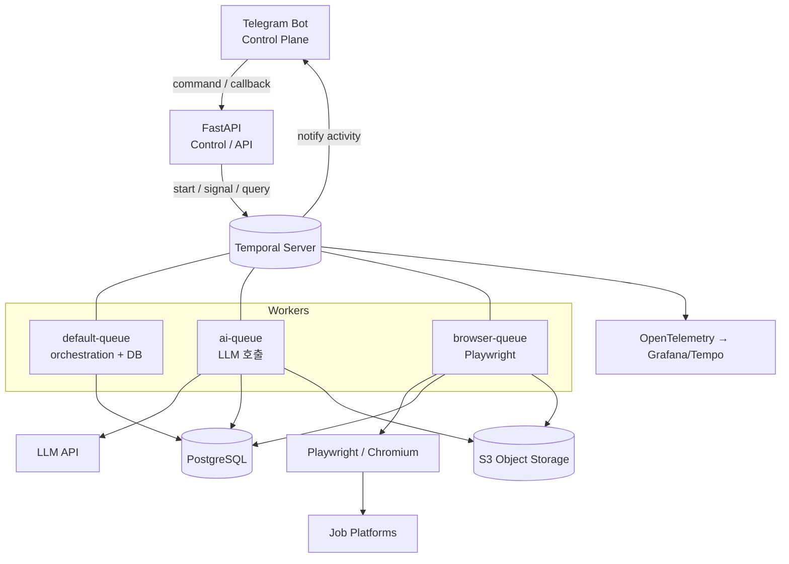

# 개요와 시스템 구성

> `docs/ARCHITECTURE.md` 색인의 §0–§1. 절 번호는 코드 주석이 참조하므로 바뀌지 않는다.

---

## 0. 한 줄 요약

| 계층 | 기술 | 책임 | 책임이 아닌 것 |
|---|---|---|---|
| Control Plane | FastAPI | 외부 진입점, 워크플로우 시작/시그널 전달 | 오래 걸리는 작업 실행 |
| Orchestration | Temporal | 단계·상태·타이머·재시도·승인 대기 | 비즈니스 데이터 저장 |
| AI Reasoning | 순수 Pydantic + 프롬프트 함수 (`ai/`) | Resume 생성/검토 루프, Recipe 수선 추론 | 시스템 전체 흐름 제어 |
| Execution | Playwright | **검증된 Recipe만** 실행 | 무엇을 할지 판단 |
| Human Loop | Telegram Bot | 승인/스케줄/중단 (운영 콘솔) | 상태의 원본 보관 |
| Data | PostgreSQL + S3 | 비즈니스 사실(fact)과 파일 | 실행 진행 상태 |
| Contract | Pydantic | AI 출력 / Recipe 스키마 검증 | — |

핵심 불변식 4개 — 이 4개가 깨지면 V1의 디버깅 지옥이 재현된다.

1. **Temporal = 실행 상태, DB = 비즈니스 데이터.** 진행 단계를 DB에 이중으로 관리하지 않는다.
2. **AI는 제출하지 않는다.** AI는 Recipe(데이터)를 만들고, Playwright는 Recipe를 실행한다.
3. **모든 I/O는 Activity 안에서만.** Workflow 코드는 결정적(deterministic)이어야 한다.
4. **되돌릴 수 없는 행위(최종 submit)는 사람의 승인 뒤에서만.**

---

## 1. 시스템 구성도

### Task Queue를 3개로 나누는 이유
| Queue | Worker 특성 | 동시성 |
|---|---|---|
| `default` | 가벼움, DB 트랜잭션 위주 | 높게 (수십) |
| `ai` | 느림, 토큰 비용, rate limit | 중간 (LLM RPM에 맞춤) |
| `browser` | 메모리 수백 MB/세션, 플랫폼별 rate limit | **낮게 (플랫폼당 1~2)** |

한 큐에 몰면 Playwright 세션이 워커를 잡아먹어 승인 처리 같은 가벼운 작업까지 지연된다.
`browser` 큐는 플랫폼당 동시성 1을 강제해서 "같은 사이트에 동시 3건 지원" 같은 사고를 구조적으로 막는다.
