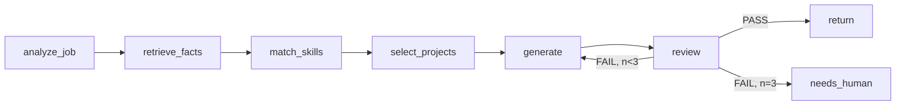

# 이력서 생성 파이프라인 (ResumeWorkflow)

> `docs/ARCHITECTURE.md` 색인의 §2.3. 절 번호는 코드 주석이 참조하므로 바뀌지 않는다.

---

### 2.3 ResumeWorkflow (AI child)

- 이 그래프 **내부**가 오케스트레이션 프레임워크(LangGraph 또는 PydanticAI, §9.2)의 영역이 될 수 있다.
  재시도 루프·상태는 Temporal이 아니라 그래프가 들고 있어도 되지만, **경계는 activity 단위**로 잡는다:
  `run_resume_graph(input) -> ResumeDraft`.
- 왜 그래프를 activity 하나에 넣는가: 그래프 실행 중간 상태는 Temporal 이벤트 히스토리에 넣을 만한 가치가 없다
  (LLM 호출은 비결정적, 재생 불가). 대신 **각 노드의 프롬프트/출력을 S3에 덤프**해서 디버깅한다.
- 반대로 "생성 → 검토 → 재생성" **큰 루프는 Temporal에 노출**한다. 3회 시도가 UI에 보여야 디버깅이 된다.
- 사실(fact) 기반 생성 (M3, 구현 완료): `retrieve_facts`(`FactSource` port, `config/facts.yaml`가 원본) →
  `select_relevant_facts`(`domain/resume_matching.py`, keyword 겹침으로 match_skills/select_projects를
  한 랭킹 단계로 합침) → LLM 구조화 생성(`ai/schemas.py`의 `ResumeContentSchema`, 스키마 위반 시 §5대로
  내부 2회 재프롬프트) → review 노드의 첫 체크는 `ground_check`(같은 파일) — highlight마다 근거 `fact_id`가
  있는지, 그 id가 실제 `Fact` 목록에 존재하는지를 본다. 근거 없는 서술과 지어낸 fact_id 인용 둘 다
  hallucination으로 잡는다. Recipe의 `value_ref`(참조만, 리터럴 금지, §3)와 같은 철학 — 이력서의 모든
  서술도 리터럴이 아니라 fact_id 참조여야 한다.
- **LLM 기반 2차 리뷰는 보류(2026-08-20 결정)** — `SimpleResumeReviewer`가 하는 일은 위 `ground_check`
  (룰 기반)와 summary 길이 체크뿐, "LLM이 LLM 출력을 다시 평가"하는 단계는 없다. `ResumeReviewer` port도
  여전히 구현체 1개(§11.1 "구현 2개" 원칙 미충족, 아래 어댑터 표 참고). 의도적으로 추가하지 않기로
  했다 — hallucination(가장 위험한 실패 모드, 근거 없는 사실이 제출 문서에 들어가는 것)은 이미
  `ground_check`가 막고, 톤/자연스러움 같은 품질 문제는 텔레그램 승인 단계에서 사람이 PDF 실물을 보고
  거르며 REVISE(§7)로 되돌릴 수 있다. LLM 리뷰를 넣어도 이미 있는 사람 체크포인트를 한 번 더 도는
  셈이라 비용 대비 이득이 낮다고 판단했다. 재검토 트리거: REVISE 왕복이 특정 패턴(문장 어색함 등)으로
  반복되면, 리뷰 단계를 늘리기보다 그 패턴을 `resume_guide.{platform}.md`에 규칙으로 박아 넣는 쪽을
  먼저 고려한다(가이드 patch가 이미 그 용도).
- 이 파이프라인은 여전히 분기·병렬 없는 선형 체인이다 — §9.2 도입 기준을 못 채워 plain 함수로 남아있다.
- **경력/프로젝트 블록 구조 + PDF 출력 (M3 연장)**: 실제 이력서 문서(원티드 PDF 내보내기 형식 참고 —
  이름/연락처 헤더 → 한줄 요약 → 상단 하이라이트 → 경력(회사 헤더 + 하위 블록별 불릿·기술스택) →
  개인 프로젝트 → AI 활용 경험 → 학력 → 스킬 태그 → 언어)를 만들려면 `summary`+`highlights` 뿐인
  스키마로는 부족했다. `Fact`에 `entity`/`entity_label`/`entity_period`/`block`/`block_label`/
  `block_period`를 추가해(`config/facts.yaml`) 회사명·기간·블록 제목을 **결정론 코드로** 조립하고
  (`domain/resume_blocks.group_facts_for_resume` → `FactBlock`), LLM은 그 블록 안에서 불릿
  문장만 쓴다(`ai/schemas.py`의 `BlockBullets`, 프롬프트가 block_id를 그대로 인용하도록 강제) —
  Recipe/AutomationRecipe와 같은 "AI는 생성만, 판정·조합은 코드" 철학의 연장이다. 개인 프로젝트가
  여러 개일 수 있어 `select_relevant_blocks`로 job 관련도 상위 N개만 추리고, 경력도 회사(entity)
  마다 따로 상위 N개로 줄인다(회사 자체를 솎아내진 않는다 — 그 회사 안 세부 블록 개수만 줄인다).
  처음엔 "경력은 전부 겪은 이력이라 다 보여주는 게 정상"이라 경력을 무제한으로 뒀었는데, 한 회사
  안에서 fact를 세분화한 `block`이 많아지면(실측 — 한 회사에 세부 이니셔티브 5개) 그 회사만
  압도적으로 길어지는 문제가 나왔다. REVISE(수정요청)로 "최대 4개로 줄여줘" 피드백이 왔을 때
  이게 가이드 patch(자연어, `resume_guide.{platform}.md`)로는 원천적으로 안 고쳐진다는 것도 같이 확인했다 —
  몇 개 블록이 나오는지는 LLM이 아니라 `select_relevant_blocks`가 결정하기 때문이다. 그래서 그때는
  상한 값 자체를 `Settings`(`RESUME_MAX_PROJECT_BLOCKS`/`RESUME_MAX_CAREER_BLOCKS_PER_ENTITY`, 기본
  3/4)로 빼서 사람이 `.env`로 조정하게 했다.

  **2026-08-21 되돌림**: 같은 세션에서 불릿 개수 버그(아래)를 진단하다가 이 결정 자체를
  재검토했다 — 사용자 판단은 "개수(불릿·블록 모두)는 LLM이 guide 지시를 따라 충분히 잘
  판단한다"였다. `select_relevant_blocks`는 relevance 랭킹 로직만 남기고 `RESUME_MAX_*` 기본값을
  20(사실상 무제한, fact가 비정상적으로 많이 쌓였을 때만 걸리는 안전판)으로 올렸다 — 실제
  "몇 개 보여줄지"는 다시 `resume_guide.{platform}.md` + LLM 판단으로 되돌아갔다. 불릿 개수도
  같은 결정을 따른다: `ai/prompts.build_resume_prompt`가 예전엔 "각 블록마다 1~3개의 불릿을
  써라"를 무조건 강제해서, REVISE(specific)로 "3~4개로 제한해줘"를 줘도 그 하드코딩과 매번
  충돌해 4개를 낸 적이 없었다(라이브 실측) — 이 하드코딩을 "가이드/피드백 지시가 없을 때만
  쓰는 fallback"으로 낮췄다. `resume_guide.wanted.md`에 경력 블록 불릿 개수 규칙(프로젝트엔
  이미 있었는데 경력엔 없었다)도 추가했다. 이 되돌림으로 개수 정확도는 다시 LLM 신뢰도에
  기댄다 — resume-block-count-cap 메모리에 남아있던 "자연어로는 개수를 못 바꾼다"는 결론은
  이제 유효하지 않다. `ground_check`는 `career[].blocks[].bullets`/
  `projects[].bullets`/`ai_usage`까지 재귀적으로
  검사하도록 확장했다. 이름·연락처·학력 상세·스킬 태그·언어처럼 **서술이 필요 없는 정형 정보**는
  Fact(LLM 근거)가 아니라 별도 `ProfileSource` port(`config/profile.yaml`, `FactSource`와 동일
  패턴)에서 와서 LLM을 거치지 않고 템플릿에 그대로 꽂힌다. `adapters/resume/_assemble.py`가 이
  셋(결정론 블록 메타데이터 + LLM 불릿 + Profile)을 `contracts/resume_content.AssembledResume`
  모양으로 합쳐 `ResumeDraft.content`에 담고, `PdfRenderer`는 그 모양만 알면 된다 — LLM 스키마나
  Fact 그룹핑을 몰라도 되게 경계를 나눴다. `PdfRenderer`는 §9.1에서 candidate로만 적어뒀던
  WeasyPrint를 실제로 구현했다(`adapters/pdf/weasyprint.py`, HTML/CSS 템플릿은
  `adapters/pdf/_template.py`에 분리해 weasyprint 없이도 순수 함수로 테스트한다). macOS(Homebrew)
  환경에서 weasyprint가 요구하는 libgobject/pango/cairo dlopen에 `DYLD_FALLBACK_LIBRARY_PATH`가
  필요해서 어댑터 모듈 로드 시점에 보정한다 — 사용자 셸 설정에 기대면 `make api`/`make worker`가
  새 셸에서 조용히 깨진다. weasyprint 렌더 테스트는 시스템 라이브러리(cairo/pango/glib)가 있어야
  돌아서 `@pytest.mark.native`(`make test-all`, `make up` 불필요 — Docker가 아니라 시스템
  라이브러리 문제라 마커를 따로 둔다)이고, `PDF_RENDERER` 기본값은 `weasyprint`다(`stub`는 JSON 덤프로
  남겨뒀다 — 인프라 없는 개발 환경을 위한 대역).

  **개인 프로젝트 GitHub 링크 (2026-08-22 연장)** — 전엔 프로젝트 URL을 `content` 원문
  텍스트에 그냥 적어뒀다(`config/facts.yaml`) — LLM이 불릿 문장 안에 그 URL을 그대로
  옮겨 적을지 여부에 기댔고, 옮겨 적혀도 PDF에는 escape된 평문으로만 나와 클릭 가능한
  링크가 아니었다. `entity_label`/`entity_period`와 같은 패턴으로 `Fact.entity_url`을
  추가해(`contracts/fact.py`) `group_facts_for_resume`가 `FactBlock.entity_url`로
  결정론적으로 뽑고(`domain/resume_blocks.py`), `_assemble.py`가 `ResumeBlockView.url`로
  옮겨 `PdfRenderer`가 블록 제목 옆에 항상 `<a>` 링크로 그린다(`adapters/pdf/_template.py`)
  — URL은 서술이 아니라 리터럴이라 `ground_check`(fact_id 근거 검증) 대상이 아니다. 렌더러는
  `http(s)://`로 시작하는 값만 링크로 그리고 그 외(예: `javascript:` 스킴, 빈 값)는 조용히
  생략한다.
