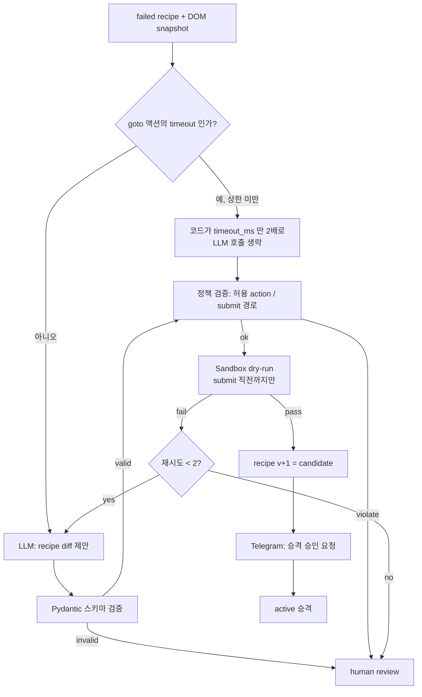
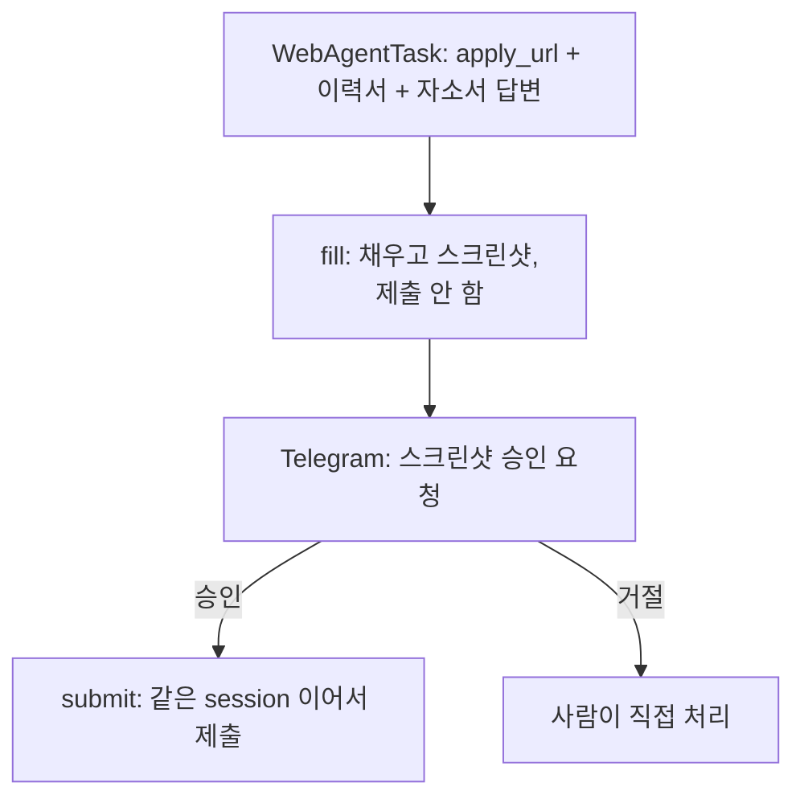
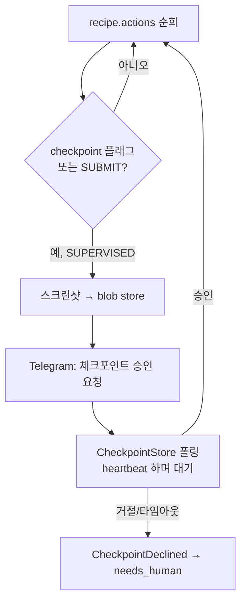

# Recipe 자기수선 · 외부 ATS · SUPERVISED 체크포인트

> `docs/ARCHITECTURE.md` 색인의 §2.4–§2.4c. 절 번호는 코드 주석이 참조하므로 바뀌지 않는다.

---

### 2.4 AutomationRepairWorkflow

- **AI가 만든 Recipe는 절대 바로 `active`가 되지 않는다.** `draft → candidate → active → deprecated`.
- Sandbox dry-run은 새 실행 모드가 필요 없다 — 기존 `ExecutionMode.DRY_RUN`(submit 직전까지만)을
  그대로 쓴다(§9.5, `_execution.resolve_mode`가 이미 이 의미로 쓰고 있었다).
- **DRY_RUN은 submit을 누르지 않되 submit 대상이 실제 매칭되는지는 확인한다.** 원래는 `SUBMIT`
  액션을 만나면 selector를 보지도 않고 `SUCCEEDED`로 끝냈는데, 그러면 이 노드 E가 정확히
  submit 스텝만 눈감은 채 "고쳤다"고 판정한다 — 수선 루프가 발산한다. 실측(2026-08-22):
  wanted recipe v1~v5의 `button:text-is("제출하기")`는 매칭 0개인데(Playwright 텍스트 엔진은
  그 텍스트를 가진 가장 작은 요소, 즉 안쪽 ``만 매칭한다) dry-run은 다섯 번 다
  통과했고, live만 같은 자리에서 계속 실패했다. `ReplayExecutor`는 원래 submit selector도
  검사하고 있었으므로, 이 수정은 실행기 셋의 계약을 맞춘 것이기도 하다(§11.1).
- **timeout 실패를 셀렉터 실패로 오진하지 않는다** (2026-08-23, 메모리
  wanted-goto-timeout-misdiagnosed-as-recipe-bug). 실제 사고는 이랬다 — wanted 지원이
  `Page.goto: Timeout 5000ms exceeded`로 실패했는데, 수선 루프가 그 실패 사유를 보지도 않고
  "DOM이 바뀌었다"고 전제해 LLM에게 셀렉터 diff를 시켰다. goto 액션엔 selector가 아예 없으므로
  고칠 셀렉터가 없고, LLM은 매번 무관한 액션을 건드린 candidate를 냈다. 두 갈래로 나눠 고쳤다:
  (1) `RecipeExecutionError`에 `failed_action_index`를 실어 "어느 액션에서 났는지"를 코드가
  알 수 있게 하고, `domain/recipe_repair.classify_failure`가 실패 사유 문자열의
  `Timeout \d+ms exceeded` 시그니처로 TIMEOUT/SELECTOR/UNKNOWN을 가른다. (2) 그 액션이
  `GOTO`이고 `timeout_ms`가 아직 `_AUTO_TIMEOUT_CAP_MS`(10초) 미만이면
  `bump_goto_timeout`이 **LLM 호출 자체를 생략하고** timeout_ms만 2배로 올린 candidate를
  결정론적으로 만든다(`activities/repair.py`가 node B 앞에서 분기). goto는 selector가 없는
  유일한 액션이라 "셀렉터가 틀렸을 가능성"이 원천적으로 없다 — 코드가 안전하게 판정할 수 있는
  유일한 케이스다. 다른 액션의 timeout은 "느려서"와 "셀렉터가 틀려 대상이 안 나타나서"를 문구로
  구분할 수 없어 여전히 LLM+DOM 판단에 맡기고, 대신 `build_recipe_diff_prompt`가 그 구분을
  명시적으로 지시한다. 자동 상향의 상한(10초)이 `Action.timeout_ms`의 절대 상한(60초)보다 훨씬
  낮은 건 의도적이다 — 10초까지 올려도 계속 timeout이면 "시간이 모자랐다"가 아니라 사이트가
  안 뜨거나 네트워크가 막혔다는 별도 문제일 가능성이 크므로, 코드가 숫자를 계속 올리는 대신
  LLM/사람에게 넘긴다(60초는 LLM이 DOM을 보고 진단한 뒤 직접 정할 수 있는 값).
- 승격(node I→J)은 `AutomationRepairWorkflow` 자기 자신이 Telegram 승인을 받아 그 자리에서
  끝낸다 — "candidate의 첫 실전 실행이 supervised mode로 돌다가 성공하면 자동 승격"이라는
  이전 초안의 대안 경로는 채택하지 않았다: `ExecutionMode.SUPERVISED`가 실제 실행 중 사람이
  submit 직전 스크린샷을 보고 멈춰 세우는 메커니즘(§2.4c)이 이제는 있지만, 승격 여부가
  임의의 미래 지원 건 실행 결과에 걸리는 건 `RepairResult`를 동기적으로 기다리는
  `ApplicationWorkflow` 쪽 흐름과 여전히 안 맞는다 — 이 결정은 체크포인트 메커니즘의 유무와
  무관하다. 대신 샌드박스 dry-run 결과(actions 개수/success_signals)를 요약해 그 자리에서
  승인받는다.

**진행 상황 — M4 phase 1(버전관리 write path + 정책 검증) + phase 2(이 다이어그램 B~J 전
구간, `ApplicationWorkflow` 연동) 구현 완료.** phase 1(`RecipeSource` write path,
`{platform}/{version}.json` 파일 레이아웃, `domain/recipe_policy.py`)은 이전 절 그대로다.
phase 2에서 추가한 것:

- **`ai/schemas.RecipeDiffSchema`**(node B/C) — `actions: list[Action]`가 `contracts.recipe.Action`을
  그대로 재사용한다. `Action`의 model_validator(selector 필요 여부 등)가
  `LLMClient.structured()`의 `model_validate()` 경유로 이미 실행되므로, node C "Pydantic 스키마
  검증"이 `activities/repair.py`의 재프롬프트 루프(`SimpleResumeGenerator._structured_with_reprompt`와
  같은 패턴, `max_reprompts=2`) 안에서 공짜로 딸려온다 — 조립된 `AutomationRecipe` 전체가
  무효(예: submit이 마지막이 아님)여도 같은 루프에서 재프롬프트한다. `expected_elements`/
  `validation_rules`는 LLM이 안 건드리고 `domain/recipe_repair.build_candidate_recipe`(순수
  함수, "AI는 생성만, 조합은 코드")가 이전 recipe에서 그대로 물려받는다. `propose_recipe_diff`
  activity가 `previous`도 같이 돌려줘서(`RecipeDiffResult`) node D(정책 검증)를 workflow가
  activity 없이 순수 함수로 직접 부를 수 있게 했다(§11.3 "모든 I/O는 activity 안에서만" —
  정책 검증엔 I/O가 없다).
- **`workflows/repair.AutomationRepairWorkflow`** — 위 다이어그램을 그대로 코드화했다.
  `MAX_SANDBOX_ATTEMPTS=2`로 "재시도 < 2?" 루프를 구현하고(실패한 샌드박스 시도의 새
  snapshot_key로 다음 LLM 호출을 다시 프롬프팅한다), 통과하면 `status="candidate"`로
  `save_recipe_candidate` 한 뒤 Telegram 승인을 기다려(자체 `approve`/`reject` signal + nonce,
  `ApplicationWorkflow`의 승인 패턴과 동일) `promote_recipe`를 부른다. 실패 지점 어디서든
  `RepairResult(promoted=False, reason=...)`로 정상 종료하며 그때마다 `notify` activity로
  사람에게 알린다.
- **샌드박스 dry-run의 실행 컨텍스트** — `RepairInput.ctx: ExecutionContext`에 그 실패를 만든
  실제 지원 건의 profile/upload_keys를 그대로 담아 온다(`workflows/_execution.build_context`를
  `run_execution`과 공유). "이 selector 수정이 실제로 값을 채울 수 있는가"는 데이터와 무관한
  질문이라, dedupe로 다른 지원 건의 실패가 이 워크플로우를 트리거했어도 상관없다 — 먼저
  도착한 실행의 컨텍스트로 검증하면 충분하다.
- **child workflow dedupe(`repair-{platform}-{form_hash}`)** — phase 1에서 "전례 없는 새
  패턴"으로 미해결로 남겼던 지점. `workflow.execute_child_workflow`가 이미 도는 실행과 같은
  id로 시작하면 `WorkflowAlreadyStartedError`가 나는데, **"이미 도는 수선에 붙어서 결과를
  같이 기다리기"는 채택하지 않았다** — Temporal 워크플로우 코드 안에서 child가 아닌 임의
  워크플로우의 완료를 기다릴 표준 API가 없다(activity로 Client를 새로 만들어 폴링하는 방법은
  있지만, 이 정도 이득에 비해 컨테이너에 Temporal Client를 추가로 흘려보내는 배선 비용이
  크다고 판단했다). 대신 `workflows/_repair.run_repair`가 이 예외를 잡아 그 지원 건만
  포기시키고 사람에게 넘긴다 — 진행 중인 수선이 끝나 recipe가 승격되면 다음 지원 시도가
  `load_active_recipe`로 그 결과를 자연히 집어간다.
- **`ApplicationWorkflow` 연동** — `_execution.ExecutionOutcome`에 `repair: RepairTrigger | None`을
  추가해 `_handle_execution_failure`가 RecipeExecutionError일 때만 채운다(§2.2 pseudocode의
  `for attempt in (1, 2)`를 그대로 구현 — `application.py._execute`가 첫 실행 실패 시 딱 한
  번 `_repair.run_repair`를 부르고 recipe를 재조회해 두 번째 실행을 시도한다, 그 이상은
  없다). `ApplicationState.REPAIRING`(이미 §2.2 상태 기계에 있던 값)을 이 구간에 persist한다.
- **Telegram 승격 승인 라우팅** — `DecisionRequest.repair_promotion`(신규 bool)이 True면
  `TelegramNotifier`가 승인/보류 2버튼(`_repair_keyboard`, REVISE/코멘트 없음)을 보낸다.
  이때 `application_id` 필드는 실제 지원 건이 아니라 `f"{platform}-{form_hash}"`를 담는다 —
  `telegram/bridge.py`가 `pa`/`pr` 콜백을 받으면 이 값으로 `wf_id = f"repair-{...}"`를
  복원해 `AutomationRepairWorkflow.approve`/`.reject`를 부른다(`application-*`로 조립하는
  기존 액션들과 분기).

### 2.4b ATS/자체구축 실행 — `WebAgentExecutor`(Aside)

외부 ATS(`domain/job_applicability.py`의 `channel == "external_ats"`)와 회사 자체구축 채용폼은
Recipe로 처리하지 않는다 — 회사마다 폼이 달라 recipe 재사용(§2.1의 `form_hash` dedup 전제)이
안 되기 때문이다. 그렇다고 지원 자체를 영구히 차단하지도 않는다 — 대신 범용 브라우저
에이전트(Aside, CLI/MCP로 제어 가능한 로컬 구독 도구)를 실행 도구로 쓰고, 이 프로젝트는
이력서(`AssembledResume`, §2.3의 산출물을 그대로 재사용)와 자소서 답변(별도 파이프라인, 아직
없음)만 만들어 넘긴다. `RecipeExecutor`처럼 `PlatformAdapter`를 하나 더 추가하는 문제가
아니다 — Recipe 자체가 "재사용 가능한 구조"를 전제하는데, 이 채널은 회사마다 1회성이라
recipe라는 개념 자체가 안 맞는다.

**`fill()`과 `submit()`을 프로토콜에서 별도 메서드로 분리한 게 핵심 안전장치다** — 한 메서드로
합치면 구현이 실수로/편의상 한 호출에 채움+제출을 다 해버릴 길이 타입 레벨에서 열려버린다.
`submit()`은 `fill()`이 돌려준 session으로만 이어받는다. Recipe의 supervised mode(§2.4)와
같은 자리에 있는 안전장치이지만, 이쪽은 매 실행이 전부 이 게이트를 거친다 — 회사마다
1회성이라 recipe처럼 "N회 성공하면 자동 승격"이 의미가 없기 때문이다(같은 회사 폼이
반복되면 자연히 재사용되고 승인 피로도가 줄어들 뿐, 별도 승격 절차는 두지 않는다).

이 설계는 다음을 실측(2026-08-20, aside 1.26.810.1915)해서 확정했다:
- `aside exec "<프롬프트>"`는 실제 clickable submit 버튼 앞에서도 "누르지 마라" 지시를
  지킨다(httpbin.org/forms/post로 검증: screenshot·accessibility snapshot·URL 불변 3중 확인).
- `aside exec --session <id> "이제 제출해라"`로 같은 세션을 이어서 실제 제출까지 완주한다.
- `--session` 없이 부르면 지금 사람이 포커스한 탭에 붙어버린다(실측: 관련 없는 탭을 잡음) —
  그래서 로그인~채움~제출을 하나의 세션 안에서 이어가야 한다.
- `aside repl`(별도 명령, `--session` 없음)은 LLM을 거치지 않고 JS를 브라우저에 직접
  실행한다(응답 61ms — LLM 호출이면 수초). `exec` 프롬프트 안에서 모델에게 repl 도구를 쓰라고
  지시하면, 모델이 내부적으로 그 repl 호출을 한다 — 그래서 로그인 자격증명을 **파일 경로로만**
  프롬프트에 넣고 실제 값은 `fs.readFile`로 그 안에서 읽게 하면, 프롬프트 텍스트·모델 출력
  어디에도 평문 비밀번호가 안 남는다(the-internet.herokuapp.com 공개 테스트 계정으로 로그인
  성공 + 값 미노출까지 확인).
- Aside는 `~/.aside/u/<account>/sessions/<id>/attachments/` 밖의 파일 접근을 샌드박스로
  막는다("Path escapes Project and session roots") — 자격증명 파일은 그 경로 안에만 쓴다.
- Aside 자체 비밀번호 매니저가 도메인 기준으로 "이 계정 저장할까요?" 팝업을 띄우는 것도
  확인했다 — 같은 ATS 도메인을 여러 회사가 공유하면 계정이 섞일 수 있다는 뜻이라, 이
  프로젝트는 Aside 자체 매니저를 신뢰하지 않고 자체 `CredentialSource`(회사명 키)를 쓴다.

**레이어링 규칙**: `CredentialSource.get()`이 돌려주는 `Credential`은 Temporal 활동 경계를
절대 넘지 않는다 — 활동 반환값은 event history에 영구 기록되므로, `Credential`을
`contracts/`(workflow-safe DTO 자리)가 아니라 `ports/`에 두고, `WebAgentExecutor` 구현체
생성자에 주입해 그 구현체 **내부에서만** 호출한다. Recipe의 `value_ref`(LLM 프롬프트에 값
대신 참조만 흘리는 것)와 같은 철학을 활동 경계까지 확장한 것.

**세션 id 추출은 공식 API가 아니라 실측 기반 휴리스틱**이다 — `aside exec`가 세션 id를
구조화로 돌려주는 옵션을 찾지 못해서, 호출 전후 `~/.aside/u/<account>/sessions/` 디렉터리
목록을 diff해서 새로 생긴 디렉터리를 세션으로 간주한다(`adapters/web_agent/aside_cli.py`).
동시에 다른 프로세스가 세션을 열면 깨질 수 있어, 이 executor도 platform/company당 동시성
1(§ "Task Queue를 3개로 나누는 이유"와 같은 이유) 정책을 따라야 한다. 로그인 실패/CAPTCHA
조우 시 Aside가 실제로 남기는 stdout 문구도 아직 라이브로 재현하지 못했다 — 현재 패턴
(`_LOGIN_FAIL_PATTERN`/`_CAPTCHA_PATTERN`)은 `ClaudeCodeCliLLM`의 실측 패턴만큼 신뢰할 수
없는 최선 추정이라, 실패 사례를 관찰하는 대로 갱신해야 한다.

**아직 안 된 것(다음 phase)**: `ApplicationWorkflow`/`_execution.py` 배선(channel 분기,
스크린샷 승인 슬롯 추가/재사용)과 자소서 답변 생성 파이프라인. 지금은 port·adapter·contract
test까지만 있고, 실제 지원 흐름에 연결되지 않았다.

---

### 2.4c SUPERVISED 페이지 경계 체크포인트 — `CheckpointWaiter`

`ExecutionMode.SUPERVISED`가 이름만 있고 실제로는 `LIVE`와 동일하게 그냥 제출까지 진행되던
갭(§2.4의 이전 버전, §9.3에서 "supervised 1회 필수"라고 정책만 정해두고 실행기 구현은
비워뒀던 부분)을 메웠다. 사용자가 원한 UX는 "스텝별 알림인데 구조는 폼 채우기 완료 후
스샷 인증 — 인적사항 완료 → 스샷 승인받고 → 자기소개서 페이지 → 반복"이다. 즉 각 페이지
경계마다 스크린샷 승인을 받되, 그 사이엔 브라우저 세션이 계속 살아있어야 한다.

검토했다가 기각한 대안 두 가지:
- **브라우저 세션을 승인 대기 내내 유지하는 디태치드 프로세스 + CDP 재연결** — §2.4b의
  `WebAgentExecutor`(Aside)와 같은 급의 인프라 투자인데, 그 설계는 이미 최후순위로 동결됐다
  (메모리 ats-web-agent-executor-design) — 여기서 먼저 지을 이유가 없다.
- **DRY_RUN 패스로 끝까지 채워 스크린샷 승인 → 승인되면 완전히 새 세션으로 LIVE 재실행** —
  새 인프라는 필요 없지만 매 체크포인트마다 전체를 처음부터 다시 채우는 건 낭비/취약(뒤로
  못 가는 폼도 있다) — "페이지마다 승인받고 이어서 진행"이라는 요구와 안 맞는다.

**채택한 설계**: 단일 `execute_application` activity 호출 안에서 브라우저를 계속 띄운 채,
페이지 경계(체크포인트)마다 `activity.heartbeat()`로 워커에 생존신호를 보내며 짧게(기본
30분, `CHECKPOINT_TIMEOUT_MINUTES`) 승인을 폴링 대기한다 — "사람이 실시간으로 지켜보고
있다"는 전제 위에 서 있다. 위 두 대안의 무거운 인프라/재실행 낭비 없이 절충한다.

- `Action.checkpoint: bool`(`contracts/recipe.py`) — recipe가 페이지 경계를 명시적으로
  표시한다. `SUBMIT`은 이 플래그를 안 세워도 SUPERVISED에서 **항상** 체크포인트가 걸린다
  (CLAUDE.md 절대규칙 4 "최종 submit은 승인 뒤에만"을 recipe 작성 실수와 무관하게 강제).
- `CheckpointStore` port(`ports/checkpoint_store.py`, `record_decision`/`get_decision`) —
  nonce 발급 프로세스(worker, activity 안에서 대기)와 승인 프로세스(webhook/리스너)가
  갈라진다는 점은 §6의 nonce와 같지만, 여기서 기다리는 건 워크플로우가 아니라 **activity
  자신**이라 Temporal signal로 못 받는다 — 그래서 프로세스 경계를 넘는 별도 공유 저장소가
  필요하다. `FileCheckpointStore`(파일 하나 = 결정 하나, 다른 파일 어댑터와 같은 원자적
  쓰기 패턴) + `InMemoryCheckpointStore`(테스트 대역) 2 구현, contract test 포함.
- `CheckpointWaiter`(`adapters/executor/_checkpoint.py`, port 아님 — `Notifier`/
  `CheckpointStore`/`BlobStore`/`IdGen`을 조합하는 클래스) — 스크린샷을 blob store에 올리고
  `notifier.request_decision(DecisionRequest(checkpoint=True, ...))`으로 승인을 요청한 뒤
  `store.get_decision(nonce)`를 폴링한다. 타임아웃을 넘기거나 거절되면
  `CheckpointDeclined`(`domain/errors.py`, `NON_RETRYABLE`) 하나로 두 경우를 표현한다(사유는
  메시지 문자열로만 구분).
- `RecipeExecutor.run()`에 `heartbeat: Callable[[str], None] | None = None` 키워드 인자를
  추가했다 — activity(`activities/browser.py`)가 `temporalio.activity.heartbeat`를 plain
  callable로 넘겨줘서, adapters 레이어가 temporalio를 직접 import하지 않아도 되게 한다
  (§11 레이어 규칙, temporalio는 contracts에서만 허용). `heartbeat_timeout=30초`가 이미
  `execute_application` activity 호출에 걸려 있어(`workflows/_execution.py`) 체크포인트
  대기 중 heartbeat를 안 하면 30초 뒤 타임아웃/재시도가 난다 — 그래서 필수다. 체크포인트를
  안 쓰는 구현(`ReplayExecutor`/`AgentBrowserExecutor`)은 시그니처만 맞추고 무시한다.
  `ExecutionMode.DRY_RUN`(샌드박스, repair의 `MAX_SANDBOX_ATTEMPTS` 루프 포함)은 조건에
  `mode is SUPERVISED`가 이미 있어 체크포인트 로직과 자동으로 무관하다.
- Telegram 쪽은 `DecisionRequest.checkpoint`(중첩 승인, 승인/거절 2버튼만 — guide_patch/
  repair_promotion과 같은 자리) → 콜백 prefix `ca`/`cr`. 이 콜백은 워크플로우가 아니라
  activity가 기다리는 대상이라 signal 경로를 안 탄다 — `telegram/bridge.py`가
  `c.checkpoint_store.record_decision(nonce, approved=...)`를 직접 호출한다(§6 nonce와
  같은 이유로 이 프로세스가 워크플로우 상태를 대신 검증할 수 없다).

구현·유닛/통합 테스트(`tests/ports/test_checkpoint_store_contract.py`,
`tests/adapters/test_checkpoint_waiter.py`, `tests/adapters/test_playwright_checkpoint.py`,
`tests/telegram/test_bridge_checkpoint.py`)·`make check` 통과 완료.

**`EXECUTOR=agent_browser`도 같은 체크포인트를 지원한다** (2026-08-20 연장). `PlaywrightExecutor`와
똑같이 `CheckpointWaiter`를 생성자로 주입받고, `_run_actions` 루프에서 같은 조건
(`mode is SUPERVISED and (action.checkpoint or SUBMIT)`)으로 멈춰 선다 — 차이는 스크린샷을
찍는 방식뿐이다(Playwright는 `page.screenshot()`, agent-browser는 CLI `screenshot`
서브커맨드로 임시 파일에 찍고 바이트를 읽는다, `_screenshot_bytes`). `bootstrap.py`의
`_build_executor` "agent_browser" 분기도 playwright와 동일하게 `CheckpointWaiter`를
조립해서 넘긴다. 테스트는 `tests/adapters/test_agent_browser_checkpoint.py`(playwright
버전과 같은 시나리오를 agent-browser 엔진에 대고 재실행)로 커버.
