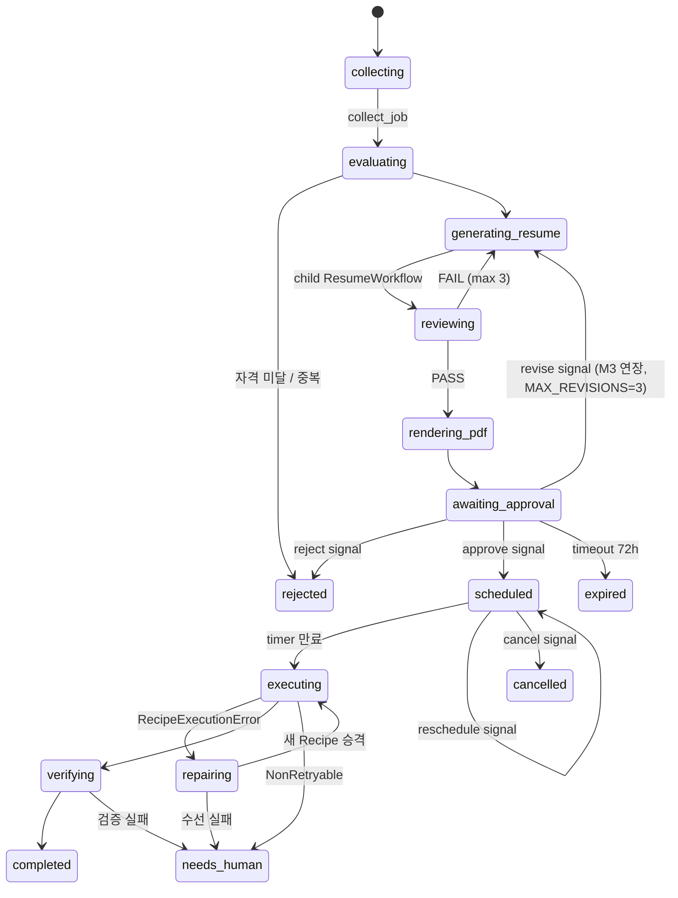

# 워크플로우 설계 · ApplicationWorkflow

> `docs/ARCHITECTURE.md` 색인의 §2–§2.2. 절 번호는 코드 주석이 참조하므로 바뀌지 않는다.

---

## 2. 워크플로우 설계

도메인 단위로만 정의한다. 더 쪼개면 추적이 어려워지고, 덜 쪼개면 재사용이 안 된다.

| Workflow | workflow_id | 역할 |
|---|---|---|
| `ApplicationWorkflow` | `application-{application_id}` | 지원 1건의 전 생애 (parent) |
| `ResumeWorkflow` | `resume-{application_id}-{attempt}` | 이력서 생성·검토 루프 (child) |
| `AutomationRepairWorkflow` | `repair-{platform}-{form_hash}` | Recipe 수선 (child, **dedupe key**) |
| `JobCollectionWorkflow` | Temporal Schedule (cron) | 공고 수집 (§11.2b) |
| `ApplyIntakeWorkflow` | Temporal Schedule (cron) | 적합 공고 상위 N건의 지원 **시작** (§11.2f) |
| `PingWorkflow` | — | 스모크 (M0) |

뒤의 둘은 원래 표에 없었다 — 지원 시작을 사람이 채팅으로만 트리거하던 걸 cron 으로도
돌리게 되면서 생겼다. **cron 이 자동화하는 범위는 "워크플로우 시작"까지고, 최종 제출은
그 안에서 여전히 사람의 승인 뒤에만 일어난다**(절대규칙 4).

### 2.1 workflow_id = 멱등성 키
`application-{id}`로 고정하면 API가 실수로 두 번 호출되어도 `WorkflowIdReusePolicy.REJECT_DUPLICATE`가
중복 지원을 막는다. **애플리케이션 레벨 중복 방지 로직을 따로 만들 필요가 없다.**

`repair-{platform}-{form_hash}`가 특히 중요하다. DOM이 바뀌면 그 플랫폼의 대기 중인 지원 건 N개가
"동시에" 실패한다. workflow_id를 폼 구조 해시로 잡으면 N개의 실패가 **하나의 수선 작업으로 합쳐진다.**
(LLM 호출 N배 + 사람에게 알림 N개를 방지)

### 2.2 ApplicationWorkflow



의사코드 (실제 구조를 그대로 반영):

```python
@workflow.defn
class ApplicationWorkflow:
    def __init__(self) -> None:
        self._state = "collecting"
        self._decision: Decision | None = None      # approve / reject
        self._scheduled_at: datetime | None = None
        self._cancelled = False

    @workflow.run
    async def run(self, cmd: StartApplication) -> ApplicationResult:
        job = await workflow.execute_activity(
            collect_job, cmd.job_url,
            start_to_close_timeout=timedelta(minutes=2),
            retry_policy=RetryPolicy(maximum_attempts=5),
        )

        verdict = await workflow.execute_activity(evaluate_eligibility, job, ...)
        if not verdict.eligible:
            await self._persist("rejected", reason=verdict.reason)
            return ApplicationResult.rejected(verdict.reason)

        # AI 루프는 child workflow로 분리 → Temporal UI에서 따로 추적/재실행 가능
        resume = await workflow.execute_child_workflow(
            ResumeWorkflow.run, ResumeInput(job=job, user_id=cmd.user_id),
            id=f"resume-{cmd.application_id}-1",
            task_queue="ai",
        )
        pdf = await workflow.execute_activity(render_pdf, resume, ...)

        # ---- Human-in-the-loop ----
        await self._persist("awaiting_approval", resume_id=resume.id, pdf_key=pdf.key)
        await workflow.execute_activity(notify_approval_request, ...)   # Telegram
        try:
            await workflow.wait_condition(
                lambda: self._decision is not None, timeout=timedelta(hours=72)
            )
        except asyncio.TimeoutError:
            await self._persist("expired")
            return ApplicationResult.expired()
        if self._decision.kind == "reject":
            await self._persist("rejected", reason=self._decision.reason)
            return ApplicationResult.rejected(self._decision.reason)

        # ---- Durable timer: 프로세스가 죽어도 살아남는 스케줄 ----
        self._scheduled_at = self._decision.scheduled_at
        while True:
            delay = self._scheduled_at - workflow.now()
            if delay <= timedelta(0):
                break
            changed_at = self._scheduled_at
            await workflow.wait_condition(          # reschedule/cancel 시그널로 깨어남
                lambda: self._cancelled or self._scheduled_at != changed_at,
                timeout=delay,
            )
            if self._cancelled:
                await self._persist("cancelled")
                return ApplicationResult.cancelled()

        # ---- 실행 (Recipe 실패 시 수선 후 1회 재시도) ----
        for attempt in (1, 2):
            recipe = await workflow.execute_activity(load_active_recipe, job.platform, ...)
            try:
                submission = await workflow.execute_activity(
                    execute_application,
                    ExecuteInput(recipe=recipe, application_id=cmd.application_id),
                    task_queue="browser",
                    start_to_close_timeout=timedelta(minutes=15),
                    heartbeat_timeout=timedelta(seconds=30),
                    retry_policy=RetryPolicy(
                        maximum_attempts=2,
                        non_retryable_error_types=["RecipeExecutionError",
                                                   "CaptchaEncountered",
                                                   "AuthRequired"],
                    ),
                )
                break
            except ActivityError as e:
                if not isinstance(e.cause, RecipeExecutionError) or attempt == 2:
                    raise
                await self._persist("repairing")
                repaired = await workflow.execute_child_workflow(
                    AutomationRepairWorkflow.run,
                    RepairInput(platform=job.platform, snapshot_key=e.cause.snapshot_key),
                    id=f"repair-{job.platform}-{e.cause.form_hash}",   # 동시 실패 dedupe
                    task_queue="ai",
                )
                if not repaired.promoted:
                    await self._persist("needs_human")
                    return ApplicationResult.needs_human("recipe repair failed")

        await workflow.execute_activity(verify_submission, submission, ...)
        await self._persist("completed", submitted_at=submission.submitted_at)
        return ApplicationResult.completed(submission)

    # ---------- Signals (Telegram / API에서 전달) ----------
    @workflow.signal
    def approve(self, d: ApproveSignal) -> None:
        if self._decision is None:                 # 중복 승인 무시 = 멱등
            self._decision = Decision.approve(d.scheduled_at)

    @workflow.signal
    def reject(self, reason: str) -> None:
        if self._decision is None:
            self._decision = Decision.reject(reason)

    @workflow.signal
    def reschedule(self, at: datetime) -> None:
        self._scheduled_at = at

    @workflow.signal
    def cancel(self) -> None:
        self._cancelled = True

    # ---------- Query (Telegram /status 가 이걸 읽는다) ----------
    @workflow.query
    def state(self) -> StateView:
        return StateView(state=self._state, scheduled_at=self._scheduled_at)
```

**설계 포인트**
- `/status`는 DB를 조회하지 않고 **워크플로우를 query**한다. 상태의 원본이 하나로 유지된다.
- 스케줄은 `sleep`이 아니라 `wait_condition(timeout=...)`. 그래야 대기 중에 재조정/취소가 먹는다.
- 승인 대기는 무한이 아니라 72시간. 무한 대기 워크플로우가 쌓이면 그게 또 운영 부채다.
- **REVISE(M3 연장)**: 위 의사코드의 2갈래(approve/reject)는 실제로는 3갈래다.
  `DecisionKind.REVISE`가 오면 `RevisionScope.SPECIFIC`(이번 재생성 1회에만, 영속 저장 안 함)
  /`GENERAL`(`config/resume_guide.{platform}.md`에 영속 — 단 사람이 diff를 한 번 더 승인해야
  반영)로 갈라서 이력서를 재생성하고 `awaiting_approval`로 되돌아간다. 가이드는 `JobRef.platform`
  별로 파일이 갈린다(§2.3, `GuideSource`) — 지금은 원티드만 실제로 쓴다. `MAX_REVISIONS`(3)를
  넘으면 `needs_human`. 자세한 구현은 CLAUDE.md "M3 연장 — REVISE" 항목과 `workflows/_revision.py`.
