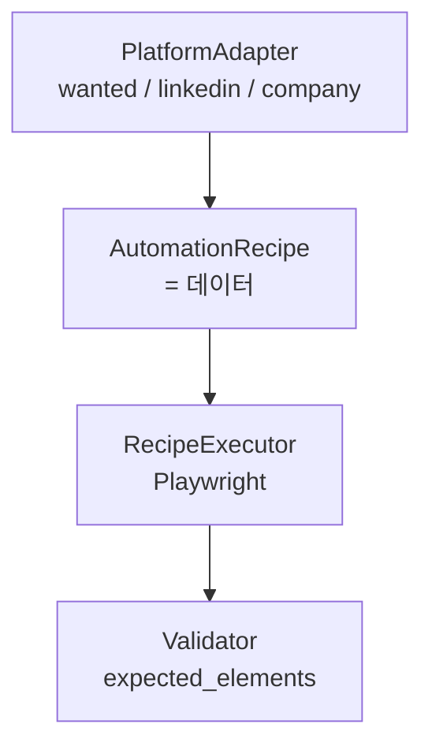

# Browser Automation 계층

> `docs/ARCHITECTURE.md` 색인의 §3. 절 번호는 코드 주석이 참조하므로 바뀌지 않는다.

---

## 3. Browser Automation 계층



Recipe는 **코드가 아니라 데이터**다. 그래서 LLM이 수정할 수 있고, 버전 관리·롤백·리뷰가 가능하다.
(모델은 workflow payload로 오가므로 `contracts/recipe.py`에 둔다. 정책 검증 로직은 `domain/recipe_policy.py`,
조립은 `domain/recipe_repair.py` — 둘 다 순수 함수다.)

```python
class ActionType(str, Enum):
    GOTO = "goto"; CLICK = "click"; FILL = "fill"; SELECT = "select"
    UPLOAD = "upload"; WAIT_FOR = "wait_for"; ASSERT_VISIBLE = "assert_visible"
    SCREENSHOT = "screenshot"; SUBMIT = "submit"          # 특별 취급

class Action(BaseModel):
    model_config = ConfigDict(extra="forbid")             # LLM의 창작 필드 차단
    type: ActionType
    selector: str | None = None
    value_ref: str | None = None                          # "profile.email" 같은 참조만
    value_literal: str | None = None
    timeout_ms: int = Field(default=5_000, ge=100, le=60_000)
    optional: bool = False
    checkpoint: bool = False                              # SUPERVISED 페이지 경계 (§2.4c)

class AutomationRecipe(BaseModel):
    model_config = ConfigDict(extra="forbid")
    platform: str
    version: int
    status: Literal["draft", "candidate", "active", "deprecated"]
    form_hash: str                                        # DOM 구조 지문
    actions: list[Action] = Field(max_length=120)
    expected_elements: list[str]                          # 실행 전 사전 조건
    success_signals: list[str]                            # 제출 성공 판정 근거
    validation_rules: list[Rule] = []

    @model_validator(mode="after")
    def submit_must_be_terminal(self):
        idx = [i for i, a in enumerate(self.actions) if a.type == ActionType.SUBMIT]
        if len(idx) > 1:
            raise ValueError("submit action은 최대 1개")
        if idx and idx[0] != len(self.actions) - 1:
            raise ValueError("submit은 마지막 action이어야 한다")
        return self
```

**정책 검증(스키마 검증과 별도)** — LLM 출력이 통과해야 하는 게이트:
- `value_literal`에 자격증명/토큰 패턴 금지. 개인정보는 반드시 `value_ref`로 프로필에서 주입.
- `SUBMIT` 액션은 마지막에 1회만. 새 Recipe가 submit 대상 셀렉터를 바꾸면 무조건 human review.
- `goto` 도메인은 플랫폼 allowlist 내부만.
- 액션 수·타임아웃 상한 (무한 루프/폭주 방지).
- `CLICK`/`WAIT_FOR`/`ASSERT_VISIBLE`의 `selector`는 `'{value}'`를 담을 수 있고, 실행 시점에
  `value_ref`/`value_literal`로 치환된다(`domain/recipe_selector.resolve_selector`, 두
  executor 구현이 공유). 지원 건마다 달라지는 텍스트(방금 업로드한 이력서 파일명, 카테고리별
  포트폴리오 파일명 등)로 매칭 대상을 좁혀야 하는데 selector 자체는 Recipe 작성 시점에
  고정돼야 해서 생긴 장치다. `FILL`/`SELECT`/`UPLOAD`는 이미 같은 필드를 "채울 값"으로
  쓰고 있어서 제외했다 — wanted 지원 폼을 실제로 붙여보며(§2.4 이전 단계, Recipe 최초
  작성) 발견했다: 업로드 직후 새로 생긴 리스트 항목이나 카테고리별 포트폴리오는 위치가
  들쭉날쭉해서 고정 selector로 못 짚는다. `UPLOAD` 액션은 Playwright에 임시파일 경로 대신
  `{name, mimeType, buffer}`를 직접 넘긴다 — blob key의 마지막 경로 요소를 그대로 파일명으로
  써서, 플랫폼이 화면에 보여주는 이름과 맞춘다(예전엔 랜덤 임시파일명이 그대로 노출됐다).

**세션/로그인**: 기본은 사용자가 최초 1회 수동 로그인한 Playwright `storage_state`를 저장하고
만료 시 재요청하는 것이다(`scripts/save_auth_state.py`). CAPTCHA를 만나면
`CaptchaEncountered`(non-retryable)로 즉시 중단하고 사람에게 넘긴다 — 우회 시도는 하지 않는다.
**2026-08-21 정책 완화**: 세션이 유난히 빨리 만료되는 플랫폼(사람인 — `career.saramin.co.kr`
신규 도메인으로 계정이 마이그레이션되며 세션 TTL이 비정상적으로 짧아진 것으로 추정, 라이브
탐색으로 실측)은 매번 사람을 부르는 비용이 너무 커서, 본인 계정 자격증명을 `.env`에 두고
`scripts/auto_login.py`가 자동 재로그인하는 경로를 추가했다. 지켜지는 제약은 그대로다 — (1)
새 계정을 대신 만들지 않는다(본인인증이 필요해 사람만 가능), (2) CAPTCHA/추가 인증은 여전히
우회하지 않고 즉시 실패시켜 사람에게 넘긴다. 이 판정(`domain/login_flow.detect_login_outcome`)
을 Playwright 글루 코드에서 분리해 고정 HTML로 테스트한 게 "우회 안 한다" 안전장치의 실제
근거다. credential vault(1Password 등, agent-browser plugin) 연동은 검토했지만 이번엔 보류
— `.env` 평문으로 시작하고 필요해지면 바꾼다.

**실행 엔진 2번째 선택지 — `AgentBrowserExecutor`(`EXECUTOR=agent_browser`).** Playwright를
대체하지 않는다 — 같은 `RecipeExecutor` 계약을 지키는 대역이 하나 더 생긴 것뿐이고,
`test_executor_contract.py`가 `replay`/`playwright`/`agent_browser` 셋에 동일하게 돈다.
존재 이유는 CDP accessibility tree 해석 차이다: `recipe-builder`가 라이브 디버깅에 쓰는
agent-browser CLI 와 프로덕션 실행기(Playwright)가 같은 selector 를 다르게 해석하는 사례를
wanted 지원 폼에서 실측했다(2026-08-20, 예: 파일유형 라디오 버튼 — agent-browser 는
`role=radio[name="이력서"]`류 접근성 매칭이 바로 됐는데 Playwright 의 자체 accessible-name
계산은 못 찾아서 `value="RESUME"` 속성 selector 로 우회해야 했다). 디버깅 엔진과 실행 엔진을
agent-browser 로 통일하면 이 번역 계층 버그가 원천적으로 없어진다.

agent-browser 는 브라우저 네이티브 `document.querySelector`로 raw CSS 를 해석해서, Playwright
가 CSS 위에 얹은 확장 문법(`:has-text()`, `:text-is()`, `text=`/`role=[name=]` 같은 엔진
프리픽스)을 그대로 못 읽는다 — `AgentBrowserExecutor`는 `domain/agent_browser_selector.py`로
이 셋을 분류해서 plain CSS는 그대로, 엔진-프리픽스는 agent-browser의 `find` 서브커맨드로,
`:has-text()`/`:text-is()`는 JS `eval`로 직접 찾아 실행한다(어댑터 docstring에 지원 범위
전체가 있다). `SELECT`/`UPLOAD`는 plain CSS만 허용 — `<input type=file>` 값은 JS로 못 채운다.
새 recipe를 이 엔진 대상으로 짤 때 어떤 selector 문법을 쓸지(엔진마다 다르게 고를지, 아니면
`EXECUTOR` 값을 보고 recipe-builder가 그 문법에 맞출지)는 아직 정하지 않았다 — 지금은 두
엔진이 이미 있는 `var/recipes/*.json` 문법(Playwright 확장 포함)을 최대한 그대로 실행할 수
있게만 만들어뒀다.
