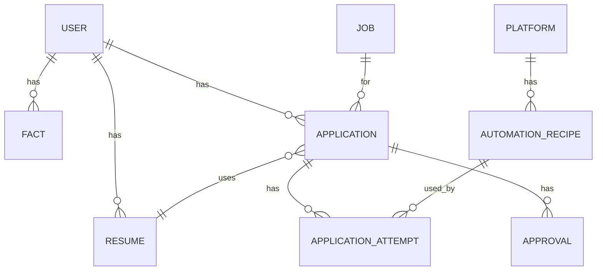

# 데이터 모델

> `docs/ARCHITECTURE.md` 색인의 §4. 절 번호는 코드 주석이 참조하므로 바뀌지 않는다.

---

## 4. 데이터 모델



SQLAlchemy 2.x + Alembic. 핵심 테이블만:

| Table | 핵심 컬럼 | 비고 |
|---|---|---|
| `users` | id, profile(JSONB) | 지원서에 채울 기본 정보 |
| `facts` | id, user_id, kind, content, source, verified_at | **이력서 생성의 유일한 사실 원천** |
| `jobs` | id, platform, external_id, url, title, company, raw(JSONB), collected_at | `UNIQUE(platform, external_id)` |
| `resumes` | id, user_id, job_id, content(JSONB), pdf_key, review_score, created_at | |
| `applications` | id, user_id, job_id, resume_id, status, workflow_id, scheduled_at, submitted_at, result(JSONB) | `UNIQUE(user_id, job_id)` = 중복 지원 방지 |
| `application_attempts` | id, application_id, recipe_id, recipe_version, mode, started_at, ended_at, outcome, error_code, snapshot_key, artifact_keys(JSONB) | 실행 1회 = 1행. 감사 로그 |
| `approvals` | id, application_id, channel, decided_by, decision, nonce, decided_at | nonce로 Telegram 버튼 재사용 차단 |
| `automation_recipes` | id, platform, version, status, form_hash, spec(JSONB), promoted_by, created_at | `UNIQUE(platform, version)` |
| `platform_policies` | platform, max_per_day, min_interval_sec, allowed_domains(JSONB) | rate limit 근거 |

### 4.1 Temporal과 DB의 경계 (가장 중요)
`applications.status`는 **원본이 아니라 projection**이다. 규칙:

- 상태를 바꾸는 주체는 오직 `persist_state` **activity 하나**. 다른 곳에서 status를 UPDATE 하지 않는다.
- 그 activity는 `(application_id, workflow_run_id, state)` 기준으로 **멱등**하게 upsert한다
  (activity는 최소 1회 실행이므로 중복 호출을 전제해야 한다).
- 사람이 "지금 어디?"를 물으면 → Temporal query.
  "지난달 몇 건 지원했지?"를 물으면 → DB.
- `applications.workflow_id`가 두 세계를 잇는 유일한 조인 키다. 로그·트레이스·S3 키에 모두 이 값을 넣는다.

### 4.2 S3 레이아웃
```
s3://auto-apply/
├── resumes/{user_id}/{resume_id}.pdf
├── portfolios/{user_id}/{file_id}
├── dom-snapshots/{platform}/{form_hash}/{ts}.html.gz
├── ai-traces/{workflow_id}/{node}/{seq}.json      # 이력서/수선 LLM 노드 입출력
├── application-artifacts/{application_id}/{attempt}/{step}.png
└── checkpoints/{application_id}/{attempt}/{id}.png  # SUPERVISED 체크포인트 스크린샷 (§2.4c)
```
